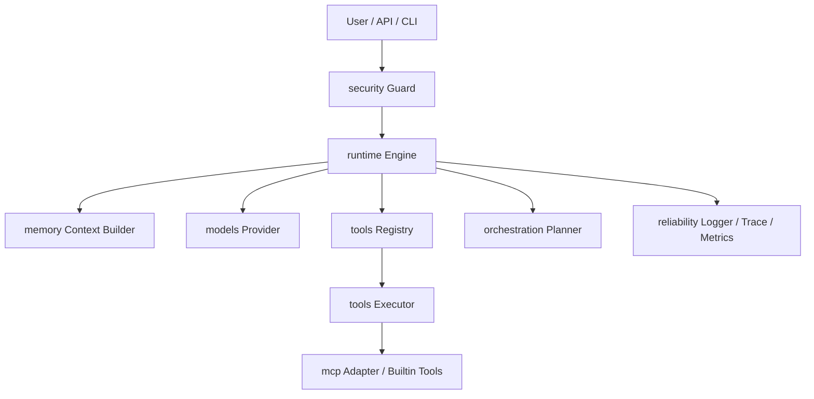

# MiniHarness TypeScript 技术方案

## 1. 背景与目标

MiniHarness 是一个轻量级 Agent Harness 框架，用于统一管理 Agent 的运行循环、模型调用、工具调用、记忆管理、MCP 接入、任务编排、安全控制与可观测性。

本方案按照“按子系统分包”的原则设计，每个目录对应一个 Harness 子系统：

| 目录 | 对应子系统 | 职责 | 首次实现阶段 |
|---|---|---|---|
| `core/` | 公共基础 | 消息、工具、智能体、事件接口定义 | 第一阶段 |
| `runtime/` | 运行时引擎 | Agent 循环、流式处理、事件驱动 | 第一阶段 |
| `tools/` | 工具层 | 工具注册、执行流水线、内置工具 | 第二阶段 |
| `memory/` | 记忆子系统 | 存储、上下文组装、记忆整合 | 第三阶段 |
| `models/` | 模型集成 | Provider 抽象、输出解析、质量门控 | 第三阶段 |
| `orchestration/` | 编排引擎 | 任务分解、状态机、多智能体协调 | 第五阶段 |
| `mcp/` | MCP 集成 | MCP 客户端、工具发现、协议适配 | 第四阶段 |
| `reliability/` | 可靠性与可观测性 | 日志、追踪、监控指标、容错机制 | 第二阶段 |
| `security/` | 安全防护 | 权限管理、路径校验、护栏、安全执行 | 第二阶段 |
| `utils/` | 工具类 | 配置管理等辅助模块 | 第一阶段 |

---

## 2. 技术选型

### 2.1 开发语言

开发语言采用 TypeScript。

推荐运行环境：

```text
Node.js >= 20
TypeScript >= 5.x
pnpm >= 9
```

### 2.2 推荐依赖

| 类型 | 推荐库 | 用途 |
|---|---|---|
| 类型校验 | `zod` | 工具参数 Schema、配置校验 |
| 日志 | `pino` | 高性能结构化日志 |
| 测试 | `vitest` | 单元测试、集成测试 |
| 打包 | `tsup` | TS 项目构建 |
| 配置 | `yaml` | 读取 YAML 配置 |
| HTTP | `undici` | Provider / MCP HTTP 请求 |
| CLI | `commander` | 命令行入口 |
| UUID | `nanoid` | trace_id、message_id 生成 |

---

## 3. 总体架构



核心调用链：

```text
用户输入
  -> 安全检查
  -> 组装上下文
  -> 调用模型
  -> 解析模型输出
  -> 判断是否需要调用工具
  -> 执行工具
  -> 工具结果回填模型
  -> 生成最终响应
  -> 保存记忆与日志
```

---

## 4. 项目目录结构

```text
MiniHarness/
├── src/
│   ├── core/
│   │   ├── message.ts
│   │   ├── event.ts
│   │   ├── agent.ts
│   │   ├── tool.ts
│   │   ├── model.ts
│   │   ├── memory.ts
│   │   ├── registry.ts
│   │   └── errors.ts
│   │
│   ├── runtime/
│   │   ├── engine.ts
│   │   ├── events.ts
│   │   ├── state.ts
│   │   ├── tool-scheduler.ts
│   │   ├── retry.ts
│   │   ├── budget.ts
│   │   └── drift.ts
│   │
│   ├── tools/
│   │   ├── registry.ts
│   │   ├── executor.ts
│   │   ├── validation.ts
│   │   ├── result.ts
│   │   └── builtin/
│   │       ├── echo.ts
│   │       ├── file.ts
│   │       ├── http.ts
│   │       └── shell.ts
│   │
│   ├── memory/
│   │   ├── store.ts
│   │   ├── local-store.ts
│   │   ├── context-builder.ts
│   │   └── summarizer.ts
│   │
│   ├── models/
│   │   ├── provider.ts
│   │   ├── mock-provider.ts
│   │   ├── openai-provider.ts
│   │   ├── parser.ts
│   │   └── quality-gate.ts
│   │
│   ├── orchestration/
│   │   ├── planner.ts
│   │   ├── state-machine.ts
│   │   ├── coordinator.ts
│   │   └── graph.ts
│   │
│   ├── mcp/
│   │   ├── client.ts
│   │   ├── discovery.ts
│   │   ├── adapter.ts
│   │   └── protocol.ts
│   │
│   ├── reliability/
│   │   ├── logger.ts
│   │   ├── trace.ts
│   │   ├── metrics.ts
│   │   ├── retry.ts
│   │   ├── circuit-breaker.ts
│   │   └── recovery.ts
│   │
│   ├── security/
│   │   ├── policy.ts
│   │   ├── guard.ts
│   │   ├── path.ts
│   │   ├── sandbox.ts
│   │   └── permission.ts
│   │
│   ├── utils/
│   │   ├── config.ts
│   │   ├── json.ts
│   │   ├── id.ts
│   │   └── time.ts
│   │
│   ├── index.ts
│   └── main.ts
│
├── configs/
│   └── harness.yaml
│
├── examples/
│   ├── simple-agent/
│   ├── tool-call/
│   └── mcp-demo/
│
├── tests/
│   ├── runtime.test.ts
│   ├── tool.test.ts
│   ├── memory.test.ts
│   └── security.test.ts
│
├── package.json
├── tsconfig.json
├── tsup.config.ts
└── README.md
```

---

## 5. 核心模块设计

## 5.1 `core/` 公共基础层

`core/` 只定义基础类型、接口和错误，不依赖具体实现。

### 5.1.1 消息结构

```ts
export type Role = 'system' | 'user' | 'assistant' | 'tool';

export interface ToolCall {
  id: string;
  name: string;
  arguments: Record<string, unknown>;
}

export interface Message {
  id: string;
  role: Role;
  content: string;
  toolCalls?: ToolCall[];
  metadata?: Record<string, unknown>;
  createdAt: number;
}
```

TypeScript 说明：

- `type Role = ...` 用于限制角色只能是固定字符串。
- `interface Message` 用于定义消息对象结构。
- `Record<string, unknown>` 表示一个键为字符串、值未知的对象，比 `any` 更安全。
- `toolCalls?` 中的 `?` 表示可选字段。

### 5.1.2 工具接口

```ts
export interface ToolResult {
  success: boolean;
  content: string;
  metadata?: Record<string, unknown>;
  errorCode?: string;
  errorName?: string;
}

export type ToolCategory =
  | 'builtin'
  | 'execution'
  | 'file'
  | 'network'
  | 'agent'
  | 'domain'
  | 'mcp';

export type ToolAccessLevel = 'system' | 'admin' | 'trusted' | 'public';

export interface ToolCapability {
  name: string;
  description: string;
  schema: Record<string, unknown>;
  category: ToolCategory;
  accessLevel: ToolAccessLevel;
  source: 'builtin' | 'mcp' | 'custom';
  timeoutMs?: number;
  cacheable?: boolean;
  maxResultCharacters?: number;
  requiredPermissions?: string[];
  metadata?: Record<string, unknown>;
}

export interface ToolValidationIssue {
  path: string;
  message: string;
}

export interface ToolValidationResult {
  ok: boolean;
  issues?: ToolValidationIssue[];
}

export interface Tool {
  name: string;
  description: string;
  schema: unknown;
  capability?: Partial<Omit<ToolCapability, 'name' | 'description' | 'schema'>>;
  validateInput?(input: Record<string, unknown>): ToolValidationResult;
  call(input: Record<string, unknown>, ctx: ToolContext): Promise<ToolResult>;
}

export interface ToolContext {
  traceId: string;
  sessionId: string;
  abortSignal?: AbortSignal;
  timeoutMs?: number;
  toolCallId?: string;
  metadata?: Record<string, unknown>;
}
```

设计原则：所有工具都实现统一的 `Tool` 接口。`name`、`description`、`schema`、`call()` 是兼容旧实现的最小契约；`capability`、`validateInput()`、`timeoutMs`、`toolCallId` 是增量能力，用于工具发现、权限控制、输入校验、超时和审计。

### 5.1.3 模型 Provider 接口

```ts
export interface ModelProvider {
  name: string;

  chat(input: ModelChatInput): Promise<ModelChatOutput>;

  stream?(input: ModelChatInput): AsyncIterable<ModelStreamEvent>;
}

export interface ModelChatInput {
  messages: Message[];
  tools?: Tool[];
  options?: ModelOptions;
}

export interface ModelChatOutput {
  message: Message;
  usage?: TokenUsage;
}

export interface ModelOptions {
  temperature?: number;
  maxTokens?: number;
  timeoutMs?: number;
}

export interface TokenUsage {
  inputTokens: number;
  outputTokens: number;
  totalTokens: number;
}

export interface ModelStreamEvent {
  type: 'text_delta' | 'tool_call' | 'done' | 'error';
  content?: string;
  toolCall?: ToolCall;
  error?: Error;
}
```

`AsyncIterable` 说明：

```ts
for await (const event of provider.stream(input)) {
  // 逐步处理流式输出
}
```

这适合实现模型的流式输出。

---

## 5.2 `runtime/` 运行时引擎

`runtime/` 是 Harness 的执行核心，负责 Agent 主循环、运行时事件、工具调度、模型重试、预算控制、取消控制和轻量漂移检测。

当前实现采用“兼容 API + 事件流 API”的双入口：

- `Engine.run()`：保持原有用法，消费内部事件流并返回最终 Assistant 消息。
- `Engine.runEvents()`：新增异步事件流入口，用于 UI、日志、调试、监控和未来实时控制平面。

### 5.2.1 Runtime 文件职责

| 文件 | 职责 |
|---|---|
| `engine.ts` | Agent 主循环，串联模型、记忆、工具、预算、重试、漂移检测和事件发射 |
| `events.ts` | 定义运行时事件协议，如 `agent_start`、`model_message`、`tool_result`、`runtime_error` |
| `state.ts` | 定义 `RunState`、`RunSnapshot`、终止原因和运行取消错误 |
| `tool-scheduler.ts` | 并发调度一批工具调用，并按原始 tool call 顺序归并结果 |
| `retry.ts` | 模型调用重试策略，基于 `retryable` 错误标记做指数退避 |
| `budget.ts` | 请求前预算检查，限制模型调用次数、估算 token 和上下文字符数 |
| `drift.ts` | 轻量漂移检测，基于重复工具调用和工具调用总数阈值做保护 |

### 5.2.2 Engine 结构

```ts
export interface EngineOptions {
  maxSteps: number;
  requestTimeoutMs: number;
  enableStream: boolean;
  maxConcurrentTools?: number;
  toolErrorMode?: 'throw' | 'observe';
  toolTimeoutMs?: number;
  modelRetry?: RetryPolicyOptions;
  budget?: Partial<RuntimeBudget>;
  drift?: DriftGuardOptions;
}

export interface EngineRunOptions {
  abortSignal?: AbortSignal;
  metadata?: Record<string, unknown>;
}

export class Engine {
  constructor(
    private readonly model: ModelProvider,
    private readonly memory: Memory,
    private readonly tools: ToolRegistry,
    private readonly options: EngineOptions,
  ) {}

  async run(input: string, sessionId: string): Promise<Message>;

  runEvents(
    input: string,
    sessionId: string,
    options?: EngineRunOptions,
  ): AsyncIterable<EngineEvent>;
}
```

设计要点：

- `run()` 面向普通调用方，保持“输入 -> 最终消息”的简单接口。
- `runEvents()` 面向交互式 UI 和监控系统，逐步产出运行时事件。
- `EngineRunOptions.abortSignal` 允许外部在安全点取消运行。
- `metadata` 会透传到模型调用 metadata，便于链路追踪。

### 5.2.3 事件协议

运行时事件定义在 `src/runtime/events.ts`：

```ts
export type EngineEvent =
  | AgentStartEvent
  | TurnStartEvent
  | ModelStartEvent
  | ModelDeltaEvent
  | ModelMessageEvent
  | ToolStartEvent
  | ToolResultEvent
  | TurnEndEvent
  | AgentEndEvent
  | RuntimeErrorEvent;
```

主要事件：

| 事件 | 含义 |
|---|---|
| `agent_start` | 本次运行开始，包含 `sessionId`、`traceId` 和输入长度 |
| `turn_start` | 新一轮 Agent 循环开始 |
| `model_start` | 即将调用模型 |
| `model_message` | 模型 Assistant 消息定稿 |
| `tool_start` | 某个工具调用开始 |
| `tool_result` | 某个工具调用结束，包含成功状态和耗时 |
| `turn_end` | 一轮包含工具调用的循环结束 |
| `agent_end` | 无工具调用，生成最终 Assistant 消息 |
| `runtime_error` | 运行时在模型、工具、预算、取消、漂移或终止阶段遇到错误 |

每个事件都带 `RunSnapshot`：

```ts
export interface RunSnapshot {
  sessionId: string;
  traceId: string;
  step: number;
  messageCount: number;
  modelCallCount: number;
  toolCallCount: number;
  estimatedTokens: number;
  usedTokens: number;
  elapsedMs: number;
  terminationReason?: TerminationReason;
}
```

这让调用方不需要读取内部状态，也能获得稳定的执行进度。

### 5.2.4 Agent 主循环

当前主循环可以概括为：

```text
创建 user 消息
  -> 保存到 memory
  -> buildContext()
  -> agent_start
  -> for step < maxSteps
      -> turn_start
      -> abort 检查
      -> model_start
      -> budget 检查
      -> model.chat()，必要时按 retry 策略重试
      -> model_message
      -> abort 检查
      -> 如果无 toolCalls
          -> 保存 assistant
          -> agent_end
          -> 返回
      -> 保存 assistant
      -> tool_start *
      -> ToolScheduler 并发执行工具
      -> tool_result *
      -> DriftGuard 检测重复工具调用
      -> turn_end
  -> maxSteps 超限，发出 runtime_error 并抛出 MaxStepsExceededError
```

关键控制点：

1. `maxSteps` 防止 Agent 无限循环。
2. `BudgetManager` 在每次模型调用前做请求级预算检查。
3. `RetryPolicy` 只重试 `retryable === true` 的模型错误。
4. `ToolScheduler` 可以并发执行工具，但写回上下文时保持原始 `toolCalls` 顺序。
5. `toolErrorMode: observe` 可以将工具错误转成 `role: 'tool'` 消息，让模型下一轮恢复。
6. `AbortSignal` 在模型调用前、模型消息后、工具执行前等安全点生效。
7. `DriftGuard` 通过重复工具调用检测和工具调用总数上限降低循环漂移风险。

### 5.2.5 工具调度与错误观察

`ToolScheduler` 的职责是把同一条 assistant 消息里的多个工具调用调度执行：

```ts
export interface ToolSchedulerOptions {
  maxConcurrentTools?: number;
  toolErrorMode?: 'throw' | 'observe';
  toolTimeoutMs?: number;
}
```

执行规则：

- `maxConcurrentTools` 控制同批工具调用最大并发数。
- `toolTimeoutMs` 控制单个工具调用最大等待时间，并通过子 `AbortSignal` 通知工具取消。
- 工具执行完成顺序可以不同，但返回给 `Engine` 的 `Message[]` 必须按原始 `toolCalls` 顺序排列。
- `throw` 模式保持原行为：工具缺失、权限拒绝或工具异常直接抛出。
- `observe` 模式把错误转换成 tool 消息：

```ts
{
  id: toolCall.id,
  role: 'tool',
  content: 'MiniHarnessError: Tool not found: missing',
  metadata: {
    toolCallId: toolCall.id,
    toolName: toolCall.name,
    success: false,
    errorCode: 'TOOL_NOT_FOUND',
  },
}
```

这样模型可以把错误当作观察结果，在下一轮选择替代方案。

### 5.2.6 模型重试

模型 Provider 已经把 HTTP、网络、超时等错误归一化为 `ModelProviderError`，其中包含 `retryable`。

运行时只对可重试错误做重试：

```ts
export interface RetryPolicyOptions {
  maxRetries?: number;
  initialBackoffMs?: number;
  maxBackoffMs?: number;
}
```

不重试：

- API Key 缺失
- 参数错误
- 模型输出解析为不可恢复错误
- 工具权限错误
- `retryable === false` 的 Provider 错误

每次失败都会发出 `runtime_error`，metadata 中包含：

```ts
{
  attempt: number;
  willRetry: boolean;
}
```

### 5.2.7 预算控制

运行时预算定义在 `src/runtime/budget.ts`：

```ts
export interface RuntimeBudget {
  maxModelCalls: number;
  maxEstimatedTokens: number;
  maxContextCharacters: number;
  reserveOutputTokens: number;
}
```

预算策略：

- 请求前用 `Math.ceil(message.content.length / 4)` 粗略估算 token。
- 模型返回 `usage` 时记录真实 `usage.totalTokens`。
- `maxModelCalls` 限制单次任务的模型调用次数。
- `maxContextCharacters` 限制上下文字符数。
- `reserveOutputTokens` 为模型输出预留预算。

预算超限时抛出 `RuntimeBudgetExceededError`，并在事件流中产生 `runtime_error`，`phase` 为 `budget`。

### 5.2.8 漂移检测与取消控制

`DriftGuard` 当前实现的是低成本保护：

```text
工具调用总数超过 maxToolCalls
  -> RuntimeDriftError

同一工具名 + 同一参数在窗口内重复达到 repeatedToolThreshold
  -> RuntimeDriftError
```

工具调用签名使用稳定序列化，避免对象 key 顺序影响检测。

取消控制使用标准 `AbortSignal`：

```ts
const controller = new AbortController();

for await (const event of engine.runEvents('hello', 'session_1', {
  abortSignal: controller.signal,
})) {
  if (event.type === 'model_message') {
    controller.abort();
  }
}
```

取消会在安全点抛出 `RuntimeAbortedError`，并发出 `runtime_error`，`terminationReason` 为 `aborted`。

---

## 5.3 `tools/` 工具层

工具层负责工具注册、工具查询、输入校验、权限检查、超时控制、结果归一化和调用审计。当前实现重点是“保持 `Tool` 最小接口兼容，同时增加能力描述和统一执行流水线”。

### 5.3.1 工具注册中心

```ts
import type { Tool, ToolCall, ToolContext, Message, ToolCapability } from '../core';

export class DefaultToolRegistry {
  private readonly tools = new Map<string, Tool>();
  private readonly capabilities = new Map<string, ToolCapability>();

  constructor(private readonly executor?: ToolExecutor) {}

  register(tool: Tool): void {
    if (!/^[A-Za-z0-9_-]{1,64}$/.test(tool.name)) {
      throw new ToolValidationError(`Invalid tool name: ${tool.name}`);
    }

    if (this.tools.has(tool.name)) {
      throw new Error(`Tool already registered: ${tool.name}`);
    }

    this.tools.set(tool.name, tool);
    this.capabilities.set(tool.name, this.buildCapability(tool));
  }

  get(name: string): Tool | undefined {
    return this.tools.get(name);
  }

  list(): Tool[] {
    return [...this.tools.values()];
  }

  listCapabilities(): ToolCapability[] {
    return [...this.capabilities.values()];
  }

  getCapability(name: string): ToolCapability | undefined {
    return this.capabilities.get(name);
  }

  unregister(name: string): boolean {
    const removed = this.tools.delete(name);
    this.capabilities.delete(name);
    return removed;
  }

  async execute(toolCall: ToolCall, ctx: ToolContext): Promise<Message> {
    const tool = this.get(toolCall.name);
    if (!tool) {
      throw new ToolNotFoundError(toolCall.name);
    }

    const result = this.executor
      ? await this.executor.execute(
          tool,
          toolCall.arguments,
          ctx,
          this.getCapability(tool.name),
        )
      : await tool.call(toolCall.arguments, ctx);

    return {
      id: toolCall.id,
      role: 'tool',
      content: result.content,
      createdAt: Date.now(),
      metadata: {
        toolName: tool.name,
        success: result.success,
        ...result.metadata,
      },
    };
  }
}
```

注册表的职责：

- `list()` 仍返回 `Tool[]`，供 OpenAI/Chat Completions provider 转成 function tools。
- `listCapabilities()` 返回带分类、来源、权限、超时和结果限制的能力视图，供 UI、调试和动态工具发现使用。
- 注册时校验工具名，确保兼容模型 function calling。
- 注册时缓存 schema/capability，避免每轮模型调用重复构造。

### 5.3.2 工具执行流水线

工具调用不要直接执行，建议经过统一 pipeline：

```text
ToolCall
  -> 权限检查
  -> 输入校验
  -> 超时控制
  -> 执行工具
  -> 结果归一化和裁剪
  -> 日志记录
  -> 返回 ToolResult
```

示例：

```ts
export class ToolExecutor {
  constructor(private readonly securityGuard: SecurityGuard) {}

  async execute(
    tool: Tool,
    input: Record<string, unknown>,
    ctx: ToolContext,
    capability?: ToolCapability,
  ): Promise<ToolResult> {
    const startedAt = Date.now();

    try {
      await this.securityGuard.checkToolPermission(tool.name, input, capability);

      const validation = validateToolInput(tool, input);
      if (!validation.ok) {
        throw new ToolValidationError(formatValidationIssues(validation.issues ?? []));
      }

      const effectiveTimeoutMs = ctx.timeoutMs ?? tool.capability?.timeoutMs;
      const rawResult = await callWithTimeout(
        () => tool.call(input, { ...ctx, timeoutMs: effectiveTimeoutMs }),
        effectiveTimeoutMs,
      );
      const result = normalizeToolResult(
        tool,
        rawResult,
        ctx,
        Date.now() - startedAt,
      );

      logger.info({
        traceId: ctx.traceId,
        toolName: tool.name,
        latencyMs: Date.now() - startedAt,
        success: result.success,
      });

      return result;
    } catch (error) {
      logger.error({
        traceId: ctx.traceId,
        toolName: tool.name,
        error,
      });

      throw error;
    }
  }
}
```

输入校验规则：

- 工具实现了 `validateInput()` 时，优先使用工具自定义校验。
- 否则使用工具 `schema` 的 JSON Schema 子集，当前支持 `type`、`required`、`properties`、`enum`、`additionalProperties`。
- 校验失败抛出 `ToolValidationError`，不会进入工具业务实现。

结果处理规则：

- `content` 统一为字符串。
- `capability.maxResultCharacters` 可限制工具结果长度，默认上限为 `64_000` 字符。
- 被截断时写入 `metadata.truncated`、`originalLength`、`maxResultCharacters`、`toolName`。
- 未知工具异常会转成 `ToolExecutionError`；工具超时会转成 `ToolTimeoutError`。

### 5.3.3 工具调度超时

`ToolScheduler` 除了控制并发和错误观察，还会给每次工具调用注入：

```ts
{
  toolCallId: toolCall.id,
  timeoutMs: options.toolTimeoutMs,
  abortSignal: childAbortSignal,
}
```

即使注册表没有注入 `ToolExecutor`，调度器也会在 Promise 层按 `toolTimeoutMs` 结束等待；`toolErrorMode: 'observe'` 时超时会变成 `role: 'tool'` 消息，metadata 中包含 `errorCode: 'TOOL_TIMEOUT'`。

---

## 5.4 `memory/` 记忆子系统

记忆模块负责保存历史消息、读取相关上下文、压缩长会话。

### 5.4.1 Memory 接口

```ts
export interface Memory {
  save(sessionId: string, message: Message): Promise<void>;

  loadRecent(sessionId: string, limit: number): Promise<Message[]>;

  search(sessionId: string, query: string, topK: number): Promise<Message[]>;

  buildContext(sessionId: string, input: Message): Promise<Message[]>;
}
```

### 5.4.2 上下文组装策略

推荐上下文顺序：

```text
System Prompt
  +
长期用户偏好
  +
相关历史记忆
  +
最近 N 轮对话
  +
当前用户输入
```

第一版可以先实现本地内存存储：

```ts
export class InMemoryStore implements Memory {
  private readonly sessions = new Map<string, Message[]>();

  async save(sessionId: string, message: Message): Promise<void> {
    const messages = this.sessions.get(sessionId) ?? [];
    messages.push(message);
    this.sessions.set(sessionId, messages);
  }

  async loadRecent(sessionId: string, limit: number): Promise<Message[]> {
    const messages = this.sessions.get(sessionId) ?? [];
    return messages.slice(-limit);
  }

  async search(sessionId: string, query: string, topK: number): Promise<Message[]> {
    const messages = this.sessions.get(sessionId) ?? [];
    return messages
      .filter((m) => m.content.includes(query))
      .slice(0, topK);
  }

  async buildContext(sessionId: string, input: Message): Promise<Message[]> {
    const recent = await this.loadRecent(sessionId, 20);
    return [
      createSystemMessage('You are MiniHarness Agent.'),
      ...recent,
      input,
    ];
  }
}
```

后续可以升级为：

```text
SQLite 本地存储
  -> 向量检索
  -> 摘要记忆
  -> 多会话记忆隔离
```

---

## 5.5 `models/` 模型集成

模型模块对外只暴露统一的 `ModelProvider`。

### 5.5.1 Mock Provider

第一阶段先使用 Mock Provider 跑通框架。

```ts
export class MockProvider implements ModelProvider {
  name = 'mock';

  async chat(input: ModelChatInput): Promise<ModelChatOutput> {
    const last = input.messages.at(-1);

    return {
      message: {
        id: createId(),
        role: 'assistant',
        content: `Mock response: ${last?.content ?? ''}`,
        createdAt: Date.now(),
      },
    };
  }
}
```

### 5.5.2 真实 Provider

真实 Provider 负责处理：

```text
1. 消息格式转换
2. 工具 Schema 转换
3. 模型 API 调用
4. 流式输出解析
5. tool_call 解析
6. token usage 统计
7. 错误码归一化
```

建议每个模型供应商单独实现：

```text
OpenAIProvider
ClaudeProvider
GeminiProvider
LocalProvider
```

不要把不同厂商的协议细节写入 `runtime/`。

---

## 5.6 `mcp/` MCP 集成

MCP 模块负责外部工具发现和协议适配。

设计目标：MCP 工具最终转换成内部统一的 `Tool`。

```text
MCP Server
  -> MCP Client
  -> Discovery
  -> Adapter
  -> core.Tool
  -> tools.Registry
```

### 5.6.1 MCP Tool Adapter

```ts
export interface McpToolAdapterOptions {
  namePrefix?: string;
}

export class McpToolAdapter implements Tool {
  readonly name: string;
  readonly description: string;
  readonly schema: unknown;
  readonly capability = {
    category: 'mcp',
    accessLevel: 'trusted',
    source: 'mcp',
  };

  constructor(
    private readonly tool: McpTool,
    private readonly client: McpClient,
    options: McpToolAdapterOptions = {},
  ) {
    this.name = options.namePrefix
      ? `${options.namePrefix}_${tool.name}`
      : tool.name;
    this.description = tool.description ?? tool.title ?? tool.name;
    this.schema = tool.inputSchema;
  }

  async call(input: Record<string, unknown>, ctx: ToolContext): Promise<ToolResult> {
    const result = await this.client.callTool({
      name: this.tool.name,
      arguments: input,
      traceId: ctx.traceId,
    });

    return {
      success: true,
      content: result.content,
      metadata: result.metadata,
    };
  }
}
```

MCP adapter 的内部 `name` 可以带 server 前缀，避免多个 MCP server 暴露同名工具时注册冲突；实际 `tools/call` 仍使用 MCP 原始工具名。adapter 的 metadata 保留 `mcpServerName`、`mcpToolName` 和结构化 MCP content。这样 `runtime/` 不需要关心工具来自 MCP、本地函数，还是业务插件。

---

## 5.7 `orchestration/` 编排引擎

编排层用于复杂任务，如代码审查、自动测试生成、文档生成、多 Agent 协同。

### 5.7.1 任务结构

```ts
export type TaskStatus = 'pending' | 'running' | 'done' | 'failed' | 'skipped';

export interface Task {
  id: string;
  title: string;
  description: string;
  status: TaskStatus;
  dependsOn: string[];
  result?: string;
  error?: string;
}
```

### 5.7.2 状态机

```text
pending -> running -> done
pending -> running -> failed
failed  -> running -> done
pending -> skipped
```

### 5.7.3 适用场景

```text
1. 用户给出复杂目标，需要拆成多个步骤。
2. 一个任务需要多个工具组合完成。
3. 一个任务需要多个 Agent 角色协作。
4. 任务之间存在依赖关系。
5. 某一步失败后需要降级或回滚。
```

---

## 5.8 `reliability/` 可靠性与可观测性

### 5.8.1 日志字段

每次请求建议记录：

```text
trace_id
session_id
request_id
model_name
tool_name
latency_ms
success
error_code
retry_count
token_usage
```

### 5.8.2 重试策略

可重试错误：

```text
网络超时
限流
临时 5xx
MCP 短暂连接失败
```

不应重试错误：

```text
权限拒绝
参数错误
工具不存在
路径越权
安全策略拦截
```

### 5.8.3 熔断策略

```text
同一工具连续失败达到阈值
  -> 进入 open 状态
  -> 短时间拒绝调用
  -> 到达恢复窗口后半开探测
  -> 成功则恢复，失败则继续熔断
```

---

## 5.9 `security/` 安全防护

安全模块应在工具调用、文件访问、命令执行前生效。

### 5.9.1 安全策略

```ts
export interface SecurityPolicy {
  allowTools: string[];
  denyTools: string[];
  sandboxDir: string;
  allowNetwork: boolean;
  allowShell: boolean;
  allowedShellCommands: string[];
}
```

### 5.9.2 路径校验

```ts
import path from 'node:path';

export function validateSandboxPath(baseDir: string, targetPath: string): string {
  const base = path.resolve(baseDir);
  const target = path.resolve(baseDir, targetPath);

  if (!target.startsWith(base + path.sep) && target !== base) {
    throw new Error(`Path escapes sandbox: ${targetPath}`);
  }

  return target;
}
```

该函数用于防止：

```text
../../etc/passwd
/root/.ssh/id_rsa
C:\Windows\System32\config
```

### 5.9.3 命令执行控制

Shell 工具必须限制：

```text
1. 是否允许启用 shell
2. 命令白名单
3. 工作目录必须在 sandbox 内
4. 超时时间
5. 输出最大长度
6. 环境变量脱敏
```

---

## 6. 配置文件设计

`configs/harness.yaml`：

```yaml
runtime:
  maxSteps: 8
  requestTimeoutMs: 60000
  toolTimeoutMs: 30000
  enableStream: false
  maxConcurrentTools: 1
  toolErrorMode: throw
  modelRetry:
    maxRetries: 0
    initialBackoffMs: 250
    maxBackoffMs: 2000
  budget:
    maxModelCalls: 20
    maxEstimatedTokens: 1000000
    maxContextCharacters: 120000
    reserveOutputTokens: 4000
  drift:
    maxToolCalls: 50
    repeatedToolWindow: 6
    repeatedToolThreshold: 1000000
    reflectionInterval: 0

model:
  provider: deepseek
  openai:
    model: gpt-5.5
    apiKeyEnv: OPENAI_API_KEY
    baseUrl: https://api.openai.com/v1
  deepseek:
    model: deepseek-v4-flash
    apiKeyEnv: DEEPSEEK_API_KEY
    baseUrl: https://api.deepseek.com
  temperature: 0.2
  maxTokens: 4096

memory:
  type: local
  recentLimit: 20
  searchTopK: 5
  summary:
    enabled: true
    maxSummaryCharacters: 500
  context:
    systemPrompt: You are MiniHarness Agent.
    maxContextCharacters: 12000

tools:
  enableBuiltin: true
  allowShell: false
  allowFile: false
  allowHttp: false

mcp:
  enable: false
  protocolVersion: 2025-06-18
  requestTimeoutMs: 30000
  servers:
    - name: local-tools
      transport: http
      endpoint: http://127.0.0.1:3001/mcp

orchestration:
  enable: true
  defaultRole: default
  maxRetries: 1
  continueOnFailure: true

security:
  sandboxDir: ./workspace
  allowNetwork: false
  allowShell: false
  allowShellCommands: []

reliability:
  enableTrace: true
```

配置读取建议使用 `zod` 做校验，避免启动后才发现配置错误。

运行时相关配置说明：

| 字段 | 说明 |
|---|---|
| `maxSteps` | 单次 Agent 循环最大轮数 |
| `toolTimeoutMs` | 单个工具调用最大等待时间，会注入 `ToolContext.timeoutMs` 并触发 `TOOL_TIMEOUT` |
| `maxConcurrentTools` | 同一轮工具调用最大并发数 |
| `toolErrorMode` | 工具错误处理模式，`throw` 直接抛错，`observe` 转成 tool 消息 |
| `modelRetry` | 模型调用重试策略，仅重试 `retryable` 错误 |
| `budget` | 单次任务模型调用次数、估算 token、上下文字符数限制 |
| `drift` | 重复工具调用和工具调用总数保护 |

---

## 7. 最小可运行示例

### 7.1 `package.json`

```json
{
  "name": "miniharness",
  "version": "0.1.0",
  "type": "module",
  "scripts": {
    "dev": "tsx src/main.ts",
    "build": "tsup src/index.ts --format esm,cjs --dts",
    "test": "vitest run",
    "lint": "eslint src tests"
  },
  "dependencies": {
    "nanoid": "^5.0.0",
    "pino": "^9.0.0",
    "undici": "^7.0.0",
    "yaml": "^2.0.0",
    "zod": "^4.0.0"
  },
  "devDependencies": {
    "@types/node": "^22.0.0",
    "tsup": "^8.0.0",
    "tsx": "^4.0.0",
    "typescript": "^5.0.0",
    "vitest": "^3.0.0"
  }
}
```

### 7.2 `main.ts`

```ts
import { Engine } from './runtime/engine';
import { InMemoryStore } from './memory/local-store';
import { createModelProvider } from './models/provider-factory';
import { DefaultToolRegistry } from './tools/registry';
import { loadHarnessConfig } from './utils/config';

async function main() {
  const config = await loadHarnessConfig();
  const model = createModelProvider(config);
  const memory = new InMemoryStore();
  const tools = new DefaultToolRegistry();

  const engine = new Engine(model, memory, tools, {
    maxSteps: config.runtime.maxSteps,
    requestTimeoutMs: config.runtime.requestTimeoutMs,
    enableStream: config.runtime.enableStream,
    maxConcurrentTools: config.runtime.maxConcurrentTools,
    toolErrorMode: config.runtime.toolErrorMode,
    toolTimeoutMs: config.runtime.toolTimeoutMs,
    modelRetry: config.runtime.modelRetry,
    budget: config.runtime.budget,
    drift: config.runtime.drift,
  });

  const response = await engine.run('帮我分析一下当前项目结构', 'default-session');

  console.log(response.content);
}

main().catch((error) => {
  console.error(error);
  process.exit(1);
});
```

TypeScript 说明：

- `async function main()` 表示异步主函数。
- `loadHarnessConfig()` 会读取 `.env` 和 YAML 配置。
- `await engine.run(...)` 等待 Harness 执行完成。
- `main().catch(...)` 用于捕获最外层异常，防止 Promise 未处理。

如果调用方需要观察完整运行过程，可以使用事件流：

```ts
for await (const event of engine.runEvents('hello', 'default-session')) {
  if (event.type === 'model_message') {
    console.log(event.message.content);
  }

  if (event.type === 'runtime_error') {
    console.error(event.phase, event.message);
  }
}
```

---

## 8. 开发阶段规划

## 第一阶段：最小 Harness 骨架

目标：跑通普通输入输出。

实现内容：

```text
core/message.ts
core/tool.ts
core/model.ts
core/memory.ts
runtime/engine.ts
runtime/events.ts
runtime/state.ts
runtime/tool-scheduler.ts
runtime/retry.ts
runtime/budget.ts
runtime/drift.ts
models/mock-provider.ts
memory/local-store.ts
tools/registry.ts
main.ts
```

验收标准：

```text
1. 可以接收用户输入。
2. 可以调用 MockProvider。
3. 可以返回 Assistant 消息。
4. 可以保存最近会话。
5. 可以通过 npm/pnpm 启动。
6. 可以通过 `runEvents()` 观察运行时事件。
7. 可以限制工具并发、模型重试、预算和重复工具调用。
```

---

## 第二阶段：工具系统、安全与日志

目标：工具可注册、可执行、可追踪、可拦截。

实现内容：

```text
tools/executor.ts
tools/pipeline.ts
tools/builtin/echo.ts
tools/builtin/file.ts
security/guard.ts
security/path.ts
reliability/logger.ts
```

验收标准：

```text
1. 工具可以注册到 Registry。
2. 工具调用前能做权限校验。
3. 文件工具不能越过 sandbox。
4. 工具执行有超时控制。
5. 工具调用有结构化日志。
```

---

## 第三阶段：真实模型与 Memory

目标：接入真实模型 Provider，并完善上下文组装。

实现内容：

```text
models/openai-provider.ts
models/parser.ts
models/quality-gate.ts
memory/context-builder.ts
memory/summarizer.ts
```

验收标准：

```text
1. 支持真实模型调用。
2. 支持模型 tool_call 输出解析。
3. 支持最近 N 轮上下文。
4. 支持上下文长度控制。
5. 模型异常不会导致进程崩溃。
```

---

## 第四阶段：MCP 集成

目标：接入外部 MCP 工具生态。

实现内容：

```text
mcp/client.ts
mcp/discovery.ts
mcp/adapter.ts
mcp/protocol.ts
```

验收标准：

```text
1. 可以连接 MCP Server。
2. 可以发现 MCP 工具。
3. 可以将 MCP 工具转换成 core.Tool。
4. 可以通过 Runtime 调用 MCP 工具。
5. MCP 调用失败有明确日志和错误信息。
```

---

## 第五阶段：编排引擎

目标：支持复杂任务拆解和多 Agent 协同。

实现内容：

```text
orchestration/planner.ts
orchestration/state-machine.ts
orchestration/coordinator.ts
orchestration/graph.ts
```

验收标准：

```text
1. 可以将复杂任务拆成多个子任务。
2. 子任务支持状态流转。
3. 任务之间支持依赖关系。
4. 支持失败重试或降级。
5. 支持多个 Agent 分工协作。
```

---

## 9. 测试方案

### 9.1 单元测试

重点覆盖：

```text
core 类型转换
工具注册与查找
工具参数校验
memory 读写
security 路径校验
runtime 主循环
runtime 事件流
runtime 工具调度
runtime 模型重试
runtime 预算控制
runtime 漂移检测
models 输出解析
```

示例：

```ts
import { describe, expect, it } from 'vitest';
import { DefaultToolRegistry } from '../src/tools/registry';
import { EchoTool } from '../src/tools/builtin/echo';

describe('DefaultToolRegistry', () => {
  it('registers and gets a tool', () => {
    const registry = new DefaultToolRegistry();
    const tool = new EchoTool();

    registry.register(tool);

    expect(registry.get('echo')).toBe(tool);
  });
});
```

### 9.2 集成测试

覆盖：

```text
1. 用户输入 -> 模型 -> 文本输出。
2. 用户输入 -> 模型 -> 工具调用 -> 最终输出。
3. 用户输入 -> MCP 工具调用。
4. 工具失败后的错误恢复。
5. 权限拒绝场景。
6. 最大循环次数限制。
7. `runEvents()` 事件顺序。
8. 工具并发执行但按原始顺序写回上下文。
9. retryable 模型错误重试。
10. 预算超限和重复工具调用保护。
11. AbortSignal 取消运行。
```

---

## 10. 关键设计原则

### 10.1 `core/` 不依赖业务实现

正确依赖方向：

```text
runtime -> core
models  -> core
tools   -> core
memory  -> core
mcp     -> core
```

避免：

```text
core -> runtime
core -> openai-provider
core -> mcp-client
```

### 10.2 所有外部能力抽象成接口

模型、工具、记忆、MCP 都通过接口交互。这样可以替换实现，不影响主流程。

### 10.3 工具调用必须可控

工具调用必须经过：

```text
工具注册中心
参数校验
权限策略
路径校验
沙箱限制
超时控制
日志审计
```

### 10.4 Agent 循环必须有上限

必须配置 `maxSteps`，防止模型反复调用工具导致死循环。

同时应配置任务级预算和漂移保护：

```text
maxModelCalls
maxEstimatedTokens
maxToolCalls
repeatedToolThreshold
```

这些限制不是替代 `maxSteps`，而是从模型调用次数、上下文成本和重复行动三个维度补充保护。

### 10.5 MCP 作为适配层，不侵入 runtime

MCP 协议细节只存在于 `mcp/` 目录中。`runtime/` 只认识统一的 `Tool` 接口。

### 10.6 事件流不替代消息历史

`EngineEvent` 用于观测执行过程，`Message[]` 才是模型上下文的事实来源。

运行时必须保持：

```text
历史消息只追加
工具结果按原始 toolCalls 顺序追加
不回写旧消息
```

这有利于多轮推理的前缀稳定性，也便于未来接入 prompt caching。

### 10.7 错误恢复必须可配置

工具错误存在两种合理策略：

```text
throw    -> 保持传统失败语义，适合测试和严格任务
observe  -> 将错误变成 tool 消息，适合让模型尝试恢复
```

默认值应保持 `throw`，避免调用方在不知情的情况下吞掉系统错误。

---

## 11. 推荐落地顺序

推荐按以下顺序开发：

```text
1. core/
2. memory/local-store.ts
3. models/mock-provider.ts
4. tools/registry.ts
5. runtime/engine.ts
6. runtime/events.ts + runtime/state.ts
7. runtime/tool-scheduler.ts
8. runtime/retry.ts + runtime/budget.ts + runtime/drift.ts
9. tools/executor.ts
10. security/guard.ts
11. reliability/logger.ts
12. models/openai-provider.ts
13. mcp/
14. orchestration/
```

第一版不要追求功能完整，先把主链路跑通：

```text
输入 -> 上下文 -> 模型 -> 输出
```

第二版再补：

```text
工具调用 -> 安全控制 -> 日志追踪
```

第三版再接入：

```text
真实模型 -> MCP -> 编排引擎
```

运行时增强版应补齐：

```text
runEvents -> 工具并发调度 -> 错误观察 -> 模型重试 -> 预算控制 -> 漂移保护
```

---

## 12. 最终交付物

| 交付物 | 说明 |
|---|---|
| MiniHarness TS 源码 | 完整 TypeScript 工程 |
| README.md | 项目说明、快速启动、配置说明 |
| configs/harness.yaml | 默认配置文件 |
| examples/ | 普通对话、工具调用、MCP 示例 |
| tests/ | 单元测试和集成测试 |
| 架构文档 | 本技术方案和模块设计文档 |

---

## 13. 总结

MiniHarness 的核心思想是：

```text
core 定标准
runtime 跑循环
runtime 发事件、控预算、调工具
tools 管工具
memory 组上下文
models 接模型
mcp 接外部工具生态
orchestration 做复杂任务编排
reliability 保证稳定性
security 保证安全边界
utils 提供基础辅助能力
```

第一阶段只需要实现最小闭环：

```text
Message
Tool
ModelProvider
Memory
Engine
EngineEvent
RunSnapshot
ToolRegistry
MockProvider
InMemoryStore
```

这条链路跑通后，再逐步扩展工具执行、安全控制、真实模型、MCP 集成、任务编排和更完整的控制平面。
