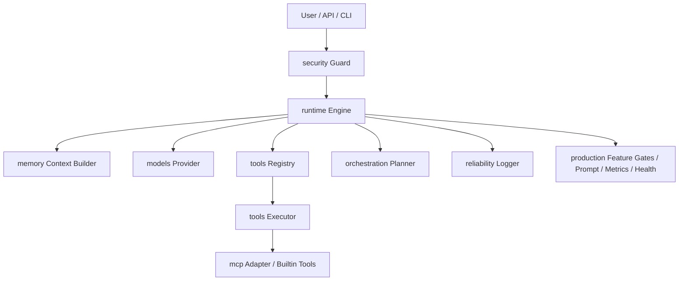

# MiniHarness TypeScript 技术方案

## 1. 背景与目标

MiniHarness 是一个轻量级 Agent Harness 框架，用于统一管理 Agent 的运行循环、模型调用、工具调用、记忆管理、MCP 接入、任务编排、安全控制与可观测性。

本方案按照“按子系统分包”的原则设计，每个目录对应一个 Harness 子系统：

| 目录 | 对应子系统 | 职责 | 首次实现阶段 |
|---|---|---|---|
| `core/` | 公共基础 | 消息、工具、智能体、事件接口定义 | 第一阶段 |
| `runtime/` | 运行时引擎 | Agent 循环、流式处理、事件驱动 | 第一阶段 |
| `tools/` | 工具层 | 工具注册、执行流水线、内置工具 | 第二阶段 |
| `memory/` | 记忆子系统 | 存储、上下文组装、记忆整合 | 第三阶段 |
| `models/` | 模型集成 | Provider 抽象、输出解析、质量门控 | 第三阶段 |
| `orchestration/` | 编排引擎 | 任务分解、状态机、多智能体协调 | 第五阶段 |
| `mcp/` | MCP 集成 | MCP 客户端、生命周期握手、工具发现缓存、协议适配 | 第四阶段 |
| `production/` | 生产化横切层 | Feature Gates、模块化提示词、Schema cache、运行指标与健康快照 | 第六阶段 |
| `reliability/` | 可靠性入口 | 结构化日志入口；追踪、指标和容错由 runtime/models/tools/production 横切实现 | 第二阶段 |
| `security/` | 安全防护 | 权限管理、路径校验、护栏、安全执行 | 第二阶段 |
| `utils/` | 工具类 | 配置管理等辅助模块 | 第一阶段 |

---

## 2. 技术选型

### 2.1 开发语言

开发语言采用 TypeScript。

推荐运行环境：

```text
Node.js >= 20
TypeScript >= 5.x
pnpm >= 9
```

### 2.2 推荐依赖

| 类型 | 推荐库 | 用途 |
|---|---|---|
| 类型校验 | `zod` | 工具参数 Schema、配置校验 |
| 日志 | `pino` | 高性能结构化日志 |
| 测试 | `vitest` | 单元测试、集成测试 |
| 打包 | `tsup` | TS 项目构建 |
| 配置 | `yaml` | 读取 YAML 配置 |
| HTTP | `undici` | Provider / MCP HTTP 请求 |
| CLI | `commander` | 命令行入口 |
| UUID | `nanoid` | trace_id、message_id 生成 |

---

## 3. 总体架构



核心调用链：

```text
用户输入
  -> 安全检查
  -> 组装上下文
  -> 调用模型
  -> 解析模型输出
  -> 判断是否需要调用工具
  -> 执行工具
  -> 工具结果回填模型
  -> 生成最终响应
  -> 保存记忆与日志
```

---

## 4. 项目目录结构

```text
MiniHarness/
├── src/
│   ├── core/
│   │   ├── message.ts
│   │   ├── event.ts
│   │   ├── agent.ts
│   │   ├── tool.ts
│   │   ├── model.ts
│   │   ├── memory.ts
│   │   ├── registry.ts
│   │   └── errors.ts
│   │
│   ├── runtime/
│   │   ├── engine.ts
│   │   ├── events.ts
│   │   ├── state.ts
│   │   ├── tool-scheduler.ts
│   │   ├── retry.ts
│   │   ├── budget.ts
│   │   └── drift.ts
│   │
│   ├── tools/
│   │   ├── registry.ts
│   │   ├── executor.ts
│   │   ├── validation.ts
│   │   ├── result.ts
│   │   └── builtin/
│   │       ├── echo.ts
│   │       ├── file.ts
│   │       ├── http.ts
│   │       └── shell.ts
│   │
│   ├── memory/
│   │   ├── store.ts
│   │   ├── local-store.ts
│   │   ├── context-builder.ts
│   │   └── summarizer.ts
│   │
│   ├── models/
│   │   ├── mock-provider.ts
│   │   ├── openai-provider.ts
│   │   ├── chat-completions-provider.ts
│   │   ├── parser.ts
│   │   ├── chat-completions-parser.ts
│   │   ├── quality-gate.ts
│   │   ├── output-governance.ts
│   │   ├── hallucination.ts
│   │   ├── circuit-breaker.ts
│   │   ├── provider-router.ts
│   │   ├── reasoning-budget.ts
│   │   └── provider-factory.ts
│   │
│   ├── orchestration/
│   │   ├── planner.ts
│   │   ├── state-machine.ts
│   │   ├── coordinator.ts
│   │   ├── evaluator.ts
│   │   └── graph.ts
│   │
│   ├── mcp/
│   │   ├── client.ts
│   │   ├── discovery.ts
│   │   ├── adapter.ts
│   │   └── protocol.ts
│   │
│   ├── reliability/
│   │   ├── logger.ts
│   │
│   ├── production/
│   │   ├── feature-gates.ts
│   │   ├── prompt.ts
│   │   ├── schema-cache.ts
│   │   └── metrics.ts
│   │
│   ├── security/
│   │   ├── policy.ts
│   │   ├── guard.ts
│   │   ├── path.ts
│   │   ├── sandbox.ts
│   │   └── permission.ts
│   │
│   ├── utils/
│   │   ├── config.ts
│   │   ├── json.ts
│   │   ├── id.ts
│   │   └── time.ts
│   │
│   ├── index.ts
│   └── main.ts
│
├── configs/
│   └── harness.yaml
│
├── examples/
│   ├── simple-agent/
│   ├── tool-call/
│   └── mcp-demo/
│
├── tests/
│   ├── runtime.test.ts
│   ├── tool.test.ts
│   ├── production-feature-gates.test.ts
│   ├── production-prompt.test.ts
│   ├── production-schema-cache.test.ts
│   ├── production-metrics.test.ts
│   ├── memory.test.ts
│   └── security.test.ts
│
├── package.json
├── tsconfig.json
├── tsup.config.ts
└── README.md
```

---

## 5. 核心模块设计

## 5.1 `core/` 公共基础层

`core/` 只定义基础类型、接口和错误，不依赖具体实现。

### 5.1.1 消息结构

```ts
export type Role = 'system' | 'user' | 'assistant' | 'tool';

export interface ToolCall {
  id: string;
  name: string;
  arguments: Record<string, unknown>;
}

export interface Message {
  id: string;
  role: Role;
  content: string;
  toolCalls?: ToolCall[];
  metadata?: Record<string, unknown>;
  createdAt: number;
}
```

TypeScript 说明：

- `type Role = ...` 用于限制角色只能是固定字符串。
- `interface Message` 用于定义消息对象结构。
- `Record<string, unknown>` 表示一个键为字符串、值未知的对象，比 `any` 更安全。
- `toolCalls?` 中的 `?` 表示可选字段。

### 5.1.2 工具接口

```ts
export interface ToolResult {
  success: boolean;
  content: string;
  metadata?: Record<string, unknown>;
  errorCode?: string;
  errorName?: string;
}

export type ToolCategory =
  | 'builtin'
  | 'execution'
  | 'file'
  | 'network'
  | 'agent'
  | 'domain'
  | 'mcp';

export type ToolAccessLevel = 'system' | 'admin' | 'trusted' | 'public';

export interface ToolCapability {
  name: string;
  description: string;
  schema: Record<string, unknown>;
  category: ToolCategory;
  accessLevel: ToolAccessLevel;
  source: 'builtin' | 'mcp' | 'custom';
  timeoutMs?: number;
  cacheable?: boolean;
  maxResultCharacters?: number;
  requiredPermissions?: string[];
  metadata?: Record<string, unknown>;
}

export interface ToolValidationIssue {
  path: string;
  message: string;
}

export interface ToolValidationResult {
  ok: boolean;
  issues?: ToolValidationIssue[];
}

export interface Tool {
  name: string;
  description: string;
  schema: unknown;
  capability?: Partial<Omit<ToolCapability, 'name' | 'description' | 'schema'>>;
  validateInput?(input: Record<string, unknown>): ToolValidationResult;
  call(input: Record<string, unknown>, ctx: ToolContext): Promise<ToolResult>;
}

export interface ToolContext {
  traceId: string;
  sessionId: string;
  abortSignal?: AbortSignal;
  timeoutMs?: number;
  toolCallId?: string;
  metadata?: Record<string, unknown>;
}
```

设计原则：所有工具都实现统一的 `Tool` 接口。`name`、`description`、`schema`、`call()` 是兼容旧实现的最小契约；`capability`、`validateInput()`、`timeoutMs`、`toolCallId` 是增量能力，用于工具发现、权限控制、输入校验、超时和审计。

### 5.1.3 模型 Provider 接口

```ts
export interface ModelProvider {
  name: string;

  chat(input: ModelChatInput): Promise<ModelChatOutput>;

  stream?(input: ModelChatInput): AsyncIterable<ModelStreamEvent>;
}

export interface ModelChatInput {
  messages: Message[];
  tools?: Tool[];
  options?: ModelOptions;
  metadata?: Record<string, unknown>;
}

export interface ModelChatOutput {
  message: Message;
  usage?: TokenUsage;
  metadata?: Record<string, unknown>;
}

export interface ModelOptions {
  temperature?: number;
  maxTokens?: number;
  timeoutMs?: number;
  reasoning?: ReasoningOptions;
}

export interface ReasoningOptions {
  strategy: 'disabled' | 'adaptive' | 'budget_based' | 'required';
  effort?: 'low' | 'medium' | 'high' | 'max';
}

export interface TokenUsage {
  inputTokens: number;
  outputTokens: number;
  totalTokens: number;
  reasoningTokens?: number;
  cachedInputTokens?: number;
}

export interface ModelStreamEvent {
  type: 'text_delta' | 'tool_call' | 'done' | 'error';
  content?: string;
  toolCall?: ToolCall;
  error?: Error;
}
```

`AsyncIterable` 说明：

```ts
for await (const event of provider.stream(input)) {
  // 逐步处理流式输出
}
```

这适合实现模型的流式输出。

---

## 5.2 `runtime/` 运行时引擎

`runtime/` 是 Harness 的执行核心，负责 Agent 主循环、运行时事件、工具调度、模型重试、预算控制、取消控制和轻量漂移检测。

当前实现采用“兼容 API + 事件流 API”的双入口：

- `Engine.run()`：保持原有用法，消费内部事件流并返回最终 Assistant 消息。
- `Engine.runEvents()`：新增异步事件流入口，用于 UI、日志、调试、监控和未来实时控制平面。

### 5.2.1 Runtime 文件职责

| 文件 | 职责 |
|---|---|
| `engine.ts` | Agent 主循环，串联模型、记忆、输出治理、工具、预算、重试、漂移检测和事件发射 |
| `events.ts` | 定义运行时事件协议，如 `agent_start`、`model_message`、`output_governance`、`model_correction`、`tool_result`、`runtime_error` |
| `state.ts` | 定义 `RunState`、`RunSnapshot`、终止原因和运行取消错误 |
| `tool-scheduler.ts` | 并发调度一批工具调用，并按原始 tool call 顺序归并结果 |
| `retry.ts` | 模型调用重试策略，基于 `retryable` 错误标记做指数退避、jitter 和通用 timeout 包装 |
| `budget.ts` | 请求前预算检查，限制模型调用次数、估算 token 和上下文字符数 |
| `drift.ts` | 轻量漂移检测，基于重复工具调用和工具调用总数阈值做保护 |

### 5.2.2 Engine 结构

```ts
export interface EngineOptions {
  maxSteps: number;
  requestTimeoutMs: number;
  enableStream: boolean;
  maxConcurrentTools?: number;
  toolErrorMode?: 'throw' | 'observe';
  toolTimeoutMs?: number;
  modelRetry?: RetryPolicyOptions;
  budget?: Partial<RuntimeBudget>;
  drift?: DriftGuardOptions;
  outputGovernance?: ModelOutputGovernance;
  metrics?: RuntimeMetricsSink;
}

export interface EngineRunOptions {
  abortSignal?: AbortSignal;
  metadata?: Record<string, unknown>;
}

export interface RuntimeMetricsSink {
  record(event: EngineEvent): void;
}

export class Engine {
  constructor(
    private readonly model: ModelProvider,
    private readonly memory: Memory,
    private readonly tools: ToolRegistry,
    private readonly options: EngineOptions,
  ) {}

  async run(input: string, sessionId: string): Promise<Message>;

  runEvents(
    input: string,
    sessionId: string,
    options?: EngineRunOptions,
  ): AsyncIterable<EngineEvent>;
}
```

设计要点：

- `run()` 面向普通调用方，保持“输入 -> 最终消息”的简单接口。
- `runEvents()` 面向交互式 UI 和监控系统，逐步产出运行时事件。
- `EngineRunOptions.abortSignal` 允许外部在安全点取消运行。
- `metadata` 会透传到模型调用 metadata，便于链路追踪。
- `metrics` 是可选事件 sink；不传时运行时行为不变，传入 `ProductionMetricsCollector` 时会同步汇总模型、工具、token、错误和延迟指标。

### 5.2.3 事件协议

运行时事件定义在 `src/runtime/events.ts`：

```ts
export type EngineEvent =
  | AgentStartEvent
  | TurnStartEvent
  | ModelStartEvent
  | ModelDeltaEvent
  | ModelMessageEvent
  | OutputGovernanceEvent
  | ModelCorrectionEvent
  | ToolStartEvent
  | ToolResultEvent
  | TurnEndEvent
  | AgentEndEvent
  | RuntimeErrorEvent;
```

主要事件：

| 事件 | 含义 |
|---|---|
| `agent_start` | 本次运行开始，包含 `sessionId`、`traceId` 和输入长度 |
| `turn_start` | 新一轮 Agent 循环开始 |
| `model_start` | 即将调用模型 |
| `model_message` | 模型 Assistant 消息定稿 |
| `output_governance` | 模型输出治理报告，包含通过和拒绝的工具调用数量 |
| `model_correction` | 治理层把被拒绝工具调用转成 tool 观察消息 |
| `tool_start` | 某个工具调用开始 |
| `tool_result` | 某个工具调用结束，包含成功状态、耗时、错误码、错误名和可恢复标记 |
| `turn_end` | 一轮包含工具调用的循环结束 |
| `agent_end` | 无工具调用，生成最终 Assistant 消息 |
| `runtime_error` | 运行时在模型、工具、预算、取消、漂移或终止阶段遇到错误 |

每个事件都带 `RunSnapshot`：

```ts
export interface RunSnapshot {
  sessionId: string;
  traceId: string;
  step: number;
  messageCount: number;
  modelCallCount: number;
  toolCallCount: number;
  estimatedTokens: number;
  usedTokens: number;
  elapsedMs: number;
  terminationReason?: TerminationReason;
}
```

这让调用方不需要读取内部状态，也能获得稳定的执行进度。

### 5.2.4 Agent 主循环

当前主循环可以概括为：

```text
创建 user 消息
  -> 保存到 memory
  -> buildContext()
  -> agent_start
  -> for step < maxSteps
      -> turn_start
      -> abort 检查
      -> model_start
      -> budget 检查
      -> model.chat()，必要时按 retry 策略重试
      -> model_message
      -> abort 检查
      -> ModelOutputGovernance 校验 toolCalls
      -> 如果治理失败且 mode=throw
          -> output_governance
          -> runtime_error
          -> 抛出错误
      -> 如果治理失败且 mode=observe
          -> 追加 model_correction / tool 观察消息
          -> 下一轮模型自修正
      -> 如果无 toolCalls
          -> 保存 assistant
          -> agent_end
          -> 返回
      -> 保存 assistant
      -> tool_start *
      -> ToolScheduler 并发执行工具
      -> tool_result *
      -> DriftGuard 检测重复工具调用
      -> metrics sink 记录事件快照
      -> turn_end
  -> maxSteps 超限，发出 runtime_error 并抛出 MaxStepsExceededError
```

关键控制点：

1. `maxSteps` 防止 Agent 无限循环。
2. `BudgetManager` 在每次模型调用前做请求级预算检查。
3. `RetryPolicy` 只重试 `retryable === true` 的模型错误。
4. `ToolScheduler` 可以并发执行工具，但写回上下文时保持原始 `toolCalls` 顺序。
5. `toolErrorMode: observe` 可以将工具错误转成 `role: 'tool'` 消息，让模型下一轮恢复。
6. `AbortSignal` 在模型调用前、模型消息后、工具执行前等安全点生效。
7. `DriftGuard` 通过重复工具调用检测和工具调用总数上限降低循环漂移风险。
8. `ModelOutputGovernance` 在工具执行前拦截未知工具、非法参数和注入模式；通过的调用进入 `ToolScheduler`，拒绝的调用可作为纠正观察回填给模型。
9. 可选 `RuntimeMetricsSink` 消费每个 `EngineEvent`，为生产控制面提供低耦合指标入口。

### 5.2.5 工具调度与错误观察

`ToolScheduler` 的职责是把同一条 assistant 消息里的多个工具调用调度执行：

```ts
export interface ToolSchedulerOptions {
  maxConcurrentTools?: number;
  toolErrorMode?: 'throw' | 'observe';
  toolTimeoutMs?: number;
}
```

执行规则：

- `maxConcurrentTools` 控制同批工具调用最大并发数。
- `toolTimeoutMs` 控制单个工具调用最大等待时间，并通过子 `AbortSignal` 通知工具取消。
- 工具执行完成顺序可以不同，但返回给 `Engine` 的 `Message[]` 必须按原始 `toolCalls` 顺序排列。
- `throw` 模式保持原行为：工具缺失、权限拒绝或工具异常直接抛出。
- `observe` 模式把错误转换成 tool 消息：

```ts
{
  id: toolCall.id,
  role: 'tool',
  content: 'MiniHarnessError: Tool not found: missing',
  metadata: {
    toolCallId: toolCall.id,
    toolName: toolCall.name,
    success: false,
    errorCode: 'TOOL_NOT_FOUND',
    errorName: 'MiniHarnessError',
    retryable: false,
  },
}
```

这样模型可以把错误当作观察结果，在下一轮选择替代方案。

### 5.2.6 模型重试

模型 Provider 已经把 HTTP、网络、超时等错误归一化为 `ModelProviderError`，其中包含 `retryable`。

运行时只对可重试错误做重试：

```ts
export interface RetryPolicyOptions {
  maxRetries?: number;
  initialBackoffMs?: number;
  maxBackoffMs?: number;
  jitterRatio?: number;
}
```

`jitterRatio` 默认值为 `0`，保持历史行为；生产环境可设置为 `0.1` 到 `0.3`，在指数退避基础上增加随机抖动，避免多个请求同步重试。

不重试：

- API Key 缺失
- 参数错误
- 模型输出解析为不可恢复错误
- 工具权限错误
- `retryable === false` 的 Provider 错误

每次失败都会发出 `runtime_error`，metadata 中包含：

```ts
{
  attempt: number;
  willRetry: boolean;
}
```

`runtime/retry.ts` 还提供 `runWithTimeout()`，用于给模型、工具、MCP 或业务扩展包装统一的 Promise 级超时。调用方可以传入 `createError`，把超时归一化为框架内错误类型。

### 5.2.7 预算控制

运行时预算定义在 `src/runtime/budget.ts`：

```ts
export interface RuntimeBudget {
  maxModelCalls: number;
  maxEstimatedTokens: number;
  maxContextCharacters: number;
  reserveOutputTokens: number;
}
```

预算策略：

- 请求前用 `Math.ceil(message.content.length / 4)` 粗略估算 token。
- 模型返回 `usage` 时记录真实 `usage.totalTokens`。
- `maxModelCalls` 限制单次任务的模型调用次数。
- `maxContextCharacters` 限制上下文字符数。
- `reserveOutputTokens` 为模型输出预留预算。

预算超限时抛出 `RuntimeBudgetExceededError`，并在事件流中产生 `runtime_error`，`phase` 为 `budget`。

### 5.2.8 漂移检测与取消控制

`DriftGuard` 当前实现的是低成本保护：

```text
工具调用总数超过 maxToolCalls
  -> RuntimeDriftError

同一工具名 + 同一参数在窗口内重复达到 repeatedToolThreshold
  -> RuntimeDriftError
```

工具调用签名使用稳定序列化，避免对象 key 顺序影响检测。

取消控制使用标准 `AbortSignal`：

```ts
const controller = new AbortController();

for await (const event of engine.runEvents('hello', 'session_1', {
  abortSignal: controller.signal,
})) {
  if (event.type === 'model_message') {
    controller.abort();
  }
}
```

取消会在安全点抛出 `RuntimeAbortedError`，并发出 `runtime_error`，`terminationReason` 为 `aborted`。

---

## 5.3 `tools/` 工具层

工具层负责工具注册、工具查询、输入校验、权限检查、超时控制、结果归一化和调用审计。当前实现重点是“保持 `Tool` 最小接口兼容，同时增加能力描述和统一执行流水线”。

### 5.3.1 工具注册中心

```ts
import type { Tool, ToolCall, ToolContext, Message, ToolCapability } from '../core';

export class DefaultToolRegistry {
  private readonly tools = new Map<string, Tool>();
  private readonly capabilities = new Map<string, ToolCapability>();
  private readonly schemaCache?: ToolSchemaCache;

  constructor(
    private readonly executor?: ToolExecutor,
    options: DefaultToolRegistryOptions = {},
  ) {}

  register(tool: Tool): void {
    if (!/^[A-Za-z0-9_-]{1,64}$/.test(tool.name)) {
      throw new ToolValidationError(`Invalid tool name: ${tool.name}`);
    }

    if (this.tools.has(tool.name)) {
      throw new Error(`Tool already registered: ${tool.name}`);
    }

    this.tools.set(tool.name, tool);
    this.capabilities.set(tool.name, this.buildCapability(tool));
  }

  get(name: string): Tool | undefined {
    return this.tools.get(name);
  }

  list(): Tool[] {
    return [...this.tools.values()];
  }

  listCapabilities(): ToolCapability[] {
    return [...this.capabilities.values()];
  }

  getCapability(name: string): ToolCapability | undefined {
    return this.capabilities.get(name);
  }

  unregister(name: string): boolean {
    const removed = this.tools.delete(name);
    this.capabilities.delete(name);
    return removed;
  }

  getSchemaCacheStats(): ToolSchemaCacheStats | undefined;

  async execute(toolCall: ToolCall, ctx: ToolContext): Promise<Message> {
    const tool = this.get(toolCall.name);
    if (!tool) {
      throw new ToolNotFoundError(toolCall.name);
    }

    const result = this.executor
      ? await this.executor.execute(
          tool,
          toolCall.arguments,
          ctx,
          this.getCapability(tool.name),
        )
      : await tool.call(toolCall.arguments, ctx);

    return {
      id: toolCall.id,
      role: 'tool',
      content: result.content,
      createdAt: Date.now(),
      metadata: {
        toolName: tool.name,
        success: result.success,
        ...result.metadata,
      },
    };
  }
}
```

注册表的职责：

- `list()` 仍返回 `Tool[]`，供 OpenAI/Chat Completions provider 转成 function tools。
- `listCapabilities()` 返回带分类、来源、权限、超时和结果限制的能力视图，供 UI、调试和动态工具发现使用。
- 注册时校验工具名，确保兼容模型 function calling。
- 注册时缓存 schema/capability，并通过 `ToolSchemaCache` 计算稳定 schema hash。
- `getSchemaCacheStats()` 返回 schema 条目数、命中数和总字符数，供生产指标和工具生态调优使用。
- `list()` 仍返回原始 `Tool[]`，provider 继续发送完整 function schema；schema hash 只作为缓存感知 metadata，不改变模型 API 契约。

Schema cache metadata 会写入 capability：

```ts
{
  metadata: {
    schemaHash: 'a1b2c3d4e5f6...',
    schemaCharacters: 420
  }
}
```

### 5.3.2 工具执行流水线

工具调用不要直接执行，建议经过统一 pipeline：

```text
ToolCall
  -> 权限检查
  -> 输入校验
  -> 超时控制
  -> 执行工具
  -> 结果归一化和裁剪
  -> 日志记录
  -> 返回 ToolResult
```

示例：

```ts
export class ToolExecutor {
  constructor(private readonly securityGuard: SecurityGuard) {}

  async execute(
    tool: Tool,
    input: Record<string, unknown>,
    ctx: ToolContext,
    capability?: ToolCapability,
  ): Promise<ToolResult> {
    const startedAt = Date.now();

    try {
      await this.securityGuard.checkToolPermission(tool.name, input, capability);

      const validation = validateToolInput(tool, input);
      if (!validation.ok) {
        throw new ToolValidationError(formatValidationIssues(validation.issues ?? []));
      }

      const effectiveTimeoutMs = ctx.timeoutMs ?? tool.capability?.timeoutMs;
      const rawResult = await callWithTimeout(
        () => tool.call(input, { ...ctx, timeoutMs: effectiveTimeoutMs }),
        effectiveTimeoutMs,
      );
      const result = normalizeToolResult(
        tool,
        rawResult,
        ctx,
        Date.now() - startedAt,
      );

      logger.info({
        traceId: ctx.traceId,
        toolName: tool.name,
        latencyMs: Date.now() - startedAt,
        success: result.success,
      });

      return result;
    } catch (error) {
      logger.error({
        traceId: ctx.traceId,
        toolName: tool.name,
        error,
      });

      throw error;
    }
  }
}
```

输入校验规则：

- 工具实现了 `validateInput()` 时，优先使用工具自定义校验。
- 否则使用工具 `schema` 的 JSON Schema 子集，当前支持 `type`、`required`、`properties`、`enum`、`additionalProperties`、`minimum`、`maximum`、`minLength`、`maxLength`、`pattern`、`minItems`、`maxItems`。
- 校验失败抛出 `ToolValidationError`，不会进入工具业务实现。

结果处理规则：

- `content` 统一为字符串。
- `capability.maxResultCharacters` 可限制工具结果长度，默认上限为 `64_000` 字符。
- 被截断时写入 `metadata.truncated`、`originalLength`、`maxResultCharacters`、`toolName`。
- 未知工具异常会转成 `ToolExecutionError`；工具超时会转成 `ToolTimeoutError`。

### 5.3.3 工具调度超时

`ToolScheduler` 除了控制并发和错误观察，还会给每次工具调用注入：

```ts
{
  toolCallId: toolCall.id,
  timeoutMs: options.toolTimeoutMs,
  abortSignal: childAbortSignal,
}
```

即使注册表没有注入 `ToolExecutor`，调度器也会在 Promise 层按 `toolTimeoutMs` 结束等待；`toolErrorMode: 'observe'` 时超时会变成 `role: 'tool'` 消息，metadata 中包含 `errorCode: 'TOOL_TIMEOUT'`。

---

## 5.4 `memory/` 记忆与上下文子系统

记忆模块负责保存历史消息、读取相关上下文、维护长期记忆条目，并在会话结束后把高价值信息整合为可检索的 Markdown frontmatter 记忆。

### 5.4.1 Memory 接口

```ts
export interface Memory {
  save(sessionId: string, message: Message): Promise<void>;

  loadRecent(sessionId: string, limit: number): Promise<Message[]>;

  search(sessionId: string, query: string, topK: number): Promise<Message[]>;

  buildContext(sessionId: string, input: Message): Promise<Message[]>;
}

export interface MemoryRunEndEvent {
  sessionId: string;
  traceId: string;
  userMessage: Message;
  finalMessage?: Message;
  terminationReason?: string;
  snapshot?: Record<string, unknown>;
}

export interface MemoryLifecycle {
  onRunEnd(event: MemoryRunEndEvent): Promise<void>;
}
```

`Engine` 仍只依赖 `Memory`。当 memory 实现同时提供 `MemoryLifecycle` 时，`Engine` 会在成功结束时调用 `onRunEnd()`，用于异步整合、索引更新或审计记录。

### 5.4.2 长期 MemoryEntry

长期记忆以 `MemoryEntry` 为基本单元：

```ts
export type MemoryEntryType =
  | 'user'
  | 'feedback'
  | 'project'
  | 'reference'
  | 'episodic'
  | 'lesson';

export interface MemoryEntry {
  id: string;
  type: MemoryEntryType;
  content: string;
  tags: string[];
  confidence: number;
  version: number;
  createdAt: number;
  updatedAt: number;
  lastAccessedAt?: number;
  expiryAt?: number;
  sourceSessionId?: string;
  sourceMessageIds?: string[];
  metadata?: Record<string, unknown>;
}
```

`MarkdownMemoryStore` 将条目保存到：

```text
.miniharness/memory/
  by_type/
    user/
    feedback/
    project/
    reference/
    episodic/
    lesson/
  session_logs/
```

每个条目使用 Markdown + YAML frontmatter：

```markdown
---
id: mem_xxx
type: project
version: 1
confidence: 0.8
tags:
  - project_context
createdAt: 1782640000000
updatedAt: 1782640000000
---

# 记忆内容

MiniHarness 的 runtime 入口是 `Engine.runEvents()`。
```

写入时使用临时文件加 `rename()` 做原子替换；更新时支持 `expectedVersion` 乐观锁，冲突抛出 `MemoryVersionConflictError`。

### 5.4.3 上下文组装策略

`ContextBuilder` 保持兼容，但增加长期记忆检索能力。推荐上下文顺序：

```text
System Prompt
  +
Conversation summary
  +
Relevant memory（长期 MemoryEntry）
  +
相关历史消息
  +
最近 N 轮对话
  +
当前用户输入
```

生产级提示词可以通过 `systemPromptModules` 启用模块化构建：

```ts
new ContextBuilder({
  systemPromptModules: [
    {
      id: 'identity',
      module: 'core_identity',
      content: 'You are MiniHarness Agent.',
      cacheable: true,
      priority: 100,
    },
    {
      id: 'task',
      module: 'context_specific',
      content: 'Current task: {{input}} in {{sessionId}}',
      cacheable: false,
      priority: 10,
    },
  ],
});
```

启用后第一条 system message 会携带提示词缓存元数据：

```ts
metadata: {
  promptCacheKey: string;
  promptStaticCharacters: number;
  promptDynamicCharacters: number;
  promptTotalCharacters: number;
  promptModuleBreakdown: Record<string, unknown>;
}
```

这让调用方可以在不改变 `Message[]` 协议的前提下观察稳定提示词前缀大小和动态上下文大小。

需求分析通过 `analyzeContextRequirement()` 完成，使用中英文关键词识别用户偏好、项目上下文、历史、参考资料、反馈和错误教训。无法识别时默认加载 user/project/episodic 三类上下文，避免新会话过薄。

`ContextCache` 提供 TTL 缓存和 tag 失效，后续可用于缓存静态用户档案和参考资料。当前字符预算仍由 `ContextBuilder.maxContextCharacters` 控制，保护系统提示和当前输入不被动态记忆挤掉。

### 5.4.4 组合式 Memory 实现

```ts
const memory = createMemory(config.memory);
```

`createMemory()` 会组装：

- `InMemoryStore`：当前进程内 recent/search 消息存储。
- `SessionLogStore`：追加 JSONL 原始消息日志，用于审计和整合。
- `MarkdownMemoryStore`：按类型保存长期 `MemoryEntry`。
- `ContextBuilder`：组装模型上下文。
- `ConsolidationEngine`：在 `onRunEnd()` 中按触发门执行整合。

### 5.4.5 自动整合

`ConsolidationEngine` 采用轻量三门触发：

- 时间门：距上次整合超过 `timeGateMs`。
- 会话门：距上次整合完成 `sessionGate` 次 run。
- 显式门：用户输入包含“记住这个”“保存进度”“consolidate”等信号。

整合流程为：

```text
Orient -> Gather -> Consolidate -> Prune
```

当前实现使用确定性启发式，不额外调用模型：用户偏好写入 `user`，项目进展写入 `project`，错误和失败教训写入 `lesson`。整合失败只记录日志，不影响主回复。

---

## 5.5 `models/` 模型集成与输出治理

模型模块对外只暴露统一的 `ModelProvider`，并在 Provider 返回后、工具执行前提供输出治理能力。模型层不执行工具，只负责协议适配、响应解析、Provider 路由、质量门控、工具幻觉检测和 reasoning 策略决策。

### 5.5.1 Mock Provider

第一阶段先使用 Mock Provider 跑通框架。

```ts
export class MockProvider implements ModelProvider {
  name = 'mock';

  async chat(input: ModelChatInput): Promise<ModelChatOutput> {
    const last = input.messages.at(-1);

    return {
      message: {
        id: createId(),
        role: 'assistant',
        content: `Mock response: ${last?.content ?? ''}`,
        createdAt: Date.now(),
      },
    };
  }
}
```

### 5.5.2 真实 Provider 与协议适配

真实 Provider 负责处理：

```text
1. 消息格式转换
2. 工具 Schema 转换
3. 模型 API 调用
4. 流式输出解析
5. tool_call 解析
6. token usage 统计
7. 错误码归一化
```

当前实现包括：

```text
OpenAIProvider              -> OpenAI Responses API
ChatCompletionsProvider     -> DeepSeek 等 OpenAI-compatible Chat Completions API
MockProvider                -> 本地测试与示例
createModelProvider         -> 根据配置创建单 Provider 或 ProviderRouter
```

不要把不同厂商的协议细节写入 `runtime/`。

### 5.5.3 Provider Router 与熔断器

`ProviderRouter` 自身实现 `ModelProvider`，因此可以透明传给 `Engine`。当 `model.selection.enabled` 开启时，工厂会按 `model.provider` + `fallbackChain` 构造候选列表：

```text
Engine
  -> ProviderRouter
  -> primary provider
  -> fallback provider
  -> ModelChatOutput
```

熔断器状态：

```text
closed     -> 正常调用
open       -> 失败达到阈值，暂时跳过
half-open  -> resetTimeoutMs 后允许一次恢复探测
```

路由器只处理模型供应商故障隔离，不吞掉最终错误；所有候选 Provider 都失败时抛出 `MODEL_ROUTER_EXHAUSTED`，并标记 `retryable: true`。

### 5.5.4 输出治理层

`ModelOutputGovernance` 在 `Engine` 收到 assistant 消息后执行，目标是让模型输出在工具执行前被结构化检查：

```text
assistant message
  -> 基础格式检查
  -> 工具存在性检查
  -> 参数 schema 校验
  -> 注入模式检测
  -> 输出治理报告
  -> 可执行 toolCalls / 纠正观察消息
```

治理结果：

```ts
export interface OutputGovernanceReport {
  passed: boolean;
  acceptedToolCalls: ToolCall[];
  rejectedToolCalls: RejectedToolCall[];
}
```

拒绝原因使用稳定 code：

```text
INVALID_TOOL_CALL
UNKNOWN_TOOL
INVALID_ARGUMENTS
INJECTION_DETECTED
```

治理模式：

| 模式 | 行为 |
|---|---|
| `throw` | 直接发出 `output_governance` + `runtime_error` 并终止 |
| `observe` | 把拒绝项转换成 `role: "tool"` 观察消息，让模型下一轮自修正 |
| `self_correct` | 预留模式，后续可接入专门自修正循环 |

注意：治理层不替代 `ToolExecutor` 的权限检查。权限、安全策略和实际执行保护仍是工具执行流水线的最后防线。

### 5.5.5 工具幻觉检测

`hallucination.ts` 先提供工具名纠错建议：

```text
模型输出 ech(...)
  -> 注册表中不存在 ech
  -> 和 echo 编辑距离相近
  -> Suggestion: Use 'echo' instead of 'ech'.
```

该能力用于 `UNKNOWN_TOOL` 的纠正信息。后续可以继续扩展参数范围幻觉和事实检查器。

### 5.5.6 Reasoning Budget

`ReasoningBudgetManager` 提供 provider-neutral 的 reasoning 策略决策，不把 Claude、OpenAI 或其他供应商的私有参数硬编码进 runtime：

```ts
export interface ReasoningOptions {
  strategy: 'disabled' | 'adaptive' | 'budget_based' | 'required';
  effort?: 'low' | 'medium' | 'high' | 'max';
}
```

当前策略：

- `disabled`：不启用 reasoning。
- `adaptive`：把启用决策交给支持该能力的 Provider。
- `budget_based`：按任务复杂度和会话级 reasoning token 上限决定是否启用。
- `required`：关键任务强制启用高 effort。

`TokenUsage` 已预留 `reasoningTokens` 和 `cachedInputTokens`，便于后续接入模型原生 usage 明细。

### 5.5.7 PGE 独立评估

`orchestration/evaluator.ts` 提供 PGE 中 Evaluator 输出的标准化解析：

```text
Planner  -> 生成计划和验收标准
Generator -> 执行任务并产出结果
Evaluator -> 使用独立上下文评估结果
```

当前实现不直接调用模型，只解析 evaluator 结果：

```text
PASS
confidence: high
```

或：

```text
FAIL
- missing risk discussion
confidence: medium
```

这样先稳定评估结果协议，后续可由 `Coordinator` 的 role handler 接入独立 `ModelProvider`。

---

## 5.6 `mcp/` MCP 集成

MCP 模块负责外部工具生态接入、生命周期握手、工具发现缓存和协议适配。设计目标是：MCP 的协议细节只存在于 `mcp/` 目录中，`runtime/`、`tools/` 和 `models/` 只认识内部统一的 `Tool` 接口。

```text
MCP Server
  -> HttpMcpClient initialize / request
  -> discoverMcpTools cache
  -> McpToolAdapter
  -> core.Tool
  -> tools.Registry / ToolExecutor
```

### 5.6.1 MCP Client 生命周期与传输

`HttpMcpClient` 负责 Streamable HTTP 风格的 MCP 访问：

- `initialize()` 发送 `initialize` 请求，并在成功后发送 `notifications/initialized`。
- 响应头里的 `MCP-Session-Id` 会被保存，后续请求自动携带。
- 请求头包含 `Accept: application/json, text/event-stream` 和 `MCP-Protocol-Version`。
- 响应解析同时支持 `application/json` 和 `text/event-stream`。
- `McpError` 统一承载 HTTP 状态、JSON-RPC 错误码和 retryable 标记。

除 tools 外，客户端也保留 MCP 三种原语的扩展点：

```text
tools/list        tools/call
resources/list    resources/read
prompts/list      prompts/get
```

当前 runtime 主链路只自动消费 tools；resources/prompts 先作为客户端能力暴露，后续可接入上下文构建和编排。

### 5.6.2 工具发现缓存

`discoverMcpTools(client, options)` 在发现前会调用可选的 `client.initialize()`，然后分页读取 `tools/list`。发现结果默认使用进程内 TTL 缓存：

- 默认缓存 5 分钟。
- `cacheTtlMs` 可调整或设为 `0` 关闭缓存。
- `forceRefresh` 可强制重新发现。
- 缓存保存原始 `McpTool[]`，每次返回时再按当前 adapter 选项生成内部 `Tool`。

这对应 MCP 指南中的 L1 schema/tool discovery cache；磁盘缓存、Redis 缓存和 `notifications/tools/list_changed` 可作为后续生产级增强。

### 5.6.3 MCP Tool Adapter

`McpToolAdapter` 将远端 MCP 工具转换成内部 `Tool`：

- 内部 `name` 统一清洗为 function-calling 兼容格式，并限制在 64 个字符以内。
- 可通过 `namePrefix` 避免多个 MCP server 暴露同名工具时冲突。
- 实际 `tools/call` 仍使用 MCP 原始工具名。
- `metadata` 保留 `mcpServerName`、`mcpToolName`、`mcpOriginalName`、`internalToolName`、结构化 MCP content 和 `structuredContent`。
- `isError: true` 的 MCP 结果会转换成 `success: false` 的 `ToolResult`，不在 adapter 层抛出。

这样 `runtime/` 不需要关心工具来自 MCP、本地函数，还是业务插件；权限、输入校验、超时和审计仍由 `ToolExecutor` 与 `SecurityGuard` 统一处理。

---

## 5.7 `orchestration/` 编排引擎

编排层用于复杂任务，如代码审查、自动测试生成、文档生成、多 Agent 协同和多阶段工作流。当前实现保持第五阶段 `Coordinator.run(tasks)` 的兼容 API，同时增加事件化 DAG 调度、工作流状态机、内存 checkpoint、消息总线、scratchpad 和上下文隔离。

### 5.7.1 任务结构与执行记录

```ts
export type TaskStatus = 'pending' | 'running' | 'done' | 'failed' | 'skipped';

export interface Task {
  id: string;
  title: string;
  description: string;
  status: TaskStatus;
  dependsOn: string[];
  result?: string;
  error?: string;
}
```

旧 `Task` 类型继续作为兼容层存在。新增 v2 任务规格和执行记录用于复跑、事件、checkpoint 和审计：

```ts
export type TaskType =
  | 'role_handler'
  | 'runtime_agent'
  | 'tool'
  | 'workflow'
  | 'noop';

export type TaskExecutionStatus =
  | 'pending'
  | 'queued'
  | 'running'
  | 'completed'
  | 'failed'
  | 'skipped'
  | 'cancelled'
  | 'timed_out';

export interface TaskSpec {
  id: string;
  title: string;
  description: string;
  type: TaskType;
  dependsOn: string[];
  role?: string;
  priority?: number;
  timeoutMs?: number;
  maxRetries?: number;
  input?: Record<string, unknown>;
}

export interface TaskExecution {
  taskId: string;
  runId: string;
  status: TaskExecutionStatus;
  attempt: number;
  result?: TaskExecutionResult;
  error?: TaskExecutionError;
}
```

`normalizeTaskSpec()` 可把旧 `Task` 转为 `TaskSpec`，默认 `type: "role_handler"`；`toLegacyTask()` 可把新执行记录投影回旧任务形状。

### 5.7.2 DAG 调度与事件

```text
pending -> running -> done
pending -> running -> failed
failed  -> running -> done
pending -> skipped
```

`TaskGraph` 负责重复 ID、缺失依赖、循环依赖、拓扑排序、可运行任务、并行层和失败后代分析。`Coordinator` 负责按 DAG 调度任务，支持：

```text
1. role -> handler 分派。
2. maxRetries 重试。
3. continueOnFailure 降级。
4. maxConcurrentTasks 受限并发。
5. 只跳过依赖失败任务的后代，不影响独立分支。
6. runEvents() 输出 workflow/task/checkpoint 事件。
```

编排事件包括：

```ts
export type OrchestrationEventType =
  | 'workflow_start'
  | 'workflow_state_enter'
  | 'workflow_state_exit'
  | 'task_queued'
  | 'task_start'
  | 'task_retry'
  | 'task_result'
  | 'task_skipped'
  | 'task_cancelled'
  | 'message_sent'
  | 'checkpoint_saved'
  | 'workflow_end'
  | 'orchestration_error';
```

### 5.7.3 工作流状态机

`WorkflowStateMachine` 使用有限状态机描述多阶段工作流：

```ts
export type WorkflowStateType =
  | 'initial'
  | 'normal'
  | 'parallel'
  | 'wait'
  | 'approval'
  | 'final'
  | 'error';

export interface WorkflowDefinition {
  id: string;
  name: string;
  version: string;
  initialState: string;
  states: WorkflowStateDefinition[];
  transitions: WorkflowTransitionDefinition[];
}
```

第一版条件转移使用 TypeScript predicate，后续可在此基础上增加 YAML workflow loader 和受限表达式解释器。`OrchestrationEngine` 将 `WorkflowStateMachine` 与 `Coordinator` 组合，进入状态后执行该状态绑定的 `taskIds`，并输出状态进入、退出和 workflow 完成事件。

### 5.7.4 通信、共享状态与恢复

多 Agent 协作采用消息传递优先、scratchpad 辅助共享的模式：

```text
OrchestrationMessageBus
  - workflow 内 sequence 单调递增
  - idempotencyKey 去重
  - maxQueueSize 背压
  - agent / task 定向消息

Scratchpad
  - put/get/batchGet/delete
  - version 和 writerId
  - readOnly entry
  - access log
  - snapshot / restore

AgentExecutionContext
  - local 优先
  - inherited 只读快照
  - commitToParent(keys) 显式提交
```

`InMemoryCheckpointStore` 当前保存 workflow run 的 task executions、messages、scratchpad snapshot 和 current state。它用于单进程恢复和测试；后续可扩展为 JSONL 或 SQLite 持久化。

### 5.7.5 适用场景

```text
1. 用户给出复杂目标，需要拆成多个步骤。
2. 一个任务需要多个工具组合完成。
3. 一个任务需要多个 Agent 角色协作。
4. 任务之间存在依赖关系。
5. 某一步失败后需要降级或回滚。
6. 长流程需要事件观测、检查点和恢复。
7. 多阶段工作流需要条件分支、状态进入/退出日志。
```

---

## 5.8 `reliability/` 可靠性与可观测性

可靠性能力是横切设计，不只存在于 `src/reliability/`。当前 `src/reliability/logger.ts` 提供 pino 结构化日志入口；容错、追踪和监控分别落在运行时、模型层、工具层和生产层。

### 5.8.1 可靠性能力分布

| 能力 | 当前实现 | 作用 |
|---|---|---|
| 结构化日志 | `reliability/logger.ts`、`tools/executor.ts` | 记录工具调用 trace、session、工具名、延迟、错误码 |
| 运行事件流 | `runtime/events.ts`、`Engine.runEvents()` | 以 `traceId`/`sessionId` 贯穿一次运行，输出模型、工具、治理和错误事件 |
| 模型重试 | `runtime/retry.ts`、`Engine` | 仅重试 `retryable === true` 的模型错误，支持指数退避和 jitter |
| 通用超时 | `runtime/retry.ts` 的 `runWithTimeout()`、`ToolScheduler`、`ToolExecutor` | 防止模型、工具或外部调用无限等待 |
| 隔舱 | `ToolScheduler.maxConcurrentTools` | 限制同一轮工具调用并发，避免单批工具耗尽资源 |
| 错误作为观察 | `ToolScheduler` 的 `toolErrorMode: 'observe'` | 把工具错误转成 `role: 'tool'` 消息，允许模型下一轮自恢复 |
| Provider 熔断 | `models/circuit-breaker.ts`、`ProviderRouter` | 主模型故障时跳过熔断 Provider 并尝试 fallback |
| 幻觉前置防护 | `models/output-governance.ts`、`tools/validation.ts` | 工具执行前校验未知工具、参数 schema 和注入模式 |
| 健康指标 | `production/metrics.ts` | 聚合成功率、错误率、P99 延迟、错误码桶和健康告警 |

### 5.8.2 日志与事件字段

每次请求和工具调用建议至少保留：

```text
traceId
sessionId
toolCallId
modelName / provider
toolName
latencyMs
success
errorCode
errorName
retryable
tokenUsage
```

`tool_result` 事件已经包含 `errorCode`、`errorName` 和 `retryable`。生产指标 collector 会按这些字段聚合错误桶，日志系统也可以用相同字段做检索和告警。

### 5.8.3 重试与超时策略

可重试错误：

```text
网络超时
限流
临时 5xx
MCP 短暂连接失败
Provider Router 暂时耗尽
```

不应重试错误：

```text
权限拒绝
参数错误
工具不存在
路径越权
安全策略拦截
非幂等工具副作用未知
```

模型重试策略：

```text
baseDelay = min(initialBackoffMs * 2^(attempt - 1), maxBackoffMs)
jitter = random(0, baseDelay * jitterRatio)
delay = min(baseDelay + jitter, maxBackoffMs)
```

`jitterRatio` 默认为 `0`。如果生产环境出现同步重试峰值，可以设置为 `0.1` 到 `0.3`。

### 5.8.4 熔断与降级

Provider Router 的熔断只作用于模型供应商：

```text
closed
  -> 连续失败达到 failureThreshold
open
  -> resetTimeoutMs 后允许一次 half-open 探测
half-open
  -> 成功则 closed
  -> 失败则 open
```

工具级熔断暂不自动启用，因为工具可能存在非幂等副作用。工具侧当前优先使用超时、隔舱、错误作为观察和输出治理；需要工具级重试或补偿时，应先要求工具 capability 声明幂等性和补偿策略。

### 5.8.5 健康检查与告警

`ProductionMetricsCollector.snapshot()` 会输出：

```text
tools.successRate
tools.errorRate
tools.p50LatencyMs / p95LatencyMs / p99LatencyMs
tools.errorsByCode
runtime.completionRate
health.status
health.alerts
```

健康状态规则：

| 状态 | 条件 |
|---|---|
| `healthy` | 无告警 |
| `degraded` | P99 延迟超过 `latencyWarningMs`，或错误率超过告警阈值但未达到 critical |
| `critical` | 工具错误率达到 `errorRateWarningThreshold * 2`，或出现 runtime error |

这对应可靠性指南中的健康检查与告警，但暂不绑定外部 metrics backend。

---

## 5.9 `security/` 安全防护

安全模块应在工具调用、文件访问、命令执行前生效。

### 5.9.1 安全策略

```ts
export interface SecurityPolicy {
  allowTools: string[];
  denyTools: string[];
  sandboxDir: string;
  allowNetwork: boolean;
  allowShell: boolean;
  allowedShellCommands: string[];
}
```

### 5.9.2 路径校验

```ts
import path from 'node:path';

export function validateSandboxPath(baseDir: string, targetPath: string): string {
  const base = path.resolve(baseDir);
  const target = path.resolve(baseDir, targetPath);

  if (!target.startsWith(base + path.sep) && target !== base) {
    throw new Error(`Path escapes sandbox: ${targetPath}`);
  }

  return target;
}
```

该函数用于防止：

```text
../../etc/passwd
/root/.ssh/id_rsa
C:\Windows\System32\config
```

### 5.9.3 命令执行控制

Shell 工具必须限制：

```text
1. 是否允许启用 shell
2. 命令白名单
3. 工作目录必须在 sandbox 内
4. 超时时间
5. 输出最大长度
6. 环境变量脱敏
```

---

## 5.10 `production/` 生产化横切层

`production/` 承载第十章生产级 Harness 的轻量落地能力。它不替代 `runtime/`、`tools/`、`memory/` 或 `reliability/`，而是提供可被这些模块接入的横切组件。

### 5.10.1 Feature Gates

`FeatureGateEvaluator` 支持布尔开关、百分比灰度、允许名单和拒绝名单：

```ts
const gates = new FeatureGateEvaluator({
  schemaCache: true,
  modularPrompt: true,
  newPlanner: { enabled: true, rolloutPercent: 10 },
  internalOnly: { enabled: false, include: ['user_1'] },
});

gates.isEnabled('newPlanner', { sessionId: 'session_1' });
```

百分比灰度使用稳定 hash，同一个 `userId` 或 `sessionId` 对同一个 feature 的决策保持稳定。

### 5.10.2 ModularPromptBuilder

`ModularPromptBuilder` 将系统提示词拆成四类模块：

```text
core_identity      核心身份
capabilities       工具与能力说明
domain_knowledge   稳定领域知识
context_specific   当前任务和动态上下文
```

`cacheable: true` 的模块组成稳定前缀，`cacheable: false` 的模块组成动态尾部。构建结果返回 `cacheKey`、静态字符数、动态字符数和模块分布，用于观察提示词前缀缓存的潜在收益。

### 5.10.3 ToolSchemaCache

`ToolSchemaCache` 对 normalized JSON Schema 做稳定序列化和 SHA-256 hash：

```ts
const cache = new ToolSchemaCache({ maxEntries: 1000 });
const entry = cache.remember(tool.schema);
```

当前 provider 仍发送完整 function schema。Schema cache 只写入 capability metadata 和统计信息，避免破坏 OpenAI Responses API 或 Chat Completions 的工具协议。

### 5.10.4 ProductionMetricsCollector

`ProductionMetricsCollector` 直接消费 `EngineEvent`：

```ts
const metrics = new ProductionMetricsCollector();
const engine = new Engine(model, memory, tools, {
  ...runtimeOptions,
  metrics,
});

metrics.snapshot();
```

快照包含：

```text
model.callCount
tools.callCount / successCount / errorCount / latency
tools.successRate / errorRate
tools.p50LatencyMs / p95LatencyMs / p99LatencyMs
tools.errorsByCode
tokens.input / output / total / cachedInput / reasoning
runtime.startedRuns / completedRuns / completionRate / errorCount / turnCount
health.status / alerts
```

构造时可以传入健康阈值：

```ts
const metrics = new ProductionMetricsCollector({
  latencyWarningMs: 2_000,
  errorRateWarningThreshold: 0.01,
});
```

这对应生产指南中的结构化可观测性和健康检查，但暂不绑定外部 metrics backend。

---

## 6. 配置文件设计

`configs/harness.yaml`：

```yaml
runtime:
  maxSteps: 8
  requestTimeoutMs: 60000
  toolTimeoutMs: 30000
  enableStream: false
  maxConcurrentTools: 1
  toolErrorMode: throw
  modelRetry:
    maxRetries: 0
    initialBackoffMs: 250
    maxBackoffMs: 2000
    jitterRatio: 0
  budget:
    maxModelCalls: 20
    maxEstimatedTokens: 1000000
    maxContextCharacters: 120000
    reserveOutputTokens: 4000
  drift:
    maxToolCalls: 50
    repeatedToolWindow: 6
    repeatedToolThreshold: 1000000
    reflectionInterval: 0

model:
  provider: deepseek
  selection:
    enabled: false
    failureThreshold: 3
    resetTimeoutMs: 60000
    fallbackChain: []
  reasoning:
    strategy: disabled
    complexityThreshold: medium
    maxReasoningTokensPerSession: 100000
    maxReasoningCostPerSession: 0
  openai:
    model: gpt-5.5
    apiKeyEnv: OPENAI_API_KEY
    baseUrl: https://api.openai.com/v1
  deepseek:
    model: deepseek-v4-flash
    apiKeyEnv: DEEPSEEK_API_KEY
    baseUrl: https://api.deepseek.com
  temperature: 0.2
  maxTokens: 4096

outputGovernance:
  enabled: true
  mode: observe
  maxCorrectionTurns: 1
  allowUnknownTools: false
  strictAdditionalProperties: true
  injectionPatterns:
    - "rm -rf"
    - "DROP TABLE"
    - "<script"
    - "${jndi:"

memory:
  type: local
  rootDir: .miniharness/memory
  recentLimit: 20
  searchTopK: 5
  summary:
    enabled: true
    maxSummaryCharacters: 500
  context:
    systemPrompt: You are MiniHarness Agent.
    maxContextCharacters: 12000
    protectedCharacters: 2000
    minSectionCharacters: 200
    cache:
      enabled: true
      staticTtlMs: 600000
      dynamicTtlMs: 30000
  consolidation:
    enabled: true
    timeGateMs: 86400000
    sessionGate: 5
    contextUtilizationGate: 0.7
    minMessages: 8
    prune:
      expiredEntries: true
      lowConfidenceThreshold: 0.3
      staleDays: 30
  index:
    keyword:
      enabled: true
      minTokenLength: 2
    vector:
      enabled: false

tools:
  enableBuiltin: true
  allowShell: false
  allowFile: false
  allowHttp: false

mcp:
  enable: false
  protocolVersion: 2025-06-18
  requestTimeoutMs: 30000
  discoveryCacheTtlMs: 300000
  clientInfo:
    name: MiniHarness
    version: 0.1.0
  servers:
    - name: local-tools
      transport: streamable_http
      endpoint: http://127.0.0.1:3001/mcp
      namePrefix: mcp_local_tools

orchestration:
  enabled: true
  defaultRole: default
  maxRetries: 1
  continueOnFailure: true
  maxConcurrentTasks: 1
  defaultTaskTimeoutMs: 300000
  retry:
    initialBackoffMs: 250
    maxBackoffMs: 5000
  checkpoint:
    enabled: true
    store: memory
    rootDir: .miniharness/orchestration/checkpoints
  messages:
    maxQueueSize: 1000
    requireAckByDefault: false
  scratchpad:
    maxEntries: 1000
    maxValueCharacters: 20000

production:
  environment: development
  featureGates:
    schemaCache: true
    modularPrompt: true
    metrics: true
  prompt:
    cacheBoundaryCharacters: 48000
    exposeMetadata: true
  schemaCache:
    enabled: true
    maxEntries: 1000
  metrics:
    enabled: true
    latencyWarningMs: 2000
    errorRateWarningThreshold: 0.01

security:
  sandboxDir: ./workspace
  allowNetwork: false
  allowShell: false
  allowShellCommands: []

reliability:
  enableTrace: true
```

配置读取建议使用 `zod` 做校验，避免启动后才发现配置错误。

运行时相关配置说明：

| 字段 | 说明 |
|---|---|
| `maxSteps` | 单次 Agent 循环最大轮数 |
| `toolTimeoutMs` | 单个工具调用最大等待时间，会注入 `ToolContext.timeoutMs` 并触发 `TOOL_TIMEOUT` |
| `maxConcurrentTools` | 同一轮工具调用最大并发数 |
| `toolErrorMode` | 工具错误处理模式，`throw` 直接抛错，`observe` 转成 tool 消息 |
| `modelRetry` | 模型调用重试策略，仅重试 `retryable` 错误；支持 `maxRetries`、`initialBackoffMs`、`maxBackoffMs`、`jitterRatio` |
| `budget` | 单次任务模型调用次数、估算 token、上下文字符数限制 |
| `drift` | 重复工具调用和工具调用总数保护 |

模型治理相关配置说明：

| 字段 | 说明 |
|---|---|
| `model.selection.enabled` | 是否启用 Provider Router；默认关闭以保持单 Provider 行为 |
| `model.selection.fallbackChain` | 主 Provider 失败后的候选 Provider 顺序 |
| `model.selection.failureThreshold` | Provider 连续失败达到该值后打开熔断器 |
| `model.selection.resetTimeoutMs` | 熔断器从 open 进入 half-open 的等待时间 |
| `model.reasoning.strategy` | reasoning 策略：`disabled`、`adaptive`、`budget_based`、`required` |
| `model.reasoning.maxReasoningTokensPerSession` | 会话级 reasoning token 上限 |
| `outputGovernance.enabled` | 是否启用模型输出治理 |
| `outputGovernance.mode` | 治理失败处理模式：`throw`、`observe`、`self_correct` |
| `outputGovernance.injectionPatterns` | 递归扫描工具参数时使用的危险模式列表 |

生产化配置说明：

| 字段 | 说明 |
|---|---|
| `production.environment` | 当前运行环境：`development`、`test`、`staging`、`production` |
| `production.featureGates` | 本地运行时开关和灰度规则 |
| `production.prompt.cacheBoundaryCharacters` | 模块化提示词的缓存边界字符预算 |
| `production.schemaCache.enabled` | 是否启用工具 schema hash cache |
| `production.schemaCache.maxEntries` | 进程内 schema cache 最大条目数 |
| `production.metrics.enabled` | 是否启用生产指标 collector |
| `production.metrics.latencyWarningMs` | 延迟告警参考阈值 |
| `production.metrics.errorRateWarningThreshold` | 错误率告警参考阈值 |

支持的环境变量覆盖：

```text
HARNESS_ENVIRONMENT=production
HARNESS_FEATURE_SCHEMA_CACHE=true
HARNESS_METRICS_ENABLED=false
HARNESS_SCHEMA_CACHE_ENABLED=true
```

---

## 7. 最小可运行示例

### 7.1 `package.json`

```json
{
  "name": "miniharness",
  "version": "0.1.0",
  "type": "module",
  "scripts": {
    "dev": "tsx src/main.ts",
    "build": "tsup src/index.ts --format esm,cjs --dts",
    "test": "vitest run",
    "lint": "eslint src tests"
  },
  "dependencies": {
    "nanoid": "^5.0.0",
    "pino": "^9.0.0",
    "undici": "^7.0.0",
    "yaml": "^2.0.0",
    "zod": "^4.0.0"
  },
  "devDependencies": {
    "@types/node": "^22.0.0",
    "tsup": "^8.0.0",
    "tsx": "^4.0.0",
    "typescript": "^5.0.0",
    "vitest": "^3.0.0"
  }
}
```

### 7.2 `main.ts`

```ts
import { Engine } from './runtime/engine';
import { createMemory } from './memory/factory';
import { ModelOutputGovernance } from './models/output-governance';
import { createModelProvider } from './models/provider-factory';
import { FeatureGateEvaluator } from './production/feature-gates';
import { ProductionMetricsCollector } from './production/metrics';
import { ToolSchemaCache } from './production/schema-cache';
import { DefaultToolRegistry } from './tools/registry';
import { loadHarnessConfig } from './utils/config';

async function main() {
  const config = await loadHarnessConfig();
  const featureGates = new FeatureGateEvaluator(config.production.featureGates);
  const model = createModelProvider(config);
  const memory = createMemory(config.memory);
  const schemaCache =
    config.production.schemaCache.enabled && featureGates.isEnabled('schemaCache')
      ? new ToolSchemaCache({ maxEntries: config.production.schemaCache.maxEntries })
      : false;
  const metrics =
    config.production.metrics.enabled && featureGates.isEnabled('metrics')
      ? new ProductionMetricsCollector({
          latencyWarningMs: config.production.metrics.latencyWarningMs,
          errorRateWarningThreshold:
            config.production.metrics.errorRateWarningThreshold,
        })
      : undefined;
  const tools = new DefaultToolRegistry(undefined, { schemaCache });

  const engine = new Engine(model, memory, tools, {
    maxSteps: config.runtime.maxSteps,
    requestTimeoutMs: config.runtime.requestTimeoutMs,
    enableStream: config.runtime.enableStream,
    maxConcurrentTools: config.runtime.maxConcurrentTools,
    toolErrorMode: config.runtime.toolErrorMode,
    toolTimeoutMs: config.runtime.toolTimeoutMs,
    modelRetry: config.runtime.modelRetry,
    budget: config.runtime.budget,
    drift: config.runtime.drift,
    outputGovernance: new ModelOutputGovernance(tools, config.outputGovernance),
    metrics,
  });

  const response = await engine.run('帮我分析一下当前项目结构', 'default-session');

  console.log(response.content);
}

main().catch((error) => {
  console.error(error);
  process.exit(1);
});
```

TypeScript 说明：

- `async function main()` 表示异步主函数。
- `loadHarnessConfig()` 会读取 `.env` 和 YAML 配置。
- `await engine.run(...)` 等待 Harness 执行完成。
- `main().catch(...)` 用于捕获最外层异常，防止 Promise 未处理。

如果调用方需要观察完整运行过程，可以使用事件流：

```ts
for await (const event of engine.runEvents('hello', 'default-session')) {
  if (event.type === 'model_message') {
    console.log(event.message.content);
  }

  if (event.type === 'runtime_error') {
    console.error(event.phase, event.message);
  }
}
```

---

## 8. 开发阶段规划

## 第一阶段：最小 Harness 骨架

目标：跑通普通输入输出。

实现内容：

```text
core/message.ts
core/tool.ts
core/model.ts
core/memory.ts
runtime/engine.ts
runtime/events.ts
runtime/state.ts
runtime/tool-scheduler.ts
runtime/retry.ts
runtime/budget.ts
runtime/drift.ts
models/mock-provider.ts
memory/local-store.ts
tools/registry.ts
main.ts
```

验收标准：

```text
1. 可以接收用户输入。
2. 可以调用 MockProvider。
3. 可以返回 Assistant 消息。
4. 可以保存最近会话。
5. 可以通过 npm/pnpm 启动。
6. 可以通过 `runEvents()` 观察运行时事件。
7. 可以限制工具并发、模型重试、预算和重复工具调用。
```

---

## 第二阶段：工具系统、安全与日志

目标：工具可注册、可执行、可追踪、可拦截。

实现内容：

```text
tools/executor.ts
tools/pipeline.ts
tools/builtin/echo.ts
tools/builtin/file.ts
security/guard.ts
security/path.ts
reliability/logger.ts
```

验收标准：

```text
1. 工具可以注册到 Registry。
2. 工具调用前能做权限校验。
3. 文件工具不能越过 sandbox。
4. 工具执行有超时控制。
5. 工具调用有结构化日志。
```

---

## 第三阶段：真实模型与 Memory

目标：接入真实模型 Provider，并完善上下文组装。

实现内容：

```text
models/openai-provider.ts
models/chat-completions-provider.ts
models/provider-factory.ts
models/provider-router.ts
models/circuit-breaker.ts
models/parser.ts
models/chat-completions-parser.ts
models/quality-gate.ts
models/output-governance.ts
models/hallucination.ts
models/reasoning-budget.ts
memory/context-builder.ts
memory/summarizer.ts
```

验收标准：

```text
1. 支持真实模型调用。
2. 支持模型 tool_call 输出解析。
3. 支持最近 N 轮上下文。
4. 支持上下文长度控制。
5. 模型异常不会导致进程崩溃。
6. 模型输出进入工具执行前经过治理层校验。
7. 未知工具和非法参数可以被拒绝或转成自修正观察消息。
8. Provider Router 支持配置化 fallback 和熔断。
```

---

## 第四阶段：MCP 集成

目标：接入外部 MCP 工具生态。

实现内容：

```text
mcp/client.ts
mcp/discovery.ts
mcp/adapter.ts
mcp/protocol.ts
```

验收标准：

```text
1. 可以完成 MCP initialize / notifications/initialized 生命周期握手。
2. 可以解析 application/json 和 text/event-stream 形式的 Streamable HTTP 响应。
3. 可以发现 MCP 工具，并通过 TTL 缓存避免短时间重复 tools/list。
4. 可以将 MCP 工具转换成合法命名的 core.Tool，同时保留原始 MCP 工具名。
5. 可以通过 Runtime 调用 MCP 工具。
6. MCP 调用失败有明确日志和错误信息。
7. resources/prompts 具备协议类型和客户端方法，后续可接入上下文与编排。
```

---

## 第五阶段：编排引擎

目标：支持复杂任务拆解和多 Agent 协同。

实现内容：

```text
orchestration/planner.ts
orchestration/state-machine.ts
orchestration/coordinator.ts
orchestration/graph.ts
orchestration/execution.ts
orchestration/events.ts
orchestration/engine.ts
orchestration/workflow.ts
orchestration/workflow-state-machine.ts
orchestration/checkpoint.ts
orchestration/message-bus.ts
orchestration/scratchpad.ts
orchestration/agent-context.ts
```

验收标准：

```text
1. 可以将复杂任务拆成多个子任务。
2. 子任务支持状态流转。
3. 任务之间支持依赖关系。
4. 支持失败重试或降级。
5. 支持多个 Agent 分工协作。
6. 支持受限并发执行独立任务。
7. 支持 workflow 状态机和状态生命周期事件。
8. 支持内存 checkpoint、消息总线、scratchpad 和上下文隔离。
```

---

## 第六阶段：生产级 Harness 构建优化

目标：补齐生产环境需要的配置门控、提示词缓存感知、schema cache 和指标汇总。

实现内容：

```text
production/feature-gates.ts
production/prompt.ts
production/schema-cache.ts
production/metrics.ts
memory/context-builder.ts
tools/registry.ts
runtime/engine.ts
utils/config.ts
```

验收标准：

```text
1. 可以通过 production.featureGates 和 HARNESS_* 环境变量控制生产能力。
2. ContextBuilder 支持模块化系统提示词，并在 system message metadata 暴露稳定前缀信息。
3. DefaultToolRegistry 注册工具时记录 schemaHash 和 schemaCharacters。
4. Engine 可选接入 RuntimeMetricsSink，不接入时行为不变。
5. ProductionMetricsCollector 可以从 EngineEvent 汇总模型、工具、token、错误和延迟指标。
6. Provider 请求体保持兼容，function tool 仍发送完整 schema。
```

---

## 第七阶段：容错与可靠性工程优化

目标：基于第十一章可靠性工程指南，补齐 jitter 重试、通用超时、工具错误可观测字段和健康快照。

实现内容：

```text
runtime/retry.ts
runtime/events.ts
runtime/engine.ts
runtime/tool-scheduler.ts
tools/registry.ts
production/metrics.ts
utils/config.ts
configs/harness.yaml
docs/容错与可靠性工程优化技术实现.md
```

验收标准：

```text
1. RetryPolicy 支持 jitterRatio，默认 0 保持旧行为。
2. runWithTimeout() 可复用，并能返回调用方指定的超时错误。
3. tool_result 事件包含 errorCode、errorName 和 retryable。
4. ToolScheduler 的错误观察可以携带可恢复标记。
5. ProductionMetricsCollector 输出 P50/P95/P99、成功率、错误率、错误码桶和 health。
6. 生产指标阈值从 config.production.metrics 接入 main.ts。
7. loadHarnessConfig() 保留 runtime.modelRetry.jitterRatio。
```

---

## 9. 测试方案

### 9.1 单元测试

重点覆盖：

```text
core 类型转换
工具注册与查找
工具参数校验
memory 读写
security 路径校验
runtime 主循环
runtime 事件流
runtime 工具调度
runtime 模型重试
runtime retry jitter
runtime timeout wrapper
runtime 预算控制
runtime 漂移检测
models 输出解析
production feature gates
production prompt metadata
production schema cache
production metrics
production health snapshot
tool_result error metadata
runtime config jitterRatio
```

示例：

```ts
import { describe, expect, it } from 'vitest';
import { DefaultToolRegistry } from '../src/tools/registry';
import { EchoTool } from '../src/tools/builtin/echo';

describe('DefaultToolRegistry', () => {
  it('registers and gets a tool', () => {
    const registry = new DefaultToolRegistry();
    const tool = new EchoTool();

    registry.register(tool);

    expect(registry.get('echo')).toBe(tool);
  });
});
```

### 9.2 集成测试

覆盖：

```text
1. 用户输入 -> 模型 -> 文本输出。
2. 用户输入 -> 模型 -> 工具调用 -> 最终输出。
3. 用户输入 -> MCP 工具调用。
4. 工具失败后的错误恢复。
5. 权限拒绝场景。
6. 最大循环次数限制。
7. `runEvents()` 事件顺序。
8. 工具并发执行但按原始顺序写回上下文。
9. retryable 模型错误重试。
10. 预算超限和重复工具调用保护。
11. AbortSignal 取消运行。
12. 生产 metrics sink 不改变 Engine 最终输出。
13. 模块化 system prompt 与普通 system prompt 路径保持兼容。
```

---

## 10. 关键设计原则

### 10.1 `core/` 不依赖业务实现

正确依赖方向：

```text
runtime -> core
models  -> core
tools   -> core
memory  -> core
mcp     -> core
```

避免：

```text
core -> runtime
core -> openai-provider
core -> mcp-client
```

### 10.2 所有外部能力抽象成接口

模型、工具、记忆、MCP 都通过接口交互。这样可以替换实现，不影响主流程。

### 10.3 工具调用必须可控

工具调用必须经过：

```text
工具注册中心
参数校验
权限策略
路径校验
沙箱限制
超时控制
日志审计
```

### 10.4 Agent 循环必须有上限

必须配置 `maxSteps`，防止模型反复调用工具导致死循环。

同时应配置任务级预算和漂移保护：

```text
maxModelCalls
maxEstimatedTokens
maxToolCalls
repeatedToolThreshold
```

这些限制不是替代 `maxSteps`，而是从模型调用次数、上下文成本和重复行动三个维度补充保护。

### 10.5 MCP 作为适配层，不侵入 runtime

MCP 协议细节只存在于 `mcp/` 目录中。`runtime/` 只认识统一的 `Tool` 接口；MCP 的 initialize、session id、JSON/SSE 响应解析、发现缓存、远端工具原名和内部工具名映射都由 MCP 适配层处理。

### 10.6 事件流不替代消息历史

`EngineEvent` 用于观测执行过程，`Message[]` 才是模型上下文的事实来源。

运行时必须保持：

```text
历史消息只追加
工具结果按原始 toolCalls 顺序追加
不回写旧消息
```

这有利于多轮推理的前缀稳定性，也便于未来接入 prompt caching。

### 10.7 错误恢复必须可配置

工具错误存在两种合理策略：

```text
throw    -> 保持传统失败语义，适合测试和严格任务
observe  -> 将错误变成 tool 消息，适合让模型尝试恢复
```

默认值应保持 `throw`，避免调用方在不知情的情况下吞掉系统错误。

### 10.8 生产化横切能力不破坏协议

生产优化应优先通过 metadata、配置和事件 sink 落地：

```text
提示词缓存信息 -> system message metadata
schema cache 信息 -> ToolCapability metadata
运行指标 -> EngineEvent sink
Feature Gate -> 配置和环境变量
```

不要为了 token 优化改变 provider 的 function calling schema 契约；OpenAI Responses API 和 Chat Completions provider 仍应收到完整工具参数 schema。

---

## 11. 推荐落地顺序

推荐按以下顺序开发：

```text
1. core/
2. memory/local-store.ts
3. models/mock-provider.ts
4. tools/registry.ts
5. runtime/engine.ts
6. runtime/events.ts + runtime/state.ts
7. runtime/tool-scheduler.ts
8. runtime/retry.ts + runtime/budget.ts + runtime/drift.ts
9. tools/executor.ts
10. security/guard.ts
11. reliability/logger.ts
12. models/openai-provider.ts
13. mcp/
14. orchestration/
15. production/
```

第一版不要追求功能完整，先把主链路跑通：

```text
输入 -> 上下文 -> 模型 -> 输出
```

第二版再补：

```text
工具调用 -> 安全控制 -> 日志追踪
```

第三版再接入：

```text
真实模型 -> MCP -> 编排引擎
```

第四版再补：

```text
Feature Gates -> 模块化提示词 -> Schema cache -> Metrics collector
```

运行时增强版应补齐：

```text
runEvents -> 工具并发调度 -> 错误观察 -> 模型重试 -> 预算控制 -> 漂移保护
```

---

## 12. 最终交付物

| 交付物 | 说明 |
|---|---|
| MiniHarness TS 源码 | 完整 TypeScript 工程 |
| README.md | 项目说明、快速启动、配置说明 |
| configs/harness.yaml | 默认配置文件 |
| examples/ | 普通对话、工具调用、MCP 示例 |
| tests/ | 单元测试和集成测试 |
| 架构文档 | 本技术方案、模块设计文档和生产级优化技术实现文档 |

---

## 13. 总结

MiniHarness 的核心思想是：

```text
core 定标准
runtime 跑循环
runtime 发事件、控预算、调工具
tools 管工具
memory 组上下文
models 接模型
mcp 接外部工具、资源和 prompt 生态
orchestration 做复杂任务编排
production 做生产开关、提示词缓存感知、schema cache 和指标汇总
reliability 保证稳定性
security 保证安全边界
utils 提供基础辅助能力
```

第一阶段只需要实现最小闭环：

```text
Message
Tool
ModelProvider
Memory
Engine
EngineEvent
RunSnapshot
ToolRegistry
MockProvider
InMemoryStore
```

这条链路跑通后，再逐步扩展工具执行、安全控制、真实模型、MCP 集成、任务编排和更完整的控制平面。

生产化阶段的目标不是一次性引入完整平台，而是在不破坏现有接口的前提下，让 Harness 拥有可灰度、可观测、可度量和可继续扩展的横切基础。
