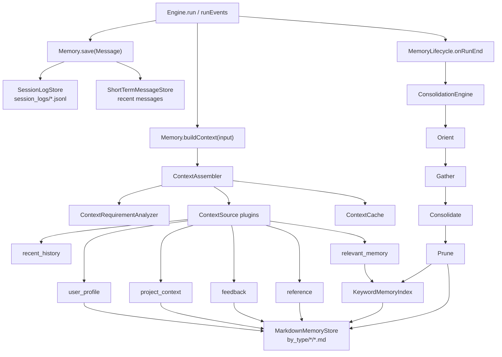

# MiniHarness 记忆与上下文子系统优化技术实现方案

> **给执行型 agent 的要求：** REQUIRED SUB-SKILL: Use superpowers:subagent-driven-development (recommended) or superpowers:executing-plans to implement this plan task-by-task. Steps use checkbox (`- [ ]`) syntax for tracking.

**目标：** 在保持现有 `Memory` 接口与 `Engine.run()` 调用方式兼容的前提下，把 MiniHarness 当前的消息级内存存储升级为可持久化、可检索、可整合、可观测的记忆与上下文子系统。

**架构：** 采用“兼容层 + 富记忆层 + 上下文组装层 + 后台整合层”的渐进方案。`Engine` 仍只依赖 `Memory`，但 `memory/` 内部新增 `MemoryEntry`、Markdown frontmatter 存储、关键词索引、上下文 source 插件、缓存和整合引擎，先用无新依赖的本地文件实现，后续再接入向量索引或数据库 adapter。

**技术栈：** TypeScript、Node.js `fs/promises`、现有 `yaml`、现有 `zod` 配置、Vitest、现有 `Logger`、现有 `RuntimeEvent`/`RunSnapshot`。

---

## 参考依据

本方案已阅读 `/Users/jojo/Desktop/all-agent/harness_engineering_guide/06_memory` 下的全部章节，并结合当前 MiniHarness 代码状态收敛：

- `README.md`：记忆子系统需要解决多层架构、可写入性、上下文组装、整合机制四个核心问题。
- `6.1_memory_architecture.md`：推荐三层记忆架构、三门触发、四阶段整合、短期会话缓存和长期索引。
- `6.2_writable_memory.md`：推荐 Markdown + YAML frontmatter、版本号、置信度、过期时间、原子写入和冲突处理。
- `6.3_context_assembly.md`：推荐静态/动态上下文分离、需求分析、并行检索、优先级排序、动态边界和 tag-based 缓存。
- `6.4_memory_consolidation.md`：推荐 Orient -> Gather -> Consolidate -> Prune 的自动整合管道，并保留原始记录以便回溯。
- `6.5_miniharness_memory.md`：给出 MiniHarness 适配方向：`MemoryEntry`、需求驱动组装、三门触发、四阶段整合。
- `summary.md`：强调自适应三层、混合检索、异步整合、索引维护和监控指标。

## 当前项目诊断

当前项目已经具备良好的最小边界：

- `src/core/memory.ts` 定义 `Memory.save/loadRecent/search/buildContext`。
- `src/memory/local-store.ts` 提供 `InMemoryStore`，适合测试和示例。
- `src/memory/context-builder.ts` 支持 system prompt、摘要、相关消息、最近消息、当前输入的固定顺序组装。
- `src/memory/summarizer.ts` 有确定性摘要器，便于测试。
- `configs/harness.yaml` 已预留 `memory.recentLimit/searchTopK/summary/context` 配置。
- `src/runtime/engine.ts` 已把所有消息写入 `memory`，模型调用前通过 `memory.buildContext()` 获取上下文。

主要差距：

1. **记忆粒度过粗**：当前只存 `Message`，没有长期 `MemoryEntry`、类型、标签、置信度、过期时间和版本。
2. **不可持久化**：`InMemoryStore` 进程退出即丢失，无法跨会话恢复。
3. **检索能力弱**：`search()` 只是字符串包含匹配，不支持按类型、标签、时间、置信度、优先级过滤。
4. **上下文组装不够选择性**：当前固定加载 recent + search，没有需求分析、source 插件、保护区、静态/动态缓存。
5. **摘要不等于整合**：`SimpleSummarizer` 只是拼接截断，不能把多轮对话沉淀成用户偏好、项目事实、反馈、参考资料。
6. **配置未完整接入**：`src/main.ts` 仍直接 `new InMemoryStore()`，没有用 `configs/harness.yaml` 中的 memory 配置。
7. **缺少生命周期钩子**：`Engine` 没有在会话结束或预算压力下通知 memory 执行整合。
8. **缺少可观测性**：无法知道上下文各部分贡献、搜索命中率、缓存命中率、整合耗时和记忆增长速度。

## 设计原则

1. **兼容优先**：保留 `Memory` 作为运行时接口；现有测试和示例默认仍可用 `InMemoryStore`。
2. **富记忆内聚在 `memory/`**：长期记忆、索引、缓存、整合逻辑不泄漏到 `runtime/` 和 `models/`。
3. **先文件后数据库**：第一阶段使用 Markdown frontmatter + JSONL 日志，避免引入 SQLite/原生向量库依赖；数据库 adapter 后续独立实现。
4. **确定性优先**：需求分析、关键词索引、整合初版用可测试启发式；LLM 整合和 embedding 通过接口预留。
5. **保护区不可截断**：system prompt、当前用户输入、最近关键消息永远优先保留，动态记忆只使用剩余预算。
6. **原始记录可回溯**：整合会生成长期记忆，但不直接删除原始 session log。
7. **按阶段交付**：先接入配置和持久化，再升级上下文组装，最后做自动整合与高级检索。

## 目标架构



运行时只知道 `Memory` 和可选生命周期钩子。`memory/` 内部负责把消息、长期条目、索引、缓存和整合连接起来。

## 数据模型

新增 `src/memory/types.ts`：

```ts
export type MemoryEntryType =
  | 'user'
  | 'feedback'
  | 'project'
  | 'reference'
  | 'episodic'
  | 'lesson';

export interface MemoryEntry {
  id: string;
  type: MemoryEntryType;
  content: string;
  tags: string[];
  confidence: number;
  version: number;
  createdAt: number;
  updatedAt: number;
  lastAccessedAt?: number;
  expiryAt?: number;
  sourceSessionId?: string;
  sourceMessageIds?: string[];
  metadata?: Record<string, unknown>;
}

export interface MemorySearchQuery {
  sessionId?: string;
  query: string;
  types?: MemoryEntryType[];
  tags?: string[];
  topK: number;
  minConfidence?: number;
  now?: number;
}

export interface MemorySearchHit {
  entry: MemoryEntry;
  score: number;
  reasons: string[];
}
```

类型映射：

| 类型 | 用途 | 默认保留策略 | 上下文优先级 |
|------|------|--------------|--------------|
| `user` | 用户偏好、工作方式、长期个人档案 | 不自动过期，低频更新 | 90 |
| `feedback` | 用户接受/拒绝的建议和原因 | 保留 180 天，低置信度可清理 | 85 |
| `project` | 当前项目架构、阶段、决策、关键文件 | 按项目活跃度清理 | 80 |
| `reference` | 可复用命令、模式、文档片段 | 长期保留，按访问更新 | 65 |
| `episodic` | 具体会话事件和最近摘要 | 30-90 天后整合或降权 | 55 |
| `lesson` | 错误教训、约束、失败恢复经验 | 置信度低时人工复核 | 75 |

## 存储设计

新增 `src/memory/markdown-store.ts`，实现 `MemoryEntryStore`：

```text
.miniharness/memory/
  by_type/
    user/
    feedback/
    project/
    reference/
    episodic/
    lesson/
  session_logs/
    <sessionId>.jsonl
  index/
    keyword.json
  state/
    consolidation.json
```

每个长期条目保存为 Markdown + YAML frontmatter：

```markdown
---
id: mem_abc123
type: project
version: 3
confidence: 0.86
tags:
  - runtime
  - memory
createdAt: 1782640000000
updatedAt: 1782640300000
sourceSessionId: default-session
sourceMessageIds:
  - msg_123
---

# 记忆内容

MiniHarness 的 runtime 入口是 `Engine.runEvents()`，memory 应保持接口兼容。
```

写入要求：

- 使用 `node:fs/promises` 写临时文件，再 `rename()` 原子替换。
- 写入前读取现有版本；`expectedVersion` 不匹配时抛出 `MemoryVersionConflictError`。
- 版本冲突第一阶段不自动 3-way merge，只返回清晰错误；第二阶段再实现行级合并。
- 删除只删除 entry 文件并同步移除索引，不删除 `session_logs`。
- 所有时间存毫秒时间戳，序列化时保持稳定顺序，方便快照测试和 git diff。

## 上下文组装设计

保留现有 `ContextBuilder` 名称作为兼容入口，但内部升级为三阶段：

```text
需求分析 -> 并行搜索 source -> 优先级排序 + 保护区裁剪
```

### 需求分析

新增 `src/memory/context-requirement.ts`：

```ts
export interface ContextRequirement {
  needsUserProfile: boolean;
  needsProjectContext: boolean;
  needsRecentHistory: boolean;
  needsReferences: boolean;
  needsFeedback: boolean;
  needsLessons: boolean;
  explicitTypes: MemoryEntryType[];
}
```

初版使用启发式关键词，覆盖英文和中文：

- 用户偏好：`prefer/style/habit/like/偏好/习惯/风格/记住`
- 项目上下文：`project/task/status/progress/项目/任务/进度/架构`
- 历史记录：`previous/before/last time/上次/之前/刚才/历史`
- 参考资料：`example/sample/pattern/how to/示例/模式/参考/怎么做`
- 反馈记录：`rejected/approved/feedback/拒绝/采纳/反馈`
- 教训经验：`bug/error/failure/lesson/错误/失败/教训`

无法识别时默认加载 `user`、`project` 和最近消息，避免冷启动上下文过薄。

### ContextSource 插件

新增 `src/memory/context-source.ts`：

```ts
export interface ContextSource {
  name: string;
  priority: number;
  tags: string[];
  shouldRun(requirement: ContextRequirement): boolean;
  load(input: ContextSourceInput): Promise<ContextSection | undefined>;
}
```

第一批 source：

- `SystemPromptSource`：系统提示，保护区。
- `ConversationSummarySource`：当前 recent 消息摘要，保护区之后。
- `RecentHistorySource`：最近 N 条消息。
- `RelevantMessageSource`：对话消息级检索，兼容现有 `Memory.search()`。
- `UserProfileSource`：读取 `type=user` 条目。
- `ProjectContextSource`：读取 `type=project` 条目。
- `FeedbackSource`：读取 `type=feedback` 条目。
- `ReferenceSource`：读取 `type=reference` 条目。
- `LessonSource`：读取 `type=lesson` 条目。

每个 source 独立失败时只记录 warning，不中断整体上下文组装。

### 保护区和预算

`ContextBuilderOptions` 扩展：

```ts
export interface ContextBudgetOptions {
  maxContextCharacters: number;
  protectedCharacters: number;
  minSectionCharacters: number;
}
```

组装顺序：

1. System prompt。
2. 当前用户输入。
3. 最近 1-2 条关键消息或摘要。
4. 按 source priority 填充动态区。
5. 超出预算时从低优先级 section 开始裁剪。

保护区内容不被动态记忆挤掉。当前项目已有 `BudgetManager` 的 token 估算，但 `ContextBuilder` 仍可先沿用字符预算，避免引入 tokenizer 依赖。

### 缓存策略

新增 `src/memory/context-cache.ts`：

- 静态缓存：`user`、`reference`、system prompt，默认 TTL 10 分钟。
- 动态缓存：`project`、`feedback`、`lesson`，默认 TTL 30 秒。
- 最近历史不缓存，直接从 message store 读取。
- `MemoryEntryStore.save/delete` 触发 tag 失效。

缓存 key 由 `sourceName + requirement + queryFingerprint + budget` 组成，避免不同预算复用同一裁剪结果。

## 整合设计

新增 `src/memory/consolidation.ts`：

```ts
export interface ConsolidationOptions {
  enabled: boolean;
  timeGateMs: number;
  sessionGate: number;
  contextUtilizationGate: number;
  minMessages: number;
  prune: {
    expiredEntries: boolean;
    lowConfidenceThreshold: number;
    staleDays: number;
  };
}
```

触发条件：

1. 时间门：距上次整合超过 `timeGateMs`，默认 24 小时。
2. 会话门：距上次整合完成至少 `sessionGate` 次 run，默认 5。
3. 显式门：用户输入包含 `保存进度`、`记住这个`、`consolidate`、`save progress` 等信号。
4. 压力门：上下文利用率超过 `contextUtilizationGate`，默认 0.7。

四阶段：

- **Orient**：分析最近 session log 的主题、涉及文件、错误、决策。
- **Gather**：提取用户偏好、项目更新、反馈、教训、参考资料候选。
- **Consolidate**：按类型写入 `MemoryEntry`，同类内容做关键词级去重。
- **Prune**：删除过期项，降权低置信度旧项，更新 `lastAccessedAt` 和索引。

第一阶段使用启发式提取，保证无模型依赖：

- 用户显式“记住/偏好/不要/以后”提取为 `user` 或 `feedback`。
- assistant 完成任务、修改文件、运行测试的摘要提取为 `project`。
- 错误、失败、重试和用户纠正提取为 `lesson`。
- 命令、配置片段、路径模式提取为 `reference`。

后续可注入 `Summarizer` 或 `ModelProvider` 做 LLM 辅助整合，但不能作为基础能力的硬依赖。

## Runtime 集成

`Engine` 的核心循环不应知道长期记忆细节，只增加一个可选生命周期钩子。

新增 `src/core/memory.ts` 可选接口：

```ts
export interface MemoryLifecycle {
  onRunEnd?(event: MemoryRunEndEvent): Promise<void>;
}

export interface MemoryRunEndEvent {
  sessionId: string;
  traceId: string;
  userMessage: Message;
  finalMessage?: Message;
  terminationReason?: string;
  snapshot?: Record<string, unknown>;
}
```

`Engine.runEvents()` 在 `agent_end` 前后调用：

- 成功结束：传入 `finalMessage` 和 `terminationReason: 'no_tool_calls'`。
- 预算、漂移、max steps 等异常：后续阶段再扩展 `onRunError`，第一阶段不改变异常路径。

`ConsolidatingMemory` 实现 `Memory & MemoryLifecycle`，内部包装：

- `messageStore`：当前会话消息读写。
- `entryStore`：长期 `MemoryEntry`。
- `contextBuilder`：上下文组装。
- `consolidationEngine`：按生命周期事件决定是否整合。

这样 `Engine` 只依赖可选接口，不直接导入 `memory/consolidation`。

## 配置设计

扩展 `configs/harness.yaml`：

```yaml
memory:
  type: local
  rootDir: .miniharness/memory
  recentLimit: 20
  searchTopK: 5
  summary:
    enabled: true
    maxSummaryCharacters: 500
  context:
    systemPrompt: You are MiniHarness Agent.
    maxContextCharacters: 12000
    protectedCharacters: 2000
    minSectionCharacters: 200
    cache:
      enabled: true
      staticTtlMs: 600000
      dynamicTtlMs: 30000
  consolidation:
    enabled: true
    timeGateMs: 86400000
    sessionGate: 5
    contextUtilizationGate: 0.7
    minMessages: 8
    prune:
      expiredEntries: true
      lowConfidenceThreshold: 0.3
      staleDays: 30
  index:
    keyword:
      enabled: true
      minTokenLength: 2
    vector:
      enabled: false
```

`src/utils/config.ts` 需要把 `memory` 从 passthrough 提升为 zod schema。`src/memory/factory.ts` 新增 `createMemory(config.memory)`，`src/main.ts` 改为使用 factory。

## 新增与修改文件

### 新增文件

- `src/memory/types.ts`
  - 定义 `MemoryEntry`、`MemoryEntryType`、搜索 query/result、上下文 section 类型。
- `src/memory/frontmatter.ts`
  - 负责 Markdown frontmatter parse/stringify，使用现有 `yaml`。
- `src/memory/entry-store.ts`
  - 定义 `MemoryEntryStore` 接口和版本冲突错误。
- `src/memory/markdown-store.ts`
  - 本地 Markdown frontmatter 持久化实现。
- `src/memory/session-log.ts`
  - JSONL 会话日志读写和最近会话摘要读取。
- `src/memory/keyword-index.ts`
  - 关键词倒排索引、增量更新、搜索融合评分。
- `src/memory/context-requirement.ts`
  - 需求分析启发式规则。
- `src/memory/context-source.ts`
  - source 插件接口和内置 source 实现。
- `src/memory/context-cache.ts`
  - TTL + tag 失效缓存。
- `src/memory/consolidation.ts`
  - 三门触发和四阶段整合。
- `src/memory/consolidating-memory.ts`
  - 组合 `Memory`、entry store、context builder、session log 和 consolidation。
- `src/memory/factory.ts`
  - 从配置创建 `InMemoryStore` 或 `ConsolidatingMemory`。

### 修改文件

- `src/core/memory.ts`
  - 增加可选 `MemoryLifecycle` 类型，不改变 `Memory` 必需方法。
- `src/memory/context-builder.ts`
  - 保持导出名，内部升级为 source-driven assembler。
- `src/memory/local-store.ts`
  - 保持测试用途，必要时暴露只读 session dump 给整合测试使用。
- `src/memory/summarizer.ts`
  - 保持 `Summarizer` 接口，增加 message window 辅助选项。
- `src/runtime/engine.ts`
  - 调用可选 `MemoryLifecycle.onRunEnd()`。
- `src/utils/config.ts`
  - 增加 memory zod schema 和默认值。
- `src/main.ts`
  - 使用 `createMemory(config.memory)`。
- `src/index.ts`
  - 导出新增 memory 模块。
- `configs/harness.yaml`
  - 补充 rootDir、consolidation、cache、index 配置。
- `README.md`
  - 更新 memory 当前能力、配置示例和持久化目录说明。

## 测试计划

新增测试：

- `tests/memory-frontmatter.test.ts`
  - frontmatter roundtrip、字段顺序、无 frontmatter 错误。
- `tests/markdown-memory-store.test.ts`
  - 保存、读取、版本递增、版本冲突、过期过滤、按类型列表。
- `tests/session-log.test.ts`
  - JSONL 追加、按 session 读取、损坏行跳过或报错策略。
- `tests/keyword-index.test.ts`
  - 索引增量更新、删除同步、关键词召回、分数稳定。
- `tests/context-requirement.test.ts`
  - 中英文关键词触发不同需求，未知查询默认加载 user/project/recent。
- `tests/context-cache.test.ts`
  - TTL 命中、过期、tag 失效、不同预算缓存隔离。
- `tests/context-assembler.test.ts`
  - source 优先级、单 source 失败降级、保护区不被裁剪、动态区裁剪。
- `tests/consolidation.test.ts`
  - 时间门、会话门、显式门、压力门；四阶段产出正确类型条目。
- `tests/memory-factory.test.ts`
  - `memory.type: local` 创建持久化 memory，缺省配置仍可启动。
- `tests/runtime-memory-lifecycle.test.ts`
  - `Engine.runEvents()` 成功结束时调用 `onRunEnd()`，失败路径不吞异常。

回归测试：

- `tests/memory.test.ts`
- `tests/context-builder.test.ts`
- `tests/runtime.test.ts`
- `tests/runtime-events.test.ts`
- `tests/runtime-budget.test.ts`

验证命令：

```bash
pnpm test tests/memory.test.ts tests/context-builder.test.ts
pnpm test tests/memory-frontmatter.test.ts tests/markdown-memory-store.test.ts tests/context-assembler.test.ts tests/consolidation.test.ts
pnpm typecheck
pnpm build
```

## 分阶段交付

### Phase 1: 配置接入与持久化 MemoryEntry

目标：

- 把 `memory` 配置纳入 zod schema。
- 新增 `MemoryEntry`、frontmatter、Markdown store、session log。
- `src/main.ts` 通过 `createMemory()` 创建 memory。
- 保持 `InMemoryStore` 作为测试和轻量模式。

验收：

- 不开启 consolidation 时，行为与当前 `InMemoryStore + ContextBuilder` 兼容。
- 本地运行后 `.miniharness/memory/session_logs/default-session.jsonl` 有会话日志。
- 长期条目可以 roundtrip，并保留版本和元数据。

### Phase 2: Source-driven ContextBuilder 与缓存

目标：

- 新增需求分析、ContextSource、ContextCache。
- 按 source priority 组装上下文。
- 引入保护区，避免当前输入和系统提示被裁掉。
- 保持现有 `ContextBuilder` 测试语义，必要时增加兼容 mode。

验收：

- 查询“上次项目进度”会加载 project + recent history。
- 查询“我的偏好”会加载 user profile。
- 单个 source 抛错时上下文仍可构建。
- 静态 source 缓存命中，entry 更新后 tag 失效。

### Phase 3: 自动整合与生命周期钩子

目标：

- 新增 `MemoryLifecycle.onRunEnd()`。
- `ConsolidatingMemory` 在 run 结束后写 session log 并判断是否整合。
- 实现三门触发 + 压力门。
- 实现 Orient/Gather/Consolidate/Prune 的启发式版本。

验收：

- 连续 5 次 run 后生成 project/episodic/lesson 等长期条目。
- 用户显式“记住这个”会立即触发 user/reference 写入。
- 过期项和低置信度旧项被 prune，但 session log 保留。
- 整合失败不影响主回复，错误通过 logger 记录。

### Phase 4: 检索增强与可观测性

目标：

- `KeywordMemoryIndex` 接入 context source。
- `ContextBuilder` 返回或记录每个 source 的贡献字符数、命中数、裁剪原因。
- 记录 memory metrics：memory size、context assembly latency、search hit rate、cache hit rate、consolidation latency。
- 预留 `EmbeddingIndex` 接口，但默认关闭。

验收：

- `searchTopK` 从长期 memory 中返回按 score 排序的结果。
- README 明确说明 vector index 仍是后续增强。
- 事件或 logger 中能看到每次上下文组装的 source 摘要。

## 不在本轮实现的内容

- 不引入 hnswlib/faiss/qdrant/pgvector。原因是当前项目强调轻量 TypeScript harness，原生依赖和外部服务会显著提高安装与 CI 成本。
- 不实现 SQLite adapter。README 中已有 SQLite 持久化待办，但第六章指南更偏向可审计的 Markdown frontmatter；SQLite 可作为后续 `MemoryEntryStore` adapter。
- 不让模型每轮都做需求分析。初版使用启发式，避免增加延迟和模型调用成本。
- 不实现复杂 3-way merge。第一版用版本冲突错误保护一致性，后续可在 `markdown-store` 内加行级 merge。
- 不删除原始 session log。整合只产生长期条目和 prune entry，原始日志按保留策略另行清理。

## 风险与缓解

| 风险 | 影响 | 缓解 |
|------|------|------|
| context builder 复杂度上升 | 测试难度和维护成本增加 | source 插件小文件化，每个 source 独立测试 |
| 启发式提取漏掉重要信息 | 长期记忆质量不稳定 | 保留 session log；后续可接入 LLM summarizer |
| 文件并发写冲突 | 多 run 同时写 memory 可能失败 | 原子写 + version check；冲突显式报错 |
| 上下文噪音增加 | 模型表现下降 | 需求分析 + source priority + protected boundary + hit metrics |
| 缓存陈旧 | 注入过期用户或项目上下文 | tag-based invalidation + 短 TTL |
| 整合阻塞主流程 | 用户请求延迟增加 | `onRunEnd()` 内部捕获错误，后续可放入后台队列 |

## 推荐实施顺序

1. 先做 Phase 1，让 memory 配置真正生效，并建立可审计的长期存储。
2. 再做 Phase 2，解决上下文质量问题，这是对模型表现最直接的提升。
3. Phase 3 在前两阶段稳定后接入，避免一开始就把整合和检索问题混在一起。
4. Phase 4 作为性能和质量增强，等有真实 memory 数据后再调参数。

这个顺序能保持现有运行时 API 稳定，同时逐步把指南中的三层记忆、可写入式记忆、三阶段上下文组装和四阶段整合落到当前 MiniHarness 项目中。
