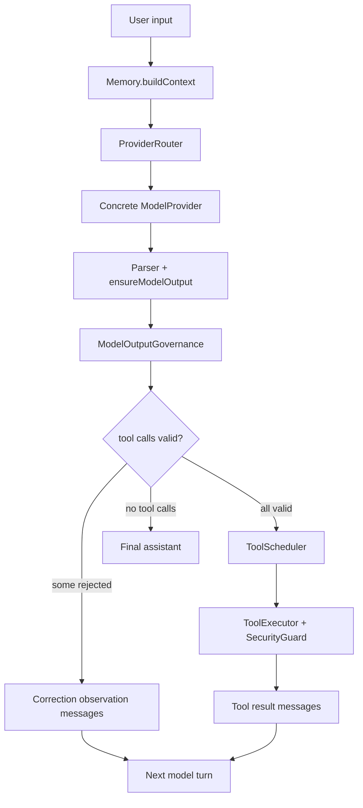

# MiniHarness 模型集成与输出治理优化实现计划

> **给执行型 agent 的要求：** REQUIRED SUB-SKILL: Use superpowers:subagent-driven-development (recommended) or superpowers:executing-plans to implement this plan task-by-task. Steps use checkbox (`- [ ]`) syntax for tracking.

**目标：** 在现有 MiniHarness TypeScript 架构上，补齐模型 Provider 路由、结构化输出治理、工具调用幻觉检测、治理事件、推理预算和独立评估能力。

**架构：** 保持 `Engine` 只依赖 `ModelProvider`、`Memory`、`ToolRegistry` 的主边界不变。新增模型路由器作为 `ModelProvider` 包装层，新增输出治理层插入在 `model_message` 与 `ToolScheduler` 之间，新增推理预算与评估器作为可配置增强能力。

**技术栈：** TypeScript、Vitest、zod、现有 `ModelProvider` / `ToolRegistry` / `ToolExecutor` / `EngineEvent` / YAML 配置。

---

## 参考依据

本方案已阅读 `/Users/jojo/Desktop/all-agent/harness_engineering_guide/07_model_integration` 下全部章节，并结合当前项目实现做收敛：

- `7.1_model_abstraction.md`：Provider 抽象、配置驱动、多模型故障转移、熔断器。
- `7.2_output_parsing.md`：文本、工具调用、思考块等结构化内容解析，以及流式增量解析。
- `7.3_quality_gate.md`：格式、工具存在性、参数、业务、权限、注入六层质量门控，以及 Planner / Generator / Evaluator 三角色分离。
- `7.4_hallucination_detection.md`：工具名、参数、事实三层幻觉检测和自修正提示。
- `7.5_reasoning_budget.md`：思考策略、任务复杂度、会话级推理预算、思考质量观测。
- `7.6_miniharness_output.md`：MiniHarness 从模型选择到响应解析、幻觉检测、质量门控、工具执行的完整链路。
- `summary.md`：防御深度、故障隔离、成本意识、用户友好、可观测性和灵活性原则。

## 当前项目诊断

### 已具备能力

- `src/core/model.ts` 已有统一 `ModelProvider.chat()` 与可选 `stream()` 接口。
- `src/models/openai-provider.ts` 支持 OpenAI Responses API。
- `src/models/chat-completions-provider.ts` 支持 DeepSeek 等 Chat Completions 兼容 Provider。
- `src/models/parser.ts` 与 `src/models/chat-completions-parser.ts` 能把外部响应转换为内部 `ModelChatOutput`。
- `src/models/provider-factory.ts` 已通过 `configs/harness.yaml` 创建 `mock`、`openai`、`deepseek` provider。
- `src/runtime/engine.ts` 已有模型重试、运行时预算、漂移检测、工具调度和事件流。
- `src/tools/executor.ts` 已在工具执行前调用 `SecurityGuard` 并执行输入校验。
- `src/tools/validation.ts` 已支持 JSON Schema 子集校验。
- `src/orchestration` 已有 planner、coordinator、task graph，可承接后续 PGE 流程。

### 主要缺口

| 缺口 | 当前表现 | 风险 |
|---|---|---|
| Provider 选择偏静态 | `createModelProvider()` 只按单个 `model.provider` switch | 单供应商超时、限流或故障时只能失败，不能透明回退 |
| 解析结果过扁平 | `ModelChatOutput` 只有 `message` 和 `usage` | 无法表达 `finishReason`、思考 token、provider 原始警告和解析告警 |
| 输出质量门控太薄 | `ensureModelOutput()` 只拒绝空响应 | 不存在工具、异常参数、注入内容进入工具调度后才失败 |
| 工具幻觉未治理 | 缺失工具在 runtime 中直接抛 `ToolNotFoundError` | 模型无法收到结构化纠正信息，容易重试失败路径 |
| 参数校验能力不足 | schema 子集只覆盖 required、type、enum、additionalProperties | 不能处理 min/max、长度、pattern、数组元素等常见约束 |
| 权限门控位置偏后 | 权限在 `ToolExecutor` 内发生 | 无统一输出治理报告，UI 和日志无法提前看到拒绝原因 |
| 推理预算缺失 | `runtime/budget.ts` 只管模型调用数和 token 粗估 | 无法按复杂任务决定 reasoning 策略，也无法观测 thinking token |
| 治理事件缺失 | `EngineEvent` 没有 output gate / correction 事件 | 难以调试模型输出为何被拒绝或纠正 |
| PGE 未落地 | orchestration 有角色调度，但模型生成和独立评估没有标准接口 | 复杂任务仍依赖模型自评，容易确认偏差 |

## 推荐路线

优先采用增量方案，不重写现有 provider、runtime 和工具层。

1. **第一阶段：输出治理先行。** 在模型输出进入工具调度前增加 `ModelOutputGovernance`，覆盖工具调用格式、工具存在性、参数 schema、注入模式和纠正建议。
2. **第二阶段：Provider 路由。** 新增 `ProviderRouter` 实现 `ModelProvider`，在不改 `Engine` 的情况下提供 fallback chain、熔断器和 provider 健康状态。
3. **第三阶段：推理预算。** 扩展 `ModelOptions`、`TokenUsage` 和 config，先做 provider 无关的策略决策和 usage 观测。
4. **第四阶段：PGE 评估。** 基于现有 orchestration 增加可选 `Evaluator`，对高风险输出做独立评估。

## 目标链路



治理层不替代 `ToolExecutor` 的权限与执行保护。它负责在执行前形成结构化判断，`ToolExecutor` 继续作为最后防线。

## 文件结构

- Create: `src/models/output-governance.ts`
  - 输出治理入口，校验 assistant 工具调用并生成治理报告、纠正观察消息。
- Create: `src/models/hallucination.ts`
  - 工具名相似度、未知参数、范围和枚举幻觉检测。
- Create: `src/models/provider-router.ts`
  - `ModelProvider` 包装器，串联 primary 和 fallback providers。
- Create: `src/models/circuit-breaker.ts`
  - closed / open / half-open 熔断器状态机。
- Create: `src/models/reasoning-budget.ts`
  - reasoning 策略、复杂度评估、usage 记录和是否启用 reasoning 的决策。
- Modify: `src/core/model.ts`
  - 扩展 `ModelOptions`、`TokenUsage`、`ModelChatOutput` 的可选治理元数据。
- Modify: `src/runtime/engine.ts`
  - 在 `model_message` 后、`tool_start` 前接入输出治理层。
- Modify: `src/runtime/events.ts`
  - 增加 `output_governance` 与 `model_correction` 事件。
- Modify: `src/tools/validation.ts`
  - 扩展 JSON Schema 子集校验。
- Modify: `src/utils/config.ts`
  - 增加 `model.selection`、`model.reasoning`、`outputGovernance` 配置 schema。
- Modify: `src/models/provider-factory.ts`
  - 根据配置返回普通 provider 或 `ProviderRouter`。
- Modify: `configs/harness.yaml`
  - 增加默认关闭的 provider selection 和默认开启的轻量 output governance 配置。
- Test: `tests/output-governance.test.ts`
  - 覆盖格式、工具存在、参数、注入、纠正消息。
- Test: `tests/runtime-output-governance.test.ts`
  - 覆盖 Engine 在治理拒绝后的 `throw` 与 `observe` 行为。
- Test: `tests/provider-router.test.ts`
  - 覆盖 fallback、熔断、恢复探测。
- Test: `tests/reasoning-budget.test.ts`
  - 覆盖 reasoning 策略和 session 统计。

## 配置设计

建议在 `configs/harness.yaml` 中新增：

```yaml
model:
  provider: deepseek
  selection:
    enabled: false
    failureThreshold: 3
    resetTimeoutMs: 60000
    fallbackChain: []
  reasoning:
    strategy: disabled # disabled | adaptive | budget_based | required
    complexityThreshold: medium
    maxReasoningTokensPerSession: 100000
    maxReasoningCostPerSession: 0

outputGovernance:
  enabled: true
  mode: observe # throw | observe | self_correct
  maxCorrectionTurns: 1
  allowUnknownTools: false
  strictAdditionalProperties: true
  injectionPatterns:
    - "rm -rf"
    - "DROP TABLE"
    - "<script"
    - "${jndi:"
```

默认建议：

- `outputGovernance.enabled: true`，因为它只影响模型工具调用，不影响无工具的普通回复。
- `outputGovernance.mode: observe`，让模型收到纠正观察，降低直接失败率。
- `model.selection.enabled: false`，避免初次引入多 provider 时改变当前运行行为。
- `model.reasoning.strategy: disabled`，等 usage 统计和 provider 支持完善后再启用。

## Task 1: 输出治理数据结构

**Files:**
- Create: `src/models/output-governance.ts`
- Test: `tests/output-governance.test.ts`

- [ ] **Step 1: 写失败测试**

```ts
import { describe, expect, it } from 'vitest';
import type { Message } from '../src/core';
import { EchoTool } from '../src/tools/builtin/echo';
import { DefaultToolRegistry } from '../src/tools/registry';
import { ModelOutputGovernance } from '../src/models/output-governance';

function assistant(toolCalls: Message['toolCalls']): Message {
  return {
    id: 'assistant_1',
    role: 'assistant',
    content: '',
    toolCalls,
    createdAt: Date.now(),
  };
}

describe('ModelOutputGovernance', () => {
  it('passes registered tool calls with valid arguments', () => {
    const registry = new DefaultToolRegistry();
    registry.register(new EchoTool());
    const gate = new ModelOutputGovernance(registry, { enabled: true, mode: 'throw' });

    const report = gate.validateAssistantMessage(
      assistant([{ id: 'call_1', name: 'echo', arguments: { text: 'hello' } }]),
    );

    expect(report.passed).toBe(true);
    expect(report.acceptedToolCalls).toHaveLength(1);
    expect(report.rejectedToolCalls).toHaveLength(0);
  });

  it('rejects unknown tools with a correction suggestion', () => {
    const registry = new DefaultToolRegistry();
    registry.register(new EchoTool());
    const gate = new ModelOutputGovernance(registry, { enabled: true, mode: 'observe' });

    const report = gate.validateAssistantMessage(
      assistant([{ id: 'call_1', name: 'ech', arguments: { text: 'hello' } }]),
    );

    expect(report.passed).toBe(false);
    expect(report.rejectedToolCalls[0]).toMatchObject({
      toolCallId: 'call_1',
      toolName: 'ech',
      code: 'UNKNOWN_TOOL',
    });
    expect(report.rejectedToolCalls[0]?.suggestion).toContain('echo');
  });
});
```

- [ ] **Step 2: 运行测试确认失败**

Run: `pnpm vitest run tests/output-governance.test.ts`

Expected: FAIL，错误包含 `Cannot find module '../src/models/output-governance'`。

- [ ] **Step 3: 添加最小类型和实现**

```ts
import type { Message, ToolCall, ToolRegistry } from '../core';

export type OutputGovernanceMode = 'throw' | 'observe' | 'self_correct';

export interface OutputGovernanceOptions {
  enabled: boolean;
  mode: OutputGovernanceMode;
  allowUnknownTools?: boolean;
  strictAdditionalProperties?: boolean;
  injectionPatterns?: string[];
}

export interface RejectedToolCall {
  toolCallId: string;
  toolName: string;
  code:
    | 'INVALID_TOOL_CALL'
    | 'UNKNOWN_TOOL'
    | 'INVALID_ARGUMENTS'
    | 'INJECTION_DETECTED';
  message: string;
  suggestion?: string;
}

export interface OutputGovernanceReport {
  passed: boolean;
  acceptedToolCalls: ToolCall[];
  rejectedToolCalls: RejectedToolCall[];
}

export class ModelOutputGovernance {
  constructor(
    private readonly registry: ToolRegistry,
    private readonly options: OutputGovernanceOptions,
  ) {}

  validateAssistantMessage(message: Message): OutputGovernanceReport {
    const toolCalls = message.toolCalls ?? [];
    const acceptedToolCalls: ToolCall[] = [];
    const rejectedToolCalls: RejectedToolCall[] = [];

    if (!this.options.enabled) {
      return { passed: true, acceptedToolCalls: toolCalls, rejectedToolCalls };
    }

    for (const toolCall of toolCalls) {
      if (!toolCall.id || !toolCall.name || !isRecord(toolCall.arguments)) {
        rejectedToolCalls.push({
          toolCallId: toolCall.id,
          toolName: toolCall.name,
          code: 'INVALID_TOOL_CALL',
          message: 'Tool call must include id, name, and object arguments.',
        });
        continue;
      }

      const tool = this.registry.get(toolCall.name);
      if (!tool && !this.options.allowUnknownTools) {
        rejectedToolCalls.push({
          toolCallId: toolCall.id,
          toolName: toolCall.name,
          code: 'UNKNOWN_TOOL',
          message: `Tool '${toolCall.name}' is not registered.`,
          suggestion: suggestToolName(toolCall.name, this.registry.list().map((item) => item.name)),
        });
        continue;
      }

      acceptedToolCalls.push(toolCall);
    }

    return {
      passed: rejectedToolCalls.length === 0,
      acceptedToolCalls,
      rejectedToolCalls,
    };
  }
}

function isRecord(value: unknown): value is Record<string, unknown> {
  return typeof value === 'object' && value !== null && !Array.isArray(value);
}

function suggestToolName(name: string, available: string[]): string | undefined {
  const best = available
    .map((candidate) => ({ candidate, score: similarity(name, candidate) }))
    .sort((left, right) => right.score - left.score)[0];

  return best && best.score >= 0.6
    ? `Use '${best.candidate}' instead of '${name}'.`
    : available.length
      ? `Available tools: ${available.slice(0, 5).join(', ')}`
      : undefined;
}

function similarity(left: string, right: string): number {
  if (left === right) {
    return 1;
  }

  const maxLength = Math.max(left.length, right.length);
  if (maxLength === 0) {
    return 1;
  }

  const distance = levenshtein(left, right);
  return (maxLength - distance) / maxLength;
}

function levenshtein(left: string, right: string): number {
  const rows = Array.from({ length: left.length + 1 }, (_, index) => [index]);

  for (let column = 1; column <= right.length; column++) {
    rows[0][column] = column;
  }

  for (let row = 1; row <= left.length; row++) {
    for (let column = 1; column <= right.length; column++) {
      const cost = left[row - 1] === right[column - 1] ? 0 : 1;
      rows[row][column] = Math.min(
        rows[row - 1][column] + 1,
        rows[row][column - 1] + 1,
        rows[row - 1][column - 1] + cost,
      );
    }
  }

  return rows[left.length][right.length];
}
```

- [ ] **Step 4: 运行测试确认通过**

Run: `pnpm vitest run tests/output-governance.test.ts`

Expected: PASS，2 tests pass。

## Task 2: 参数校验和注入检测

**Files:**
- Modify: `src/tools/validation.ts`
- Modify: `src/models/output-governance.ts`
- Test: `tests/output-governance.test.ts`

- [ ] **Step 1: 增加失败测试**

```ts
it('rejects invalid tool arguments before execution', () => {
  const registry = new DefaultToolRegistry();
  registry.register(new EchoTool());
  const gate = new ModelOutputGovernance(registry, { enabled: true, mode: 'observe' });

  const report = gate.validateAssistantMessage(
    assistant([{ id: 'call_1', name: 'echo', arguments: {} }]),
  );

  expect(report.passed).toBe(false);
  expect(report.rejectedToolCalls[0]?.code).toBe('INVALID_ARGUMENTS');
});

it('rejects string arguments containing injection patterns', () => {
  const registry = new DefaultToolRegistry();
  registry.register(new EchoTool());
  const gate = new ModelOutputGovernance(registry, {
    enabled: true,
    mode: 'observe',
    injectionPatterns: ['rm -rf'],
  });

  const report = gate.validateAssistantMessage(
    assistant([{ id: 'call_1', name: 'echo', arguments: { text: 'rm -rf /' } }]),
  );

  expect(report.passed).toBe(false);
  expect(report.rejectedToolCalls[0]?.code).toBe('INJECTION_DETECTED');
});
```

- [ ] **Step 2: 运行测试确认失败**

Run: `pnpm vitest run tests/output-governance.test.ts`

Expected: FAIL，第一个测试仍被接受，第二个测试仍被接受。

- [ ] **Step 3: 在治理层调用现有校验器**

在 `src/models/output-governance.ts` 中导入并使用：

```ts
import { formatValidationIssues, validateToolInput } from '../tools/validation';
```

在确认 `tool` 存在后加入：

```ts
const validation = validateToolInput(tool, toolCall.arguments);
if (!validation.ok) {
  rejectedToolCalls.push({
    toolCallId: toolCall.id,
    toolName: toolCall.name,
    code: 'INVALID_ARGUMENTS',
    message: formatValidationIssues(validation.issues ?? []),
    suggestion: `Use the schema for '${toolCall.name}' and regenerate arguments.`,
  });
  continue;
}

const injection = findInjection(toolCall.arguments, this.options.injectionPatterns ?? []);
if (injection) {
  rejectedToolCalls.push({
    toolCallId: toolCall.id,
    toolName: toolCall.name,
    code: 'INJECTION_DETECTED',
    message: `Argument '${injection.path}' contains dangerous pattern '${injection.pattern}'.`,
    suggestion: 'Remove command, SQL, script, or template injection content from tool arguments.',
  });
  continue;
}
```

新增递归扫描：

```ts
function findInjection(
  value: unknown,
  patterns: string[],
  path = '$',
): { path: string; pattern: string } | undefined {
  if (typeof value === 'string') {
    const pattern = patterns.find((item) =>
      value.toLowerCase().includes(item.toLowerCase()),
    );
    return pattern ? { path, pattern } : undefined;
  }

  if (Array.isArray(value)) {
    for (const [index, item] of value.entries()) {
      const result = findInjection(item, patterns, `${path}[${index}]`);
      if (result) {
        return result;
      }
    }
  }

  if (isRecord(value)) {
    for (const [key, item] of Object.entries(value)) {
      const result = findInjection(item, patterns, `${path}.${key}`);
      if (result) {
        return result;
      }
    }
  }

  return undefined;
}
```

- [ ] **Step 4: 扩展 JSON Schema 子集**

在 `src/tools/validation.ts` 的 `validateField()` 中补充：

```ts
if (typeof value === 'number') {
  if (typeof schema.minimum === 'number' && value < schema.minimum) {
    issues.push({ path, message: `must be >= ${schema.minimum}` });
  }
  if (typeof schema.maximum === 'number' && value > schema.maximum) {
    issues.push({ path, message: `must be <= ${schema.maximum}` });
  }
}

if (typeof value === 'string') {
  if (typeof schema.minLength === 'number' && value.length < schema.minLength) {
    issues.push({ path, message: `length must be >= ${schema.minLength}` });
  }
  if (typeof schema.maxLength === 'number' && value.length > schema.maxLength) {
    issues.push({ path, message: `length must be <= ${schema.maxLength}` });
  }
  if (typeof schema.pattern === 'string' && !new RegExp(schema.pattern).test(value)) {
    issues.push({ path, message: `must match pattern ${schema.pattern}` });
  }
}
```

- [ ] **Step 5: 运行测试确认通过**

Run: `pnpm vitest run tests/output-governance.test.ts tests/tool-executor.test.ts tests/tool.test.ts`

Expected: PASS，输出治理新增测试通过，现有工具校验测试不回归。

## Task 3: Engine 接入输出治理

**Files:**
- Modify: `src/runtime/engine.ts`
- Modify: `src/runtime/events.ts`
- Test: `tests/runtime-output-governance.test.ts`

- [ ] **Step 1: 写失败测试**

```ts
import { describe, expect, it } from 'vitest';
import type { Message, ModelChatInput, ModelChatOutput, ModelProvider } from '../src/core';
import { InMemoryStore } from '../src/memory/local-store';
import { Engine } from '../src/runtime/engine';
import { DefaultToolRegistry } from '../src/tools/registry';
import { ModelOutputGovernance } from '../src/models/output-governance';

class OneShotProvider implements ModelProvider {
  name = 'oneshot';
  constructor(private readonly output: Message) {}
  async chat(_input: ModelChatInput): Promise<ModelChatOutput> {
    return { message: this.output };
  }
}

describe('Engine output governance', () => {
  it('emits governance errors before missing tools execute', async () => {
    const provider = new OneShotProvider({
      id: 'assistant_1',
      role: 'assistant',
      content: '',
      toolCalls: [{ id: 'call_1', name: 'missing', arguments: {} }],
      createdAt: Date.now(),
    });
    const registry = new DefaultToolRegistry();
    const governance = new ModelOutputGovernance(registry, { enabled: true, mode: 'throw' });
    const engine = new Engine(provider, new InMemoryStore(), registry, {
      maxSteps: 4,
      requestTimeoutMs: 1000,
      enableStream: false,
      outputGovernance: governance,
    });

    const events = [];
    await expect(async () => {
      for await (const event of engine.runEvents('hello', 'session_1')) {
        events.push(event.type);
      }
    }).rejects.toThrow("Tool 'missing' is not registered.");

    expect(events).toContain('output_governance');
    expect(events).not.toContain('tool_start');
  });
});
```

- [ ] **Step 2: 运行测试确认失败**

Run: `pnpm vitest run tests/runtime-output-governance.test.ts`

Expected: FAIL，`outputGovernance` 不是 `EngineOptions` 字段或事件类型不存在。

- [ ] **Step 3: 扩展事件协议**

在 `src/runtime/events.ts` 中新增：

```ts
export type EngineEventType =
  | 'agent_start'
  | 'turn_start'
  | 'model_start'
  | 'model_delta'
  | 'model_message'
  | 'output_governance'
  | 'model_correction'
  | 'tool_start'
  | 'tool_result'
  | 'turn_end'
  | 'agent_end'
  | 'runtime_error';

export interface OutputGovernanceEvent extends BaseEngineEvent {
  type: 'output_governance';
  passed: boolean;
  acceptedToolCallCount: number;
  rejectedToolCallCount: number;
}

export interface ModelCorrectionEvent extends BaseEngineEvent {
  type: 'model_correction';
  toolCallId: string;
  toolName: string;
  message: string;
}
```

并把两个接口加入 `EngineEvent` union。

- [ ] **Step 4: 扩展 EngineOptions 并接入 gate**

在 `src/runtime/engine.ts` 中增加 import：

```ts
import type { ModelOutputGovernance } from '../models/output-governance';
```

扩展 options：

```ts
export interface EngineOptions {
  maxSteps: number;
  requestTimeoutMs: number;
  enableStream: boolean;
  maxConcurrentTools?: number;
  toolErrorMode?: ToolErrorMode;
  toolTimeoutMs?: number;
  modelRetry?: RetryPolicyOptions;
  budget?: Partial<RuntimeBudget>;
  drift?: DriftGuardOptions;
  outputGovernance?: ModelOutputGovernance;
}
```

在 `model_message` 事件之后、判断 `toolCalls` 之前加入。注意保留 `assistantMessage.toolCalls` 原值用于对话上下文一致性，后续工具调度改用局部变量 `executableToolCalls`：

```ts
const originalToolCalls = assistantMessage.toolCalls ?? [];
let executableToolCalls = originalToolCalls;
const governanceReport =
  this.options.outputGovernance?.validateAssistantMessage(assistantMessage);

if (governanceReport) {
  yield createEngineEvent({
    type: 'output_governance',
    sessionId,
    traceId: state.traceId,
    passed: governanceReport.passed,
    acceptedToolCallCount: governanceReport.acceptedToolCalls.length,
    rejectedToolCallCount: governanceReport.rejectedToolCalls.length,
    snapshot: snapshotRunState(state),
    metadata: { rejectedToolCalls: governanceReport.rejectedToolCalls },
  });

  if (!governanceReport.passed && this.options.outputGovernance.mode === 'throw') {
    const first = governanceReport.rejectedToolCalls[0];
    state.terminationReason = 'error';
    throw new Error(first?.message ?? 'Model output governance failed');
  }

  if (governanceReport.passed) {
    executableToolCalls = governanceReport.acceptedToolCalls;
  }
}
```

为读取 `mode`，给 `ModelOutputGovernance` 增加：

```ts
get mode(): OutputGovernanceMode {
  return this.options.mode;
}
```

然后把本轮后续读取 `assistantMessage.toolCalls` 的调度路径改为读取 `executableToolCalls`：

```ts
if (originalToolCalls.length === 0) {
  // 保留现有“无工具调用即结束”的逻辑。
}

for (const toolCall of executableToolCalls) {
  // 发出 tool_start。
}

toolResults = await scheduler.executeAll(executableToolCalls, {
  traceId: assistantMessage.id,
  sessionId,
  abortSignal: runOptions.abortSignal,
});

driftGuard.recordToolCalls(executableToolCalls);
```

- [ ] **Step 5: 运行测试确认通过**

Run: `pnpm vitest run tests/runtime-output-governance.test.ts`

Expected: PASS，治理拒绝发生在 `tool_start` 之前。

## Task 4: observe 模式自修正消息

**Files:**
- Modify: `src/models/output-governance.ts`
- Modify: `src/runtime/engine.ts`
- Test: `tests/runtime-output-governance.test.ts`

- [ ] **Step 1: 写失败测试**

```ts
it('turns rejected calls into tool observations in observe mode', async () => {
  const outputs: Message[] = [
    {
      id: 'assistant_1',
      role: 'assistant',
      content: '',
      toolCalls: [{ id: 'call_1', name: 'missing', arguments: {} }],
      createdAt: Date.now(),
    },
    {
      id: 'assistant_2',
      role: 'assistant',
      content: 'final',
      createdAt: Date.now(),
    },
  ];
  const provider: ModelProvider = {
    name: 'sequence',
    async chat(input) {
      const output = outputs.shift();
      if (!output) throw new Error('No output');
      if (output.id === 'assistant_2') {
        expect(input.messages.at(-1)).toMatchObject({
          role: 'tool',
          metadata: { success: false, errorCode: 'UNKNOWN_TOOL' },
        });
      }
      return { message: output };
    },
  };
  const registry = new DefaultToolRegistry();
  const governance = new ModelOutputGovernance(registry, { enabled: true, mode: 'observe' });
  const engine = new Engine(provider, new InMemoryStore(), registry, {
    maxSteps: 4,
    requestTimeoutMs: 1000,
    enableStream: false,
    outputGovernance: governance,
  });

  await expect(engine.run('hello', 'session_1')).resolves.toMatchObject({
    role: 'assistant',
    content: 'final',
  });
});
```

- [ ] **Step 2: 添加观察消息构造**

在 `src/models/output-governance.ts` 中加入：

```ts
export function createGovernanceObservation(rejection: RejectedToolCall): Message {
  return {
    id: rejection.toolCallId,
    role: 'tool',
    content: [
      `Model output rejected: ${rejection.message}`,
      rejection.suggestion ? `Suggestion: ${rejection.suggestion}` : '',
    ]
      .filter(Boolean)
      .join('\n'),
    createdAt: Date.now(),
    metadata: {
      toolCallId: rejection.toolCallId,
      toolName: rejection.toolName,
      success: false,
      errorCode: rejection.code,
      errorName: 'OutputGovernanceError',
    },
  };
}
```

- [ ] **Step 3: Engine observe 模式追加纠正消息**

在治理失败且 `mode === 'observe'` 时，先让现有逻辑保存原始 `assistantMessage`，再追加拒绝调用对应的 tool 观察消息。不要从 `assistantMessage.toolCalls` 中删除 rejected call，因为 Chat Completions 的 tool message 需要能对应上一条 assistant tool call。

```ts
const correctionMessages = governanceReport.rejectedToolCalls.map(
  createGovernanceObservation,
);

for (const message of correctionMessages) {
  messages.push(message);
  await this.memory.save(sessionId, message);
  state.messages.push(message);

  yield createEngineEvent({
    type: 'model_correction',
    sessionId,
    traceId: state.traceId,
    toolCallId: String(message.metadata?.toolCallId ?? message.id),
    toolName: String(message.metadata?.toolName ?? ''),
    message: message.content,
    snapshot: snapshotRunState(state),
  });
}

executableToolCalls = governanceReport.acceptedToolCalls;

if (executableToolCalls.length === 0) {
  state.step = step + 1;
  yield createEngineEvent({
    type: 'turn_end',
    sessionId,
    traceId: state.traceId,
    step,
    toolCallCount: 0,
    snapshot: snapshotRunState(state),
  });
  continue;
}
```

- [ ] **Step 4: 运行测试确认通过**

Run: `pnpm vitest run tests/runtime-output-governance.test.ts tests/runtime.test.ts`

Expected: PASS，observe 模式能把治理失败反馈给下一轮模型，现有 runtime 行为不回归。

## Task 5: Provider Router 和熔断器

**Files:**
- Create: `src/models/circuit-breaker.ts`
- Create: `src/models/provider-router.ts`
- Modify: `src/models/provider-factory.ts`
- Test: `tests/provider-router.test.ts`

- [ ] **Step 1: 写失败测试**

```ts
import { describe, expect, it } from 'vitest';
import { ModelProviderError, type ModelProvider } from '../src/core';
import { ProviderRouter } from '../src/models/provider-router';

function provider(name: string, behavior: 'pass' | 'fail'): ModelProvider {
  return {
    name,
    async chat() {
      if (behavior === 'fail') {
        throw new ModelProviderError(`${name} failed`, 'MODEL_FAILED', { retryable: true });
      }
      return {
        message: {
          id: `msg_${name}`,
          role: 'assistant',
          content: name,
          createdAt: Date.now(),
        },
      };
    },
  };
}

describe('ProviderRouter', () => {
  it('falls back to the next provider when primary fails', async () => {
    const router = new ProviderRouter({
      providers: [provider('primary', 'fail'), provider('fallback', 'pass')],
      failureThreshold: 1,
      resetTimeoutMs: 60000,
    });

    await expect(router.chat({ messages: [] })).resolves.toMatchObject({
      message: { content: 'fallback' },
    });
  });
});
```

- [ ] **Step 2: 实现熔断器**

```ts
export type CircuitBreakerState = 'closed' | 'open' | 'half-open';

export class CircuitBreaker {
  private failureCount = 0;
  private openedAt = 0;
  private stateValue: CircuitBreakerState = 'closed';

  constructor(
    private readonly failureThreshold: number,
    private readonly resetTimeoutMs: number,
    private readonly now: () => number = Date.now,
  ) {}

  get state(): CircuitBreakerState {
    return this.stateValue;
  }

  isAvailable(): boolean {
    if (this.stateValue === 'closed') return true;
    if (this.stateValue === 'half-open') return true;
    if (this.now() - this.openedAt >= this.resetTimeoutMs) {
      this.stateValue = 'half-open';
      return true;
    }
    return false;
  }

  recordSuccess(): void {
    this.failureCount = 0;
    this.stateValue = 'closed';
  }

  recordFailure(): void {
    this.failureCount++;
    if (this.failureCount >= this.failureThreshold) {
      this.stateValue = 'open';
      this.openedAt = this.now();
    }
  }
}
```

- [ ] **Step 3: 实现 ProviderRouter**

```ts
import type { ModelChatInput, ModelChatOutput, ModelProvider } from '../core';
import { ModelProviderError } from '../core';
import { CircuitBreaker } from './circuit-breaker';

export interface ProviderRouterOptions {
  providers: ModelProvider[];
  failureThreshold: number;
  resetTimeoutMs: number;
}

export class ProviderRouter implements ModelProvider {
  name = 'provider-router';
  private readonly breakers: Map<string, CircuitBreaker>;

  constructor(private readonly options: ProviderRouterOptions) {
    this.breakers = new Map(
      options.providers.map((provider) => [
        provider.name,
        new CircuitBreaker(options.failureThreshold, options.resetTimeoutMs),
      ]),
    );
  }

  async chat(input: ModelChatInput): Promise<ModelChatOutput> {
    const errors: unknown[] = [];

    for (const provider of this.options.providers) {
      const breaker = this.breakers.get(provider.name);
      if (!breaker?.isAvailable()) {
        continue;
      }

      try {
        const output = await provider.chat({
          ...input,
          metadata: { ...input.metadata, routedProvider: provider.name },
        });
        breaker.recordSuccess();
        return output;
      } catch (error) {
        breaker.recordFailure();
        errors.push(error);
      }
    }

    throw new ModelProviderError('All model providers failed', 'MODEL_ROUTER_EXHAUSTED', {
      retryable: true,
      cause: errors,
    });
  }
}
```

- [ ] **Step 4: 运行测试确认通过**

Run: `pnpm vitest run tests/provider-router.test.ts`

Expected: PASS，primary 失败时 fallback provider 返回结果。

## Task 6: 推理预算与 usage 扩展

**Files:**
- Modify: `src/core/model.ts`
- Create: `src/models/reasoning-budget.ts`
- Test: `tests/reasoning-budget.test.ts`

- [ ] **Step 1: 扩展核心类型**

在 `src/core/model.ts` 中调整为兼容式扩展：

```ts
export interface ModelOptions {
  temperature?: number;
  maxTokens?: number;
  timeoutMs?: number;
  reasoning?: ReasoningOptions;
}

export interface ReasoningOptions {
  strategy: 'disabled' | 'adaptive' | 'budget_based' | 'required';
  effort?: 'low' | 'medium' | 'high' | 'max';
}

export interface TokenUsage {
  inputTokens: number;
  outputTokens: number;
  totalTokens: number;
  reasoningTokens?: number;
  cachedInputTokens?: number;
}

export interface ModelChatOutput {
  message: Message;
  usage?: TokenUsage;
  metadata?: Record<string, unknown>;
}
```

- [ ] **Step 2: 写 ReasoningBudgetManager 测试**

```ts
import { describe, expect, it } from 'vitest';
import { ReasoningBudgetManager } from '../src/models/reasoning-budget';

describe('ReasoningBudgetManager', () => {
  it('disables reasoning when strategy is disabled', () => {
    const manager = new ReasoningBudgetManager({ strategy: 'disabled' });
    expect(manager.resolveOptions('hard')).toEqual({ strategy: 'disabled' });
  });

  it('enables adaptive reasoning for hard tasks under budget', () => {
    const manager = new ReasoningBudgetManager({
      strategy: 'budget_based',
      complexityThreshold: 'medium',
      maxReasoningTokensPerSession: 1000,
    });
    expect(manager.resolveOptions('hard')).toEqual({
      strategy: 'adaptive',
      effort: 'medium',
    });
  });

  it('records reasoning token usage', () => {
    const manager = new ReasoningBudgetManager({
      strategy: 'budget_based',
      maxReasoningTokensPerSession: 100,
    });
    manager.recordUsage({ inputTokens: 1, outputTokens: 20, totalTokens: 21, reasoningTokens: 10 });
    expect(manager.getStatus()).toMatchObject({ reasoningTokens: 10 });
  });
});
```

- [ ] **Step 3: 实现预算管理器**

```ts
import type { ReasoningOptions, TokenUsage } from '../core';

export type TaskComplexity = 'easy' | 'medium' | 'hard' | 'very_hard';

export interface ReasoningBudgetConfig {
  strategy: ReasoningOptions['strategy'];
  complexityThreshold?: TaskComplexity;
  maxReasoningTokensPerSession?: number;
}

const order: TaskComplexity[] = ['easy', 'medium', 'hard', 'very_hard'];

export class ReasoningBudgetManager {
  private reasoningTokens = 0;

  constructor(private readonly config: ReasoningBudgetConfig) {}

  resolveOptions(complexity: TaskComplexity): ReasoningOptions {
    if (this.config.strategy === 'disabled') {
      return { strategy: 'disabled' };
    }

    if (this.config.strategy === 'required') {
      return { strategy: 'required', effort: 'high' };
    }

    if (this.config.strategy === 'adaptive') {
      return { strategy: 'adaptive', effort: 'medium' };
    }

    const limit = this.config.maxReasoningTokensPerSession ?? Number.POSITIVE_INFINITY;
    const threshold = this.config.complexityThreshold ?? 'medium';
    const complexEnough = order.indexOf(complexity) >= order.indexOf(threshold);

    if (complexEnough && this.reasoningTokens < limit) {
      return { strategy: 'adaptive', effort: 'medium' };
    }

    return { strategy: 'disabled' };
  }

  recordUsage(usage: TokenUsage | undefined): void {
    this.reasoningTokens += usage?.reasoningTokens ?? 0;
  }

  getStatus(): { reasoningTokens: number } {
    return { reasoningTokens: this.reasoningTokens };
  }
}
```

- [ ] **Step 4: 运行测试确认通过**

Run: `pnpm vitest run tests/reasoning-budget.test.ts tests/parser.test.ts tests/chat-completions-parser.test.ts`

Expected: PASS，核心类型扩展不破坏现有 parser 测试。

## Task 7: 配置和工厂集成

**Files:**
- Modify: `src/utils/config.ts`
- Modify: `configs/harness.yaml`
- Modify: `src/models/provider-factory.ts`
- Test: `tests/provider-factory.test.ts`

- [ ] **Step 1: 为新增配置写测试**

在 `tests/provider-factory.test.ts` 中新增：

```ts
it('loads model selection and output governance defaults', async () => {
  const dir = await mkdtemp(join(tmpdir(), 'miniharness-governance-config-'));
  const configPath = join(dir, 'harness.yaml');
  await writeFile(
    configPath,
    `
runtime:
  maxSteps: 4
  requestTimeoutMs: 1000
model:
  provider: mock
outputGovernance:
  enabled: true
  mode: observe
`,
  );

  const config = await loadHarnessConfig(configPath);

  expect(config.outputGovernance).toMatchObject({
    enabled: true,
    mode: 'observe',
    maxCorrectionTurns: 1,
  });
  expect(config.model.selection).toMatchObject({
    enabled: false,
  });
});
```

- [ ] **Step 2: 扩展 zod schema**

在 `src/utils/config.ts` 中新增：

```ts
const modelSelectionConfigSchema = z
  .object({
    enabled: z.boolean().default(false),
    failureThreshold: z.number().int().positive().default(3),
    resetTimeoutMs: z.number().int().positive().default(60_000),
    fallbackChain: z.array(z.enum(['mock', 'openai', 'deepseek'])).default([]),
  })
  .default({
    enabled: false,
    failureThreshold: 3,
    resetTimeoutMs: 60_000,
    fallbackChain: [],
  });

const modelReasoningConfigSchema = z
  .object({
    strategy: z.enum(['disabled', 'adaptive', 'budget_based', 'required']).default('disabled'),
    complexityThreshold: z.enum(['easy', 'medium', 'hard', 'very_hard']).default('medium'),
    maxReasoningTokensPerSession: z.number().int().nonnegative().default(100_000),
    maxReasoningCostPerSession: z.number().nonnegative().default(0),
  })
  .default({
    strategy: 'disabled',
    complexityThreshold: 'medium',
    maxReasoningTokensPerSession: 100_000,
    maxReasoningCostPerSession: 0,
  });

const outputGovernanceConfigSchema = z
  .object({
    enabled: z.boolean().default(true),
    mode: z.enum(['throw', 'observe', 'self_correct']).default('observe'),
    maxCorrectionTurns: z.number().int().nonnegative().default(1),
    allowUnknownTools: z.boolean().default(false),
    strictAdditionalProperties: z.boolean().default(true),
    injectionPatterns: z.array(z.string()).default(['rm -rf', 'DROP TABLE', '<script', '${jndi:']),
  })
  .default({
    enabled: true,
    mode: 'observe',
    maxCorrectionTurns: 1,
    allowUnknownTools: false,
    strictAdditionalProperties: true,
    injectionPatterns: ['rm -rf', 'DROP TABLE', '<script', '${jndi:'],
  });
```

把 `selection` 与 `reasoning` 加入 `modelConfigSchema`，把 `outputGovernance` 加入 `harnessConfigSchema`。

- [ ] **Step 3: 更新默认 YAML**

在 `configs/harness.yaml` 中加入同名配置，保持默认行为清晰。

- [ ] **Step 4: 运行测试确认通过**

Run: `pnpm vitest run tests/provider-factory.test.ts`

Expected: PASS，配置加载新增字段并保留旧配置兼容。

## Task 8: PGE 独立评估最小落地

**Files:**
- Create: `src/orchestration/evaluator.ts`
- Test: `tests/orchestration.test.ts`

- [ ] **Step 1: 增加 Evaluator 类型和测试**

```ts
import { evaluateOutput } from '../src/orchestration/evaluator';

it('parses conservative evaluator results', () => {
  const result = evaluateOutput({
    criteria: ['must mention risk', 'must include next step'],
    output: 'This mentions risk and includes next step.',
    evaluationText: 'PASS\nconfidence: high',
  });

  expect(result).toEqual({
    passed: true,
    confidence: 'high',
    issues: [],
  });
});

it('fails when evaluator lists issues', () => {
  const result = evaluateOutput({
    criteria: ['must mention risk'],
    output: 'done',
    evaluationText: 'FAIL\n- missing risk discussion\nconfidence: medium',
  });

  expect(result.passed).toBe(false);
  expect(result.issues).toEqual(['missing risk discussion']);
});
```

- [ ] **Step 2: 实现纯解析评估器**

```ts
export interface EvaluationInput {
  criteria: string[];
  output: string;
  evaluationText: string;
}

export interface EvaluationResult {
  passed: boolean;
  confidence: 'low' | 'medium' | 'high';
  issues: string[];
}

export function evaluateOutput(input: EvaluationInput): EvaluationResult {
  const lines = input.evaluationText
    .split(/\r?\n/)
    .map((line) => line.trim())
    .filter(Boolean);
  const firstLine = lines[0]?.toLowerCase() ?? '';
  const issues = lines
    .filter((line) => line.startsWith('-'))
    .map((line) => line.replace(/^-+\s*/, ''));
  const confidenceLine = lines.find((line) => line.toLowerCase().startsWith('confidence:'));
  const confidence = parseConfidence(confidenceLine);

  return {
    passed: firstLine === 'pass' && issues.length === 0,
    confidence,
    issues,
  };
}

function parseConfidence(line: string | undefined): EvaluationResult['confidence'] {
  const value = line?.split(':')[1]?.trim().toLowerCase();
  if (value === 'high' || value === 'medium' || value === 'low') {
    return value;
  }
  return 'low';
}
```

- [ ] **Step 3: 后续接入原则**

PGE 的模型调用接入不放在第一批代码中。先把评估结果解析、标准化和测试稳定下来，再由 orchestration 的 role handler 使用独立 `ModelProvider` 生成 `evaluationText`。这样可以避免把 runtime 主循环和多模型评估一次性耦合。

- [ ] **Step 4: 运行测试确认通过**

Run: `pnpm vitest run tests/orchestration.test.ts`

Expected: PASS，现有 orchestration 测试不回归，新增 evaluator 解析测试通过。

## 验证矩阵

每个阶段完成后运行对应窄测试，最终运行全量验证：

```bash
pnpm test
pnpm typecheck
pnpm build
```

验收标准：

- 模型返回普通文本时行为不变。
- 模型返回已注册工具且参数合法时行为不变。
- 模型返回未知工具时，`throw` 模式在 `tool_start` 前失败，`observe` 模式生成 tool 观察消息并让模型下一轮修正。
- 参数 schema 错误、额外字段、注入模式能被治理层拒绝并产出稳定 reason code。
- Provider Router 能在 primary retryable 失败时尝试 fallback。
- 熔断器 open 后在 reset timeout 前跳过故障 provider。
- reasoning 配置默认 disabled，不影响现有 OpenAI / DeepSeek 请求。
- 新事件不破坏现有 `Engine.run()` 返回值。

## 风险和取舍

- 不建议第一阶段把 `SecurityGuard` 强行前移到输出治理层。当前安全策略已经在 `ToolExecutor` 中生效，治理层先复用工具存在性与 schema 校验，并把权限继续留给最后防线。后续可以通过依赖注入把 `SecurityGuard` 也传给治理层。
- 不建议第一阶段实现真实 streaming parser。当前 provider 都是非流式路径，先把非流式输出治理做稳，再扩展 `ModelProvider.stream()`。
- 不建议第一阶段启用多 provider fallback。配置和 router 先落地，默认关闭，避免改变现有 DeepSeek 默认运行方式。
- 不建议把指南中的 Claude 专属 thinking 参数硬编码进当前项目。MiniHarness 当前主线是 OpenAI Responses 和 Chat Completions 兼容协议，reasoning 应作为 provider-neutral option，再由具体 provider 决定如何映射。

## 执行顺序

1. Task 1 到 Task 4：形成可用的输出治理闭环。
2. Task 5：引入 provider router，但默认关闭。
3. Task 6 到 Task 7：补齐 reasoning 和配置入口。
4. Task 8：为复杂任务独立评估打基础。
5. 全量验证后更新 `README.md` 的模型治理配置说明。
