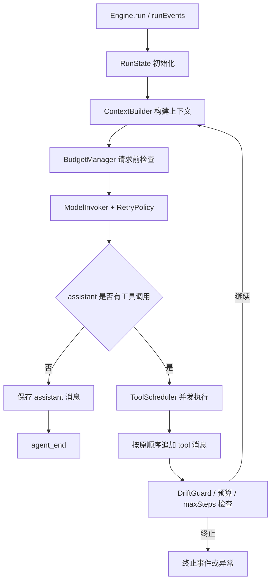

# MiniHarness 运行时引擎优化技术实现方案

> **给执行型 agent 的要求：** REQUIRED SUB-SKILL: Use superpowers:subagent-driven-development (recommended) or superpowers:executing-plans to implement this plan task-by-task. Steps use checkbox (`- [ ]`) syntax for tracking.

**目标：** 在保持现有 `Engine.run(input, sessionId): Promise<Message>` API 兼容的前提下，把当前批处理式运行时升级为可观测、可恢复、可控预算、支持并发工具和事件流的 Agent Runtime。

**架构：** 当前项目已经具备 `ModelProvider`、`Memory`、`ToolRegistry`、`ToolExecutor`、`ContextBuilder` 等分层接口，优化应围绕 `src/runtime/engine.ts` 增量扩展，不重写模型层或工具层。新增运行时事件、状态快照、预算控制、重试策略和工具调度模块，让 `Engine.run()` 继续返回最终消息，同时新增事件化入口供 UI、CLI 和未来控制平面消费。

**技术栈：** TypeScript、Vitest、现有 `pino` 日志、现有 `ModelProvider.stream?` 扩展点、现有 `AbortSignal` 工具上下文、现有 zod/YAML 配置。

---

## 参考依据

本方案基于 `/Users/jojo/Desktop/all-agent/harness_engineering_guide/04_runtime` 的运行时章节，并结合当前 MiniHarness 代码现状做收敛：

- `4.1_agent_loop.md`：运行时应围绕 Think-Act-Observe 循环建立明确终止条件、事件边界和前缀一致的消息追加。
- `4.2_message_state.md`：消息与状态管理需要可追踪，当前项目可用轻量不可变快照替代大型可变 AppState。
- `4.3_streaming.md`：事件流应先落地为 async generator；真实 provider stream 可后续接入，先保证事件协议和回退路径。
- `4.4_error_recovery.md`：工具错误应支持“错误即观察”，模型错误应支持 retry/backoff，避免单点失败直接终止长任务。
- `4.5_drift_correction.md`：长任务需要重复行动检测、反思点和硬约束，优先实现低成本启发式。
- `4.6_token_budget.md`：预算控制应覆盖单次请求、任务级累计调用和上下文压缩触发。
- `4.8_realtime_control.md`：暂停、取消、检查点和控制平面应以安全点为边界；当前项目先实现 abort/cancel 和状态快照接口。

## 当前项目诊断

当前 `src/runtime/engine.ts` 的执行模型清晰但偏 MVP：

- `Engine.run()` 一次性调用 `model.chat()`，模型响应结束后才处理工具。
- `enableStream` 已在配置和 `EngineOptions` 中出现，但运行时没有实际使用。
- 同一条 assistant 消息中的多个工具调用按顺序执行，没有并发调度。
- 工具缺失或工具执行异常会抛出并终止循环；还没有“错误作为 tool 消息反馈给模型”的模式。
- 模型 provider 已有 `retryable` 错误标记，但运行时没有 retry/backoff 统一策略。
- `ContextBuilder` 有字符级裁剪，但缺少请求级、任务级 token/调用预算控制。
- `ToolContext` 已支持 `abortSignal`，但 `Engine.run()` 未创建或传入取消信号。
- 运行时没有标准事件类型，外部无法订阅 turn/tool/model 生命周期事件。

这些问题不需要一次性重构。推荐通过“事件协议先行，行为保持兼容”的方式推进。

## 设计原则

1. **兼容优先**：`Engine.run()` 的现有返回值、异常行为和测试语义默认不变。
2. **事件优先**：新增 `Engine.runEvents()` 作为 async generator，`Engine.run()` 可以内部消费事件并返回最终消息。
3. **前缀一致**：消息历史只追加，不回写旧消息；工具结果按原工具调用顺序追加，即使工具并发执行。
4. **错误可观察**：默认保留现有 throw 行为，新增 `toolErrorMode: 'throw' | 'observe'` 作为可配置恢复策略。
5. **预算可解释**：先使用字符/usage 混合估算，不引入新 tokenizer 依赖；模型返回 usage 时优先使用真实 usage。
6. **小步可测**：每个阶段都有独立单元测试，避免运行时核心一次性膨胀。

## 新增与修改文件

- Create: `src/runtime/events.ts`
  - 定义运行时事件类型、事件 payload、辅助构造函数。
- Create: `src/runtime/state.ts`
  - 定义 `RunState`、`RunSnapshot`、终止原因、状态更新辅助函数。
- Create: `src/runtime/budget.ts`
  - 定义 `RuntimeBudget`, `BudgetManager`, `estimateMessageTokens()` 和预算检查结果。
- Create: `src/runtime/retry.ts`
  - 定义 `RetryPolicy`, `sleep()`, `runWithRetry()`，仅处理 `retryable` 错误。
- Create: `src/runtime/tool-scheduler.ts`
  - 并发执行一组工具调用，按原顺序返回 tool 消息，支持错误观察模式。
- Create: `src/runtime/drift.ts`
  - 提供重复工具调用检测、最大工具调用数检查、可选反思提示构造。
- Modify: `src/runtime/engine.ts`
  - 新增 `runEvents()`，重构 `run()` 复用事件流；接入预算、retry、tool scheduler、abort signal。
- Modify: `src/core/model.ts`
  - 扩展 `ModelStreamEvent` 或保持现状，只在需要时补充 `metadata` 和 `usage` 字段。
- Modify: `src/core/tool.ts`
  - 可选增加 `ToolExecutionMode` 类型；不改变现有 `ToolRegistry` 必需方法。
- Modify: `src/utils/config.ts`
  - 为 runtime 配置增加默认值：并发工具数、错误模式、预算和重试策略。
- Modify: `README.md`
  - 补充事件运行时、预算和错误恢复配置示例。
- Test: `tests/runtime-events.test.ts`
  - 验证事件顺序、最终结果、工具事件、错误事件。
- Test: `tests/runtime-budget.test.ts`
  - 验证预算估算、调用计数和超限终止。
- Test: `tests/runtime-retry.test.ts`
  - 验证 retryable 模型错误会重试，非 retryable 错误不重试。
- Test: `tests/tool-scheduler.test.ts`
  - 验证工具并发执行但结果按调用顺序追加。
- Modify: `tests/runtime.test.ts`
  - 保持现有兼容测试，并增加 `run()` 复用事件流后的回归断言。

## 目标架构



运行时事件不替代现有消息模型。事件用于观测生命周期，消息仍是模型上下文的事实来源。

## 运行时事件协议

新增 `src/runtime/events.ts`：

```ts
export type EngineEvent =
  | AgentStartEvent
  | TurnStartEvent
  | ModelStartEvent
  | ModelMessageEvent
  | ModelDeltaEvent
  | ToolStartEvent
  | ToolResultEvent
  | TurnEndEvent
  | AgentEndEvent
  | RuntimeErrorEvent;
```

推荐事件：

| 事件 | 触发时机 | 关键字段 |
|------|----------|----------|
| `agent_start` | 收到用户输入后 | `sessionId`, `traceId`, `inputLength` |
| `turn_start` | 每轮模型调用前 | `step`, `messageCount`, `budget` |
| `model_start` | 发起模型调用前 | `provider`, `timeoutMs` |
| `model_delta` | provider 支持 stream 时 | `content`, `toolCall?` |
| `model_message` | assistant 消息定稿后 | `message`, `usage?` |
| `tool_start` | 每个工具调用开始 | `toolCallId`, `toolName` |
| `tool_result` | 每个工具调用结束 | `toolCallId`, `success`, `latencyMs` |
| `turn_end` | 一轮工具结果写入后 | `step`, `toolCallCount`, `terminationReason?` |
| `agent_end` | 最终 assistant 消息产生 | `message`, `steps`, `usage` |
| `runtime_error` | 运行时捕获错误 | `code`, `retryable`, `phase` |

`runEvents()` 必须保证事件顺序稳定。工具可以并发执行，但 `tool_result` 事件可以按完成顺序发出；写入 `messages` 和 `memory` 时必须按 assistant 中的工具调用顺序追加，保持模型上下文前缀一致。

## Engine API 设计

保持现有 API：

```ts
async run(input: string, sessionId: string): Promise<Message>
```

新增：

```ts
runEvents(
  input: string,
  sessionId: string,
  options?: EngineRunOptions,
): AsyncIterable<EngineEvent>
```

新增可选运行参数：

```ts
export interface EngineRunOptions {
  abortSignal?: AbortSignal;
  metadata?: Record<string, unknown>;
}
```

`Engine.run()` 内部消费 `runEvents()`，记录最后一个 `agent_end.message` 并返回；如果事件流以错误结束，则保持现有 throw 语义。

## 流式策略

第一阶段不要求立即实现真实 OpenAI/Chat Completions streaming，因为当前 provider 只实现 `chat()`。运行时应先支持双路径：

1. `enableStream === true && model.stream` 存在：消费 `model.stream()`，发出 `model_delta`，组装最终 assistant 消息。
2. 否则：调用 `model.chat()`，只发出 `model_start` 和 `model_message`，保持现有行为。

这样可以先稳定事件协议和测试，再单独扩展 provider 的真实流式解析。

## 工具调度优化

新增 `ToolScheduler`：

```ts
export interface ToolSchedulerOptions {
  maxConcurrentTools: number;
  toolErrorMode: 'throw' | 'observe';
  toolTimeoutMs?: number;
}
```

执行策略：

- 对同一 assistant 消息中的工具调用使用受限并发。
- 每个工具调用都传入独立 `AbortController`，并串联外部 `abortSignal`。
- `toolErrorMode === 'throw'` 时维持当前语义。
- `toolErrorMode === 'observe'` 时把错误转成 `role: 'tool'` 消息，`metadata.success = false`，`content` 包含错误类型和可读说明，让模型下一轮自行恢复。
- 无论执行完成顺序如何，返回给 `Engine` 的 `Message[]` 按原始 toolCalls 顺序排列。

## 模型重试与断路器

当前 `OpenAIProvider` 和 `ChatCompletionsProvider` 已经把 HTTP、超时、网络错误归一化成 `ModelProviderError`，并带有 `retryable`。运行时新增轻量 `RetryPolicy`：

```ts
export interface RetryPolicyOptions {
  maxRetries: number;
  initialBackoffMs: number;
  maxBackoffMs: number;
}
```

第一阶段只做 retry/backoff，不实现完整断路器。断路器可以作为后续扩展，因为当前项目没有长期服务进程和多会话调度器，过早加入全局断路状态会增加测试和配置复杂度。

## Token 与任务预算

新增 `BudgetManager`，先做任务级预算，不引入新依赖：

```ts
export interface RuntimeBudget {
  maxModelCalls: number;
  maxEstimatedTokens: number;
  maxContextCharacters: number;
  reserveOutputTokens: number;
}
```

预算来源：

- 请求前用消息字符数估算 token，默认 `Math.ceil(chars / 4)`。
- 模型返回 `usage` 时，用真实 `usage.totalTokens` 累加任务级 token。
- `ContextBuilder.maxContextCharacters` 继续负责上下文裁剪。
- `BudgetManager` 负责是否允许下一次模型调用、是否应触发压缩或终止。

预算超限行为：

- `throw` 模式：抛出新的 `RuntimeBudgetExceededError`。
- `observe` 模式：生成一条最终 assistant 消息说明预算耗尽，并发出 `agent_end`，适合 UI 场景。

建议第一阶段只实现 `throw`，保持测试明确；第二阶段再加入降级最终消息。

## 漂移与重复行动控制

当前 MiniHarness 没有显式 `Goal` 类型，可以用用户输入作为 `originalGoal`。先实现低成本 `DriftGuard`：

- 记录最近 N 次工具调用签名：`${toolName}:${stableStringify(arguments)}`。
- 同一签名在窗口内出现超过阈值时触发 `repeated_tool_call`。
- 总工具调用数超过 `maxToolCalls` 时触发 `tool_call_limit`。
- 每隔 `reflectionInterval` 轮可选注入一条 system 消息，要求模型重新对齐原始目标。

第一阶段建议只检测和终止，不自动重置上下文。上下文重置需要持久化 checkpoint 支持，后续再做。

## 实时控制平面最小落地

不建议立即实现完整 pause/resume API。当前项目更适合先落地三个基础点：

1. `EngineRunOptions.abortSignal`：允许调用方取消模型等待和工具执行。
2. `RunSnapshot`：在每个 `turn_end` 事件中暴露可序列化状态摘要。
3. `checkpoint` 接口预留：定义快照结构，但不做磁盘持久化。

这样能为未来 WebSocket/SSE 控制面打基础，同时不会把当前库变成服务端框架。

## 配置扩展

建议扩展 `runtime` 配置：

```yaml
runtime:
  maxSteps: 8
  requestTimeoutMs: 60000
  enableStream: false
  maxConcurrentTools: 4
  toolErrorMode: throw
  toolTimeoutMs: 60000
  modelRetry:
    maxRetries: 2
    initialBackoffMs: 250
    maxBackoffMs: 2000
  budget:
    maxModelCalls: 20
    maxEstimatedTokens: 1000000
    maxContextCharacters: 120000
    reserveOutputTokens: 4000
  drift:
    maxToolCalls: 50
    repeatedToolWindow: 6
    repeatedToolThreshold: 3
    reflectionInterval: 0
```

默认值应尽量保持现有测试不变：

- `toolErrorMode: throw`
- `enableStream: false`
- `maxConcurrentTools: 1` 或 `4` 都可；如果改成 `4`，测试必须证明消息写入顺序稳定。

## 分阶段实施计划

### Task 1: 事件协议与 `runEvents()` 骨架

**Files:**
- Create: `src/runtime/events.ts`
- Modify: `src/runtime/engine.ts`
- Test: `tests/runtime-events.test.ts`

- [ ] 添加 `EngineEvent` 类型和事件构造函数。
- [ ] 在 `Engine` 中新增 `runEvents()`，先走现有 `model.chat()` 路径。
- [ ] 修改 `run()` 消费 `runEvents()`，保持返回最终 assistant 消息。
- [ ] 测试无工具调用场景事件顺序：`agent_start -> turn_start -> model_start -> model_message -> agent_end`。
- [ ] 测试现有 `Engine.run()` 行为不变。

### Task 2: 状态快照与终止原因

**Files:**
- Create: `src/runtime/state.ts`
- Modify: `src/runtime/engine.ts`
- Test: `tests/runtime-events.test.ts`

- [ ] 定义 `RunState`、`RunSnapshot`、`TerminationReason`。
- [ ] 每轮事件携带 `step`, `messageCount`, `modelCallCount`, `toolCallCount`。
- [ ] `MaxStepsExceededError` 触发前发出 `runtime_error` 事件。
- [ ] 测试 `maxSteps` 超限时状态计数正确。

### Task 3: 工具并发调度与顺序提交

**Files:**
- Create: `src/runtime/tool-scheduler.ts`
- Modify: `src/runtime/engine.ts`
- Test: `tests/tool-scheduler.test.ts`
- Test: `tests/runtime.test.ts`

- [ ] 实现 `ToolScheduler.executeAll(toolCalls, ctx)`。
- [ ] 使用受限并发执行工具调用。
- [ ] 发出 `tool_start` 和 `tool_result` 事件。
- [ ] 返回结果按原 toolCalls 顺序排列。
- [ ] 测试两个工具完成顺序相反时，写入模型上下文的 tool 消息仍按调用顺序排列。

### Task 4: 错误即观察模式

**Files:**
- Modify: `src/runtime/tool-scheduler.ts`
- Modify: `src/runtime/engine.ts`
- Modify: `src/core/errors.ts`
- Test: `tests/tool-scheduler.test.ts`
- Test: `tests/runtime.test.ts`

- [ ] 增加 `toolErrorMode: 'throw' | 'observe'`。
- [ ] `throw` 模式保持 `ToolNotFoundError` 和工具异常直接抛出。
- [ ] `observe` 模式把错误转换成 `role: 'tool'` 消息。
- [ ] 测试缺失工具在 observe 模式下进入下一轮模型调用。

### Task 5: 模型重试策略

**Files:**
- Create: `src/runtime/retry.ts`
- Modify: `src/runtime/engine.ts`
- Test: `tests/runtime-retry.test.ts`

- [ ] 实现指数退避 `runWithRetry()`。
- [ ] 只对 `error.retryable === true` 的错误重试。
- [ ] 每次失败发出 `runtime_error` 事件，metadata 标记 `attempt`。
- [ ] 测试 retryable 错误重试成功。
- [ ] 测试非 retryable 错误不会重试。

### Task 6: 预算管理

**Files:**
- Create: `src/runtime/budget.ts`
- Modify: `src/runtime/engine.ts`
- Modify: `src/utils/config.ts`
- Test: `tests/runtime-budget.test.ts`

- [ ] 实现字符级 token 估算。
- [ ] 记录模型调用次数和累计 token。
- [ ] 请求前检查 `maxModelCalls` 和 `maxEstimatedTokens`。
- [ ] 模型返回 `usage` 时使用真实 usage 更新预算。
- [ ] 测试预算超限时终止并给出明确错误。

### Task 7: AbortSignal 与安全取消

**Files:**
- Modify: `src/runtime/engine.ts`
- Modify: `src/runtime/tool-scheduler.ts`
- Test: `tests/runtime-events.test.ts`

- [ ] `runEvents()` 接收 `abortSignal`。
- [ ] 模型调用前检查 signal。
- [ ] 工具执行时把 signal 传入 `ToolContext.abortSignal`。
- [ ] signal 触发时发出 `runtime_error`，并停止后续工具调度。
- [ ] 测试取消后不会继续执行未开始的工具。

### Task 8: 漂移与重复工具调用检测

**Files:**
- Create: `src/runtime/drift.ts`
- Modify: `src/runtime/engine.ts`
- Modify: `src/utils/config.ts`
- Test: `tests/runtime-drift.test.ts`

- [ ] 实现稳定参数序列化和工具调用签名。
- [ ] 记录最近 N 次工具调用。
- [ ] 超过重复阈值时终止或发出纠正事件。
- [ ] 支持 `reflectionInterval` 为 0 时完全关闭。
- [ ] 测试重复工具调用超过阈值后停止循环。

### Task 9: README 与配置文档

**Files:**
- Modify: `README.md`
- Modify: `configs/harness.yaml`
- Test: `npm run typecheck`

- [ ] 添加运行时事件示例。
- [ ] 添加工具错误模式说明。
- [ ] 添加预算和重试配置示例。
- [ ] 说明 `Engine.run()` 与 `Engine.runEvents()` 的使用差异。

## 测试策略

每个阶段都需要先写测试再实现：

- `npm test -- tests/runtime-events.test.ts`
- `npm test -- tests/tool-scheduler.test.ts`
- `npm test -- tests/runtime-retry.test.ts`
- `npm test -- tests/runtime-budget.test.ts`
- `npm test -- tests/runtime-drift.test.ts`
- `npm run typecheck`
- `npm test`

重点断言：

- 事件顺序稳定。
- `Engine.run()` 兼容原行为。
- 并发工具不破坏消息顺序。
- 错误恢复模式可配置。
- retry 只处理 retryable 错误。
- 预算超限有明确终止原因。
- abort 不留下半提交状态。

## 不建议本轮实现的内容

- 不立即实现完整 WebSocket/SSE 服务端。
- 不立即引入 tokenizer 依赖或外部 token counting API。
- 不把消息模型改成 block-based 结构；当前 `Message.content: string + toolCalls` 已能支持现阶段优化。
- 不实现磁盘 checkpoint restore；先通过 `RunSnapshot` 保留接口边界。
- 不强制改默认工具错误为 observe，避免破坏现有测试和调用方预期。

## 风险与缓解

| 风险 | 影响 | 缓解 |
|------|------|------|
| 事件流重构改变 `run()` 行为 | 破坏现有用户 | `run()` 先复用事件流但保留所有现有测试 |
| 并发工具改变上下文顺序 | 降低模型缓存命中并影响推理 | 执行可并发，提交必须按原 toolCalls 顺序 |
| 错误即观察掩盖真正系统错误 | 调试困难 | 默认仍为 throw，仅 opt-in observe |
| 预算估算不准确 | 误杀或超限 | 优先使用 provider usage，字符估算只做保守检查 |
| 漂移检测误报 | 过早终止任务 | 默认关闭或宽松阈值，先只检测重复工具调用 |

## 推荐执行顺序

推荐先做 Task 1-4，形成可观测且更可靠的运行时核心；再做 Task 5-6 加强稳定性与成本控制；最后做 Task 7-9，为长任务和未来控制平面铺路。

最小可交付版本：

1. `runEvents()` 事件流。
2. 工具并发调度且顺序提交。
3. `toolErrorMode` 支持 observe。
4. 模型 retry。
5. README 示例。

这个版本已经能显著提升当前项目运行时的可观测性、延迟表现和故障恢复能力，同时保持 API 兼容。
