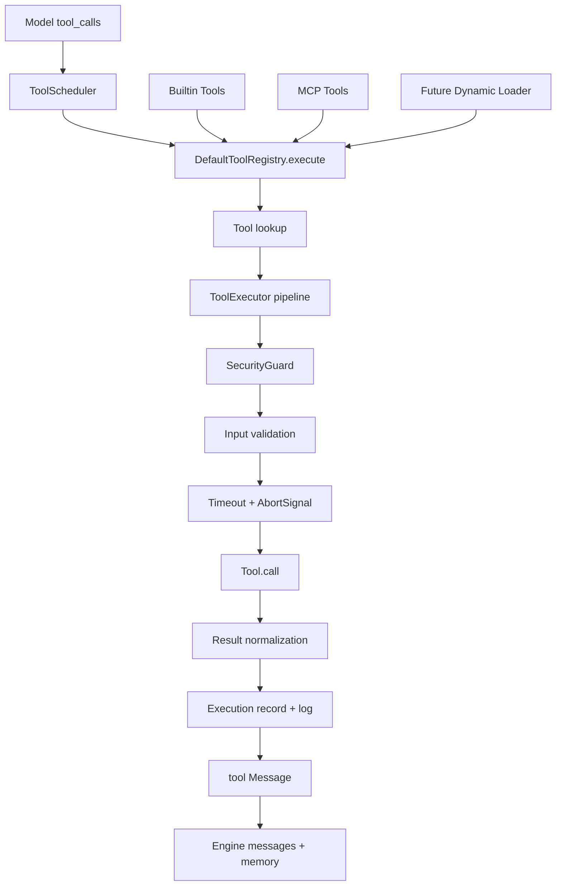

# MiniHarness 工具层优化技术实现方案

状态：设计草案
日期：2026-06-28

## 1. 背景

MiniHarness 当前已经具备基础工具层：

- `src/core/tool.ts` 定义 `Tool`、`ToolResult`、`ToolContext`、`ToolRegistry`。
- `src/tools/registry.ts` 提供 `DefaultToolRegistry`，负责注册、查询和把工具结果转成 `role: "tool"` 消息。
- `src/tools/executor.ts` 提供 `ToolExecutor`，在工具调用前接入 `SecurityGuard`，并记录结构化日志。
- `src/runtime/tool-scheduler.ts` 支持同一条 assistant 消息中的工具并发执行，并按原始调用顺序归并结果。
- `src/mcp/adapter.ts` 和 `src/mcp/discovery.ts` 已经把 MCP 工具包装成内部 `Tool`。
- `configs/harness.yaml` 已有 `toolTimeoutMs`、`maxConcurrentTools`、`toolErrorMode` 等运行时配置。

当前实现的边界清晰，但工具层仍偏 MVP。主要缺口是：工具输入没有统一校验、`toolTimeoutMs` 尚未真正约束工具执行、注册表没有能力元数据和 Schema 缓存视图、工具错误缺少标准分类、结果大小没有统一截断策略，MCP 工具命名也缺少跨服务冲突处理。

本方案基于 `/Users/jojo/Desktop/all-agent/harness_engineering_guide/05_tool_layer` 下的工具层章节，并结合当前 TypeScript 代码做增量优化，而不是重写工具系统。

## 2. 参考依据

已阅读的工具层指南包括：

- `README.md`：工具抽象、工具执行、工具发现是工具层三大核心问题。
- `5.1_abstraction_registry.md`：统一 `Tool<Input, Output, Progress>` 抽象、`buildTool()` 工厂、注册中心和权限策略。
- `5.2_execution_pipeline.md`：推荐 6 阶段执行流水线：发现、权限、输入验证、执行、结果处理、缓存/记录。
- `5.3_type_system.md`：工具类型、访问等级、能力描述、装饰器/复合/条件扩展模式。
- `5.4_dynamic_loading.md`：延迟加载、分级加载、Schema 缓存、MCP 动态注册和上下文缓存。
- `5.5_miniharness_tools.md`：MiniHarness 工具层应以清晰抽象、执行流水线、Schema 驱动和统一错误结果为核心。
- `summary.md`：强调权限隔离、错误恢复、并发执行、缓存和常见陷阱。

## 3. 目标

本次优化目标：

1. 在保持现有 `Tool` 接口兼容的前提下，补充工具能力元数据、输入校验、错误分类和结果处理能力。
2. 把 `ToolExecutor` 从“权限 + 日志”升级为轻量执行流水线：权限、校验、超时、调用、结果归一化、记录。
3. 让 `runtime.toolTimeoutMs` 真正作用于工具调用，并配合 `AbortSignal` 形成可取消边界。
4. 为内置工具、MCP 工具和未来动态工具提供统一注册、发现、Schema 缓存和冲突处理规则。
5. 优先使用项目已有依赖和结构，不引入大体量新框架。

非目标：

- 不在第一阶段实现完整插件市场或任意路径动态 import。
- 不在第一阶段实现用户审批 UI。
- 不在第一阶段实现复杂分布式工具执行。
- 不把 `ToolRegistry.list()` 的现有语义改成不兼容格式。

## 4. 当前项目诊断

### 4.1 已具备能力

- `DefaultToolRegistry` 已能防重复注册、按名称查找、执行工具并封装 tool 消息。
- `ToolExecutor` 已接入 `SecurityGuard`，可以执行前阻止被拒绝工具。
- `ToolScheduler` 已支持受限并发和 `throw | observe` 两种错误模式。
- `Engine` 已在每个工具调用前后发出 `tool_start` 和 `tool_result` 事件。
- `McpToolAdapter` 已把 MCP 内容转换为文本结果，并保留结构化 MCP metadata。
- `zod` 已作为项目依赖，可用于工具参数和配置校验辅助。

### 4.2 主要问题

| 问题 | 当前表现 | 风险 |
|---|---|---|
| 输入未校验 | `Tool.schema` 只传给模型，执行前不校验 `toolCall.arguments` | 模型给出错误参数时直接进入工具实现 |
| 超时未落地 | `EngineOptions.toolTimeoutMs` 和 YAML 已存在，但调度器/执行器没有使用 | 慢工具可能挂住当前 agent turn |
| 结果无统一限制 | 工具可以返回任意长度 `content` | 大输出污染上下文，增加模型成本 |
| 错误分类不足 | 多数工具错误只以普通 `Error` 抛出 | observe 模式无法给模型稳定可恢复信息 |
| Registry 缺少能力视图 | `list()` 只返回 `Tool[]`，无 capability/schema cache API | UI、调试和动态发现难以判断工具能力 |
| MCP 名称冲突 | 多个 MCP server 暴露同名工具时会触发重复注册 | 多服务组合使用受限 |
| 权限模型偏粗 | 只有 allow/deny tool name，未结合工具类别和资源类型 | file/http/shell 工具上线后策略表达力不足 |

## 5. 推荐方案

推荐采用“保持核心接口，向外增加能力层”的增量方案。

核心思路：

- `Tool` 继续保留 `name`、`description`、`schema`、`call()` 四个必需字段，现有工具无需一次性迁移。
- 新增可选字段和辅助类型描述能力、校验、超时、缓存、来源、权限需求。
- `DefaultToolRegistry` 继续返回 `Tool[]` 给模型 provider，同时新增 `listCapabilities()` 和 Schema 缓存。
- `ToolExecutor` 承担统一流水线，工具实现只关心自身业务逻辑。
- `ToolScheduler` 接入 `toolTimeoutMs`，并向每个工具调用传递独立的可取消上下文。
- MCP 工具通过 adapter 保留原始 tool name，同时可生成安全、唯一的内部 tool name。

## 6. 目标架构



## 7. 类型设计

### 7.1 JSON Schema 基础类型

`Tool.schema` 当前是 `unknown`，模型 provider 直接透传。建议收紧为兼容 JSON Schema 的类型别名，但保持运行时兼容：

```ts
export type JsonObject = Record<string, unknown>;
export type ToolInputSchema = JsonObject;
```

第一阶段不强制所有调用点修改为严格类型，只在新 helper 和 registry 内部做窄化。

### 7.2 工具能力元数据

在 `src/core/tool.ts` 中新增：

```ts
export type ToolCategory =
  | 'builtin'
  | 'execution'
  | 'file'
  | 'network'
  | 'agent'
  | 'domain'
  | 'mcp';

export type ToolAccessLevel = 'system' | 'admin' | 'trusted' | 'public';

export interface ToolCapability {
  name: string;
  description: string;
  schema: ToolInputSchema;
  category: ToolCategory;
  accessLevel: ToolAccessLevel;
  source: 'builtin' | 'mcp' | 'custom';
  version?: string;
  timeoutMs?: number;
  cacheable?: boolean;
  maxResultCharacters?: number;
  requiredPermissions?: string[];
  examples?: Array<Record<string, unknown>>;
  limitations?: string[];
  metadata?: Record<string, unknown>;
}
```

扩展 `Tool`：

```ts
export interface Tool {
  name: string;
  description: string;
  schema: unknown;
  capability?: Partial<Omit<ToolCapability, 'name' | 'description' | 'schema'>>;
  validateInput?(input: Record<string, unknown>): ToolValidationResult;
  call(input: Record<string, unknown>, ctx: ToolContext): Promise<ToolResult>;
}
```

这样 `EchoTool`、`McpToolAdapter` 等现有实现仍然合法；新工具可以逐步补充 `capability` 和 `validateInput()`。

### 7.3 工具上下文

扩展 `ToolContext`，保留兼容：

```ts
export interface ToolContext {
  traceId: string;
  sessionId: string;
  abortSignal?: AbortSignal;
  timeoutMs?: number;
  toolCallId?: string;
  metadata?: Record<string, unknown>;
  reportProgress?: (progress: ToolProgress) => void;
}
```

第一阶段只实现 `timeoutMs`、`toolCallId` 和 `metadata`；`reportProgress` 作为后续 `tool_progress` 事件扩展点。

### 7.4 工具结果和错误

扩展 `ToolResult`：

```ts
export interface ToolResult {
  success: boolean;
  content: string;
  metadata?: Record<string, unknown>;
  errorCode?: string;
  errorName?: string;
}
```

新增标准错误：

```ts
export class ToolValidationError extends MiniHarnessError {}
export class ToolPermissionError extends MiniHarnessError {}
export class ToolTimeoutError extends MiniHarnessError {}
export class ToolExecutionError extends MiniHarnessError {}
export class ToolResultError extends MiniHarnessError {}
```

建议错误码：

| 错误 | code |
|---|---|
| 工具不存在 | `TOOL_NOT_FOUND` |
| 权限拒绝 | `TOOL_PERMISSION_DENIED` |
| 输入无效 | `TOOL_VALIDATION_ERROR` |
| 执行超时 | `TOOL_TIMEOUT` |
| 执行异常 | `TOOL_EXECUTION_ERROR` |
| 结果处理失败 | `TOOL_RESULT_ERROR` |

## 8. Registry 优化

### 8.1 保持现有能力

`DefaultToolRegistry` 的现有方法保持：

```ts
register(tool: Tool): void;
get(name: string): Tool | undefined;
list(): Tool[];
execute(toolCall: ToolCall, ctx: ToolContext): Promise<Message>;
```

### 8.2 新增能力视图

新增方法：

```ts
listCapabilities(): ToolCapability[];
getCapability(name: string): ToolCapability | undefined;
unregister(name: string): boolean;
```

注册时生成 capability cache：

```ts
private buildCapability(tool: Tool): ToolCapability {
  return {
    name: tool.name,
    description: tool.description,
    schema: normalizeToolSchema(tool.schema),
    category: tool.capability?.category ?? 'builtin',
    accessLevel: tool.capability?.accessLevel ?? 'public',
    source: tool.capability?.source ?? 'custom',
    ...tool.capability,
  };
}
```

### 8.3 命名规则

工具名需要兼容模型 function name。建议统一校验：

```text
^[A-Za-z0-9_-]{1,64}$
```

注册非法名称时抛出 `ToolValidationError`。MCP 工具如果原始名称不符合规则，由 adapter 生成内部名称，并在 metadata 中保留原始名称。

## 9. 执行流水线

建议把现有 `ToolExecutor.execute()` 扩展为 6 阶段流水线。

### 9.1 阶段 1：权限检查

继续调用：

```ts
await securityGuard.checkToolPermission(tool.name, input, capability);
```

`SecurityGuard` 可逐步扩展为：

- `denyTools` 优先于一切策略。
- `allowTools` 非空时只允许白名单工具。
- `allowShell === false` 时拒绝 `category: "execution"` 或 `requiredPermissions` 包含 `shell` 的工具。
- `allowNetwork === false` 时拒绝 `category: "network"` 或 `requiredPermissions` 包含 `network` 的工具。
- 文件工具必须结合 `sandboxDir` 和 `security/path.ts` 做路径约束。

第一阶段可以只扩展方法签名和 category 检查，审批策略留到后续。

### 9.2 阶段 2：输入验证

验证优先级：

1. 如果工具实现了 `validateInput()`，使用工具自定义验证。
2. 如果工具由 `defineTool()` 创建，使用 zod schema 验证。
3. 否则使用内置 JSON Schema 子集验证器，支持 `type`、`required`、`properties`、`enum`、`additionalProperties`。
4. MCP 工具默认使用其 `inputSchema` 做子集验证，复杂 schema 超出能力时只做 object/required 级别校验并记录 metadata。

不建议第一阶段引入 AJV。当前项目已经依赖 `zod`，内置工具可以直接用 zod；MCP 的复杂 JSON Schema 支持可作为第二阶段能力。

推荐新增：

```text
src/tools/validation.ts
```

核心接口：

```ts
export interface ToolValidationIssue {
  path: string;
  message: string;
}

export interface ToolValidationResult {
  ok: boolean;
  issues?: ToolValidationIssue[];
}
```

### 9.3 阶段 3：超时和取消

`runtime.toolTimeoutMs` 应从 `Engine` 传给 `ToolScheduler`：

```ts
const scheduler = new ToolScheduler(this.tools, {
  maxConcurrentTools: this.options.maxConcurrentTools,
  toolErrorMode: this.options.toolErrorMode,
  toolTimeoutMs: this.options.toolTimeoutMs,
});
```

`ToolScheduler` 为每个工具调用生成子 `AbortController`：

- 外部 `runOptions.abortSignal` 触发时，子 signal 同步 abort。
- 工具超时时，子 signal abort，并返回或抛出 `ToolTimeoutError`。
- `ToolExecutor` 使用 `Promise.race()` 兜底，即使工具未主动监听 `AbortSignal`，运行时也能结束等待。

### 9.4 阶段 4：执行工具

工具实现只需要处理业务逻辑：

```ts
const result = await tool.call(input, childContext);
```

约定：

- 工具成功时返回 `success: true`。
- 可恢复业务失败返回 `success: false`，不要抛异常。
- 权限、校验、超时、不可恢复执行错误由 executor 统一转换。

### 9.5 阶段 5：结果处理

统一处理：

- `content` 必须为 string。
- 空结果归一化为空字符串，不返回 `undefined`。
- 超过 `maxResultCharacters` 时截断，并在 metadata 中写入：
  - `truncated: true`
  - `originalLength`
  - `maxResultCharacters`
- metadata 自动补充：
  - `toolName`
  - `toolCallId`
  - `latencyMs`
  - `timeoutMs`
  - `success`

默认 `maxResultCharacters` 建议为 `64_000`，可由工具 capability 覆盖。

### 9.6 阶段 6：记录和缓存

第一阶段只做执行记录和日志，不做通用结果缓存。

新增轻量记录：

```ts
export interface ToolExecutionTrace {
  traceId: string;
  sessionId: string;
  toolCallId?: string;
  toolName: string;
  startedAt: number;
  latencyMs: number;
  success: boolean;
  errorCode?: string;
  stages: Record<string, { latencyMs: number; success?: boolean }>;
}
```

结果缓存只对声明 `cacheable: true` 的只读工具启用，后续配合 file/http 工具再落地。

## 10. ToolScheduler 优化

当前调度器已经完成最关键的并发和顺序归并。建议增量补齐：

1. 接受 `toolTimeoutMs`。
2. 为每个工具调用传入 `toolCallId`、`timeoutMs` 和子 `abortSignal`。
3. observe 模式下把标准错误转换为稳定 tool observation：

```text
ToolTimeoutError: Tool timed out after 30000ms
ToolValidationError: Invalid input: text is required
```

4. `ToolExecutionRecord` 中补充 `success`、`errorCode`、`startedAt`。

保持一个重要约束：工具可以并发完成，但返回给 `Engine` 的结果数组必须仍按原始 `toolCalls` 顺序排列。

## 11. MCP 工具优化

### 11.1 名称冲突处理

当前 `McpToolAdapter.name = tool.name`。多个 MCP server 暴露同名工具时会重复注册。

推荐新增：

```ts
export interface McpToolAdapterOptions {
  namePrefix?: string;
  collisionStrategy?: 'error' | 'prefix';
}
```

内部名称生成规则：

```text
mcp_<sanitizedServerName>_<sanitizedToolName>
```

metadata 保留：

- `mcpServerName`
- `mcpToolName`
- `mcpOriginalName`

调用 MCP 时仍使用原始 `tool.name`，避免破坏远端协议。

### 11.2 Schema 和结果处理

MCP adapter 的 `schema` 应经过 `normalizeToolSchema()`：

- 没有 schema 时使用 `{ type: "object", properties: {}, additionalProperties: true }`。
- 非 object schema 记录 warning metadata，但不阻塞注册。
- adapter capability 使用 `category: "mcp"`、`source: "mcp"`。

MCP content 转文本逻辑保留，但建议在 result metadata 中标记：

- `contentTypes`
- `structuredContent`
- `isError`

这些字段当前已有一部分，可进一步标准化命名。

## 12. 内置工具路线

README 中已经声明 File、HTTP、Shell tools 尚未实现。建议在流水线稳定后分阶段加入，不要先写危险工具。

### 第一批：低风险工具

- `echo`：保留，用于连通性测试。
- `file_read`：只读，必须经过 sandbox path 校验，支持 `maxBytes`。
- `file_list`：只读，支持深度和数量限制，可作为 FileStateCache 的首个候选。

### 第二批：受策略保护工具

- `file_write`：默认关闭，需要 `tools.allowFile: true` 和 sandbox path 校验。
- `http_request`：默认关闭，需要 `security.allowNetwork: true`，限制 method、timeout、response size。
- `shell_exec`：默认关闭，需要 `security.allowShell: true` 和 `allowedShellCommands` allowlist，必须使用 `spawn`/argv，不使用 `shell: true`。

### 工具构造 helper

新增：

```text
src/tools/define.ts
```

用于减少重复样板：

```ts
export function defineTool<Input>(definition: {
  name: string;
  description: string;
  input: z.ZodType<Input>;
  capability?: Partial<ToolCapability>;
  call(input: Input, ctx: ToolContext): Promise<ToolResult>;
}): Tool;
```

`defineTool()` 负责：

- zod parse。
- 生成或接收 JSON Schema。
- 包装 `call()` 的输入类型。
- 填充 capability 默认值。

## 13. 动态加载策略

当前项目已有 MCP 动态发现，暂不建议立即支持任意本地模块动态加载。

推荐分三层：

1. **静态内置工具加载**：由 `tools.enableBuiltin` 和 `tools.allowFile/allowHttp` 控制。
2. **MCP 动态发现**：沿用 `discoverMcpTools()`，增加命名和 capability 策略。
3. **受信任自定义工具加载**：后续只允许从显式配置和受控 namespace 加载，例如 `@miniharness/tools-*`，并禁止任意绝对路径 import。

可新增：

```text
src/tools/loader.ts
```

第一阶段只实现内置工具 factory：

```ts
export function createBuiltinTools(config: HarnessConfig): Tool[] {
  const tools = [new EchoTool()];
  if (config.tools?.allowFile) {
    tools.push(new FileReadTool(...), new FileListTool(...));
  }
  return tools;
}
```

## 14. 配置调整

当前 YAML 中已有：

```yaml
runtime:
  toolTimeoutMs: 30000
  maxConcurrentTools: 1
  toolErrorMode: throw

tools:
  enableBuiltin: true
  allowShell: false
  allowFile: false
  allowHttp: false
```

建议扩展但保持默认安全：

```yaml
tools:
  enableBuiltin: true
  maxResultCharacters: 64000
  validateInput: true
  mcpNameCollision: prefix # error | prefix
  allowShell: false
  allowFile: false
  allowHttp: false
```

`src/utils/config.ts` 需要把 `tools` 和 `security` 也纳入 zod schema。当前 `harnessConfigSchema` 只强校验 `runtime` 和 `model`，其余字段 passthrough，不利于后续安全默认值。

## 15. 需要修改的文件

### Core

- Modify: `src/core/tool.ts`
  - 增加 `ToolCapability`、`ToolCategory`、`ToolAccessLevel`、`ToolValidationResult`、`ToolProgress`。
  - 扩展 `ToolContext` 和 `ToolResult` 的可选字段。
- Modify: `src/core/errors.ts`
  - 增加工具层标准错误类。

### Tools

- Modify: `src/tools/registry.ts`
  - 增加 capability/schema cache。
  - 增加 `listCapabilities()`、`getCapability()`、`unregister()`。
  - 注册时校验工具名，构建 capability。
- Modify: `src/tools/executor.ts`
  - 扩展为 6 阶段执行流水线。
  - 接入输入校验、超时、结果截断、标准错误转换。
- Create: `src/tools/validation.ts`
  - 提供 zod/custom/json schema 子集验证适配。
- Create: `src/tools/result.ts`
  - 提供 `normalizeToolResult()`、`createToolErrorResult()`、截断工具函数。
- Create: `src/tools/define.ts`
  - 提供类型友好的工具定义 helper。
- Optional Create: `src/tools/loader.ts`
  - 创建内置工具集合。

### Runtime

- Modify: `src/runtime/tool-scheduler.ts`
  - 接入 `toolTimeoutMs`。
  - 传递 `toolCallId`、`timeoutMs`、子 `abortSignal`。
  - 标准化 observe 错误消息。
- Modify: `src/runtime/engine.ts`
  - 创建 `ToolScheduler` 时传入 `this.options.toolTimeoutMs`。

### MCP

- Modify: `src/mcp/adapter.ts`
  - 增加 adapter options。
  - 支持内部名称和 MCP 原始名称分离。
  - 补充 capability。
- Modify: `src/mcp/discovery.ts`
  - 支持 name prefix/collision strategy。

### Security

- Modify: `src/security/guard.ts`
  - `checkToolPermission()` 接收 capability。
  - 根据 category/requiredPermissions 检查 shell/network/file。
- Modify: `src/security/policy.ts`
  - 增加可选策略字段，但默认保持安全关闭。

### Config 和文档

- Modify: `src/utils/config.ts`
  - 校验 `tools`、`security` 配置并提供默认值。
- Modify: `README.md`
  - 更新工具层能力、配置、MCP 命名和安全默认值说明。

## 16. 测试计划

### 单元测试

- `tests/tool.test.ts`
  - 注册时缓存 capability。
  - 重复注册仍然拒绝。
  - 非法工具名拒绝。
  - `list()` 仍返回 `Tool[]`，兼容 provider。
  - `listCapabilities()` 返回 schema 和 metadata。

- `tests/tool-validation.test.ts`
  - required 字段缺失返回 `ToolValidationError`。
  - 类型不匹配返回字段路径。
  - 工具自定义 `validateInput()` 优先。
  - zod-based `defineTool()` 能 parse typed input。

- `tests/tool-executor.test.ts`
  - 权限检查发生在工具调用前。
  - 输入校验失败时不调用工具。
  - 超时返回或抛出 `ToolTimeoutError`。
  - 大结果被截断并写入 metadata。
  - 工具抛出的未知错误被转换为 `ToolExecutionError`。

- `tests/tool-scheduler.test.ts`
  - 并发执行仍按调用顺序归并。
  - `toolTimeoutMs` 被传入每个工具上下文。
  - observe 模式下 validation/timeout/not found 都变成 tool observation。

- `tests/mcp-adapter.test.ts`
  - MCP 原始名称和内部名称分离。
  - 同名不同 server 可以 prefix 注册。
  - metadata 保留 `mcpServerName` 和 `mcpToolName`。

- `tests/security.test.ts`
  - `allowNetwork: false` 拒绝 network 工具。
  - `allowShell: false` 拒绝 execution 工具。
  - denyTools 优先于 allowTools。

### 回归测试

- `pnpm test`
- `pnpm typecheck`
- `pnpm build`

## 17. 分阶段实施顺序

### 阶段 1：契约和执行流水线

1. 扩展 core 类型和错误类。
2. 增加 validation/result helper。
3. 扩展 `ToolExecutor`：权限、校验、超时、结果处理、日志。
4. `Engine` 和 `ToolScheduler` 接入 `toolTimeoutMs`。
5. 补齐测试，确保现有 `EchoTool` 和 runtime 测试不破。

验收标准：

- 工具输入无效时不会进入工具实现。
- 慢工具会按 `toolTimeoutMs` 结束等待。
- `toolErrorMode: observe` 可以把工具错误反馈给模型。
- 现有公开 API 不需要调用方迁移。

### 阶段 2：Registry 能力视图和 MCP 命名

1. `DefaultToolRegistry` 增加 capability cache。
2. MCP adapter 支持内部名称、原始名称和 prefix strategy。
3. README 更新工具发现和 MCP 注册示例。

验收标准：

- `registry.list()` 保持兼容。
- `registry.listCapabilities()` 可用于 UI/调试/文档。
- 多个 MCP server 同名工具可以安全共存或明确报错。

### 阶段 3：安全内置工具

1. 增加 `file_read`、`file_list`。
2. 接入 sandbox path 校验。
3. 增加 `tools.allowFile` 配置控制。
4. 只读工具可选接入短 TTL 缓存。

验收标准：

- 默认配置不会启用危险写入或 shell。
- 文件路径不能逃逸 sandbox。
- 大文件读取受 `maxBytes` 和结果截断双重限制。

### 阶段 4：动态加载和高级能力

1. 增加 `createBuiltinTools()`。
2. 增加受信任 custom tool loader。
3. 增加 `tool_progress` 事件。
4. 根据需要引入完整 JSON Schema validator。

验收标准：

- 动态加载只从显式信任来源加载。
- 长任务工具可以发出进度事件。
- 复杂 MCP schema 校验有明确策略。

## 18. 风险和取舍

| 取舍 | 决策 | 原因 |
|---|---|---|
| 是否重写 Tool 接口 | 不重写，只扩展可选字段 | 保持现有工具、测试和 provider 兼容 |
| 是否引入 AJV | 第一阶段不引入 | 项目已有 zod，内置 JSON Schema 子集足够覆盖当前工具 |
| 是否立刻做结果缓存 | 不做通用缓存 | 工具副作用难判断，先通过 `cacheable` 显式启用 |
| 是否启用 shell 工具 | 不默认启用 | 安全风险高，必须等权限和 allowlist 完整后再加 |
| MCP 同名工具默认策略 | 推荐 prefix | 多 MCP 服务组合是常见场景，直接 error 会降低可用性 |

## 19. 完成后的工具调用生命周期

```text
assistant.toolCalls
  -> ToolScheduler 并发取任务
  -> Registry 查找工具
  -> Executor 检查权限
  -> Executor 校验输入
  -> Executor 设置超时和取消
  -> Tool.call 执行业务逻辑
  -> Executor 归一化结果和 metadata
  -> Registry 包装 role=tool 消息
  -> Scheduler 按原调用顺序归并
  -> Engine 保存 memory 并继续下一轮模型调用
```

## 20. 最小落地版本

如果只做一个最小但有价值的版本，建议范围收敛为：

1. `toolTimeoutMs` 真正生效。
2. 工具输入校验支持 `required`、基础 `type` 和工具自定义 `validateInput()`。
3. 工具结果截断和 metadata 标准化。
4. 标准工具错误类和 observe 模式输出稳定化。
5. Registry 增加 `listCapabilities()`，但不改 `list()`。

这五项能直接提升当前项目可靠性和可观测性，且不会迫使调用方迁移。
