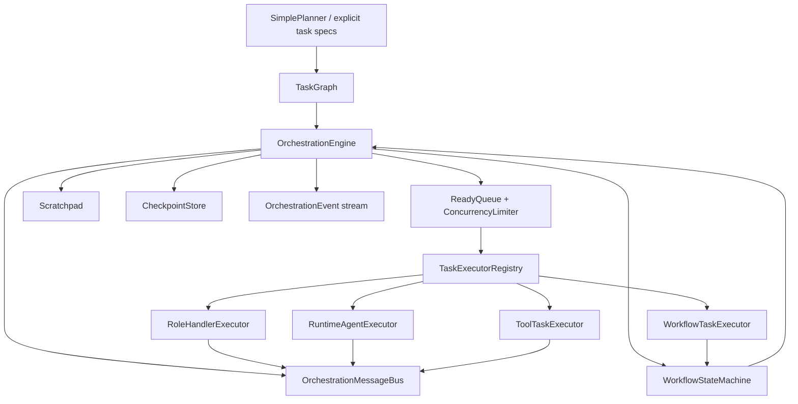

# MiniHarness 任务编排与工作流引擎优化技术实现方案

> **给执行型 agent 的要求：** REQUIRED SUB-SKILL: Use superpowers:subagent-driven-development (recommended) or superpowers:executing-plans to implement this plan task-by-task. Steps use checkbox (`- [ ]`) syntax for tracking.

状态：设计草案  
日期：2026-06-29

## 1. 背景

MiniHarness 当前已经具备第五阶段的本地任务编排核心：

- `src/orchestration/task.ts` 定义 `Task`、`TaskStatus`、执行上下文和 handler 结果。
- `src/orchestration/graph.ts` 提供依赖校验、循环检测、拓扑排序和可运行任务查询。
- `src/orchestration/state-machine.ts` 校验单个 Task 的状态流转。
- `src/orchestration/planner.ts` 将目标或显式步骤转换为任务列表。
- `src/orchestration/coordinator.ts` 按依赖执行任务，支持 role handler、失败重试和 `continueOnFailure` 降级。
- `src/orchestration/evaluator.ts` 已提供独立评估文本的轻量解析，可承接 PGE 模式。
- `src/runtime/engine.ts` 已有事件流、预算、重试、工具并发、漂移检测和输出治理，可作为编排层执行单个 agent turn 的底座。

现有实现适合作为轻量 MVP，但距离“可恢复、可观测、可并发、多智能体协作、工作流状态机驱动”的任务编排与工作流引擎还缺少几个关键层：Task 定义与执行记录分离、并行调度、编排事件、检查点、工作流状态机、消息协议、上下文隔离和配置 schema。

本方案基于 `/Users/jojo/Desktop/all-agent/harness_engineering_guide/08_orchestration` 的全部章节，并结合当前 TypeScript 项目做增量优化，不重写现有 runtime、tools、models 和 memory 边界。

## 2. 参考依据

已阅读的编排章节包括：

- `README.md`：任务编排的核心问题是任务分解、工作流状态机、多智能体协调和可靠通信。
- `8.1_task_decomposition.md`：推荐使用 DAG 建模任务依赖，区分任务定义和执行状态，使用拓扑排序和并行组提升调度效率。
- `8.2_state_machine.md`：FSM 是工作流引擎基础；声明式工作流、条件转移、错误处理、审批暂停、检查点恢复是生产化能力。
- `8.3_multi_agent.md`：Harness 适合用状态机 + 消息路由协调多智能体，并通过上下文隔离、错误传播、并发控制和 Planner/Generator/Evaluator 专化角色提升质量。
- `8.4_communication.md`：多智能体通信应默认采用消息传递，并补充共享 scratchpad；通信协议需要可靠性、顺序保证和背压控制。
- `8.5_miniharness_orchestration.md`：MiniHarness 落地建议包含 TaskManager、WorkflowStateMachine、AgentContext、SubAgentFactory 和 OrchestrationEngine。
- `summary.md`：短期优化包括 Task 优先级、超时自动重试、错误恢复和工作流可视化；长期规划包括动态 Task、分布式编排、高可用和自适应执行。

## 3. 当前项目诊断

### 3.1 已具备能力

- 任务图能检测重复 ID、缺失依赖和循环依赖。
- `Coordinator` 可以持续调度 pending 且依赖完成的任务。
- role handler 已经抽象出本地多角色协作入口。
- 失败任务可以按 `maxRetries` 立即重试。
- `continueOnFailure` 可把阻塞任务降级为 `skipped`。
- `runtime` 已经具备 `runEvents()`，可作为未来 agent task executor 的事件来源。
- `evaluator` 已具备保守解析独立评估输出的能力。

### 3.2 主要缺口

| 缺口 | 当前表现 | 风险 |
|---|---|---|
| 定义和执行状态耦合 | `Task` 同时承载 title、dependsOn、status、result、error、attempts | 同一个任务难以复跑、恢复或审计多次执行 |
| 调度仍是串行 | `Coordinator.run()` 对 runnable tasks 逐个 `await` | DAG 并行潜力没有利用，长任务吞吐低 |
| 缺少任务类型 | 只有 `role -> handler`，没有 `local_agent`、`workflow`、`tool` 等执行类型 | 后续接 runtime、tool、子 agent 时缺少稳定分派协议 |
| 缺少编排事件 | `Coordinator` 只返回最终任务列表 | UI、日志、测试和控制面无法观察 task start/result/retry/skip |
| 缺少检查点 | 任务状态只存在于内存局部变量 | 长流程中断后无法恢复，也无法审计执行历史 |
| 失败降级过粗 | `skipBlockedTasks()` 会跳过所有 pending 任务 | 非失败分支上的独立任务可能被误跳过 |
| 配置未强类型化 | `configs/harness.yaml` 有 `orchestration`，但 `utils/config.ts` 用 `passthrough()` 接收 | 默认值、校验、类型提示和测试覆盖不足 |
| 工作流 FSM 未落地 | 只有 Task 状态机，没有 workflow state/action/transition | 无法表达阶段、条件分支、审批暂停和错误状态 |
| 通信协议缺失 | 子任务结果直接存在 task.result | 多 agent 消息、ack、幂等、顺序和背压无法表达 |
| 上下文隔离缺失 | handler 收到所有 completed tasks | 子 agent 本地变量、父上下文继承、显式提交没有边界 |

## 4. 目标与非目标

### 4.1 目标

1. 保持现有 `SimplePlanner`、`TaskGraph`、`Coordinator.run()` 的基本用法兼容。
2. 引入 Task 定义和 Task 执行记录分离，支持复跑、检查点和审计。
3. 为 DAG 调度增加并行组、优先级、超时、指数退避和精确 skip descendant。
4. 新增 `Coordinator.runEvents()` 或 `OrchestrationEngine.runEvents()`，暴露稳定编排事件协议。
5. 新增工作流 FSM，支持 state、action、transition、error handler、wait/approval 和 checkpoint。
6. 建立轻量消息总线和 scratchpad，服务多角色 agent 协作、错误传播和结果汇聚。
7. 让 `orchestration` 能通过 task executor 组合现有 `runtime.Engine`、`ToolRegistry` 和 role handler。
8. 为 `orchestration` 补齐 YAML 配置 schema、README 示例和测试覆盖。

### 4.2 非目标

- 不在第一轮实现跨机器分布式调度。
- 不在第一轮引入数据库依赖；持久化先通过接口和内存实现预留。
- 不把编排层强行塞进 `runtime.Engine` 主循环。runtime 继续负责单个 agent turn，orchestration 负责多任务、多阶段协调。
- 不实现完整可视化 UI，只输出可被可视化消费的事件和 Mermaid/JSON DAG 信息。
- 不在第一轮实现通用 YAML 条件表达式解释器；先用 TypeScript predicate，之后再接声明式 YAML。

## 5. 推荐路线

推荐采用四段式增量路线：

1. **事件化 DAG 调度器。** 保留现有 `Coordinator.run()`，新增 `runEvents()`、任务执行记录、并行调度、超时、重试退避和精确跳过。
2. **工作流 FSM 内核。** 新增 `WorkflowDefinition`、`WorkflowStateMachine`、`WorkflowExecution`，让任务图可以挂在某个 workflow state 下执行。
3. **通信与上下文隔离。** 新增 `OrchestrationMessageBus`、`Scratchpad`、`AgentExecutionContext`，支持多角色 agent 的消息传递和受控共享状态。
4. **执行器适配和配置落地。** 新增 task executor registry，把 role handler、runtime agent task、tool task、workflow task 统一分派；补齐 config schema、README 和测试。

这样做的好处是每段都可独立测试，并且不会破坏当前已经通过的 orchestration 单元测试。

## 6. 目标架构



分层边界：

- `TaskGraph` 只处理依赖结构，不直接执行任务。
- `OrchestrationEngine` 负责调度、安全点、事件、检查点和失败策略。
- `TaskExecutorRegistry` 负责按 `task.type` 或 `task.role` 分派。
- `WorkflowStateMachine` 负责阶段转移，不直接了解具体 executor 细节。
- `MessageBus` 和 `Scratchpad` 是多 agent 协作协议，不替代 memory。
- `runtime.Engine` 保持单 agent turn 的执行器角色，由 `RuntimeAgentExecutor` 调用。

## 7. 类型设计

### 7.1 Task 定义和执行记录分离

当前 `Task` 继续保留为兼容类型。新增 v2 类型：

```ts
export type TaskType =
  | 'role_handler'
  | 'runtime_agent'
  | 'tool'
  | 'workflow'
  | 'noop';

export type TaskExecutionStatus =
  | 'pending'
  | 'queued'
  | 'running'
  | 'completed'
  | 'failed'
  | 'skipped'
  | 'cancelled'
  | 'timed_out';

export interface TaskSpec {
  id: string;
  title: string;
  description: string;
  type: TaskType;
  dependsOn: string[];
  role?: string;
  priority?: number;
  timeoutMs?: number;
  maxRetries?: number;
  retryBackoffMs?: number;
  continueOnFailure?: boolean;
  input?: Record<string, unknown>;
  metadata?: Record<string, unknown>;
}

export interface TaskExecution {
  taskId: string;
  runId: string;
  status: TaskExecutionStatus;
  attempt: number;
  startedAt?: number;
  finishedAt?: number;
  result?: TaskExecutionResult;
  error?: TaskExecutionError;
  metrics?: TaskExecutionMetrics;
}
```

兼容策略：

- `SimplePlanner.plan()` 第一阶段仍可返回旧 `Task[]`。
- 新增 `normalizeTaskSpecs(tasks: Array<Task | TaskSpec>)` 将旧任务转为 `TaskSpec`，默认 `type: 'role_handler'`。
- `Coordinator.run()` 内部可以使用新执行记录，最后再投影回旧 `Task[]`，保持测试兼容。

### 7.2 任务结果和错误

```ts
export interface TaskExecutionResult {
  output?: string;
  data?: Record<string, unknown>;
  messages?: OrchestrationMessage[];
}

export interface TaskExecutionError {
  code: string;
  message: string;
  retryable: boolean;
  cause?: unknown;
}

export interface TaskExecutionMetrics {
  latencyMs: number;
  modelCalls?: number;
  toolCalls?: number;
  tokensUsed?: number;
}
```

错误语义建议：

- handler 抛普通 `Error` 时默认 `retryable: false`。
- 带 `retryable === true` 的错误才走退避重试。
- 超时统一归一化为 `TASK_TIMEOUT`。
- 取消统一归一化为 `TASK_CANCELLED`。

### 7.3 编排事件协议

新增 `src/orchestration/events.ts`：

```ts
export type OrchestrationEventType =
  | 'workflow_start'
  | 'workflow_state_enter'
  | 'workflow_state_exit'
  | 'task_queued'
  | 'task_start'
  | 'task_retry'
  | 'task_result'
  | 'task_skipped'
  | 'task_cancelled'
  | 'message_sent'
  | 'checkpoint_saved'
  | 'workflow_end'
  | 'orchestration_error';
```

每个事件都包含：

- `timestamp`
- `workflowRunId`
- `traceId`
- `taskId?`
- `stateId?`
- `attempt?`
- `snapshot?`
- `metadata?`

事件流是编排可观测性的第一接口。日志、UI、测试和未来可视化都应消费事件，而不是解析内部对象。

## 8. DAG 调度优化

### 8.1 并行组和 ready queue

`TaskGraph` 新增：

- `getParallelizableGroups(): TaskSpec[][]`
- `getDependents(taskId: string): TaskSpec[]`
- `getBlockedDescendants(taskId: string): TaskSpec[]`
- `getReadyTasks(executions: Map<string, TaskExecution>): TaskSpec[]`

`Coordinator` 新增受限并发：

```ts
export interface CoordinatorOptions {
  handlers: Record<string, TaskHandler>;
  defaultRole?: string;
  maxRetries?: number;
  continueOnFailure?: boolean;
  maxConcurrentTasks?: number;
  defaultTaskTimeoutMs?: number;
}
```

默认 `maxConcurrentTasks: 1` 保持旧行为。用户显式配置后才并行执行。

### 8.2 精确失败传播

替换当前 `skipBlockedTasks()` 的粗粒度策略：

- 如果 task A failed 且不会继续重试，只跳过依赖 A 且无法满足依赖的后代任务。
- 与 A 无依赖关系的 pending 任务继续执行。
- 被跳过任务的错误记录为 `BLOCKED_BY_FAILED_DEPENDENCY`，metadata 包含 blocker task id。

### 8.3 优先级和公平性

ready queue 排序规则：

1. `priority` 高的任务优先。
2. 同优先级时按拓扑顺序。
3. 同一 workflow state 内的任务优先于未来动态加入的任务，避免长流程饥饿。

第一轮只实现静态排序，不做复杂抢占。

## 9. 工作流状态机设计

新增 `src/orchestration/workflow.ts` 和 `src/orchestration/workflow-state-machine.ts`。

```ts
export type WorkflowStateType =
  | 'initial'
  | 'normal'
  | 'parallel'
  | 'wait'
  | 'approval'
  | 'final'
  | 'error';

export interface WorkflowDefinition {
  id: string;
  name: string;
  version: string;
  initialState: string;
  states: WorkflowStateDefinition[];
  transitions: WorkflowTransitionDefinition[];
  errorHandlers?: WorkflowErrorHandler[];
}

export interface WorkflowStateDefinition {
  id: string;
  type: WorkflowStateType;
  description?: string;
  taskIds?: string[];
  actions?: WorkflowAction[];
  timeoutMs?: number;
}

export interface WorkflowTransitionDefinition {
  from: string;
  to: string;
  condition?: WorkflowCondition;
  priority?: number;
}
```

第一阶段 condition 采用 TypeScript 函数：

```ts
export type WorkflowCondition = (ctx: WorkflowContext) => boolean;
```

后续再基于项目已有 `yaml` 依赖支持声明式 YAML workflow。这样能先稳定 FSM 语义，避免一开始就实现模板表达式解释器。

## 10. 检查点与恢复

新增 `src/orchestration/checkpoint.ts`：

```ts
export interface WorkflowCheckpoint {
  workflowRunId: string;
  workflowDefinitionId?: string;
  currentState?: string;
  taskExecutions: TaskExecution[];
  messages: OrchestrationMessage[];
  scratchpad: ScratchpadSnapshot;
  createdAt: number;
}

export interface CheckpointStore {
  save(checkpoint: WorkflowCheckpoint): Promise<void>;
  load(workflowRunId: string): Promise<WorkflowCheckpoint | undefined>;
}
```

第一阶段实现：

- `InMemoryCheckpointStore`
- 每个安全点保存 checkpoint：task result 后、state transition 后、workflow end 前
- `restoreWorkflow(checkpoint)` 恢复 task executions、current state、scratchpad 和 message sequence

后续扩展：

- `JsonlCheckpointStore` 写入 `.miniharness/orchestration/checkpoints/*.jsonl`
- SQLite store，配合 memory persistence 统一落地

## 11. 通信与 Scratchpad

### 11.1 消息总线

新增 `src/orchestration/message-bus.ts`：

```ts
export interface OrchestrationMessage {
  id: string;
  sequence: number;
  workflowRunId: string;
  sourceTaskId?: string;
  sourceAgentId?: string;
  targetTaskIds?: string[];
  targetAgentIds?: string[];
  type: 'task_result' | 'agent_note' | 'approval_request' | 'error' | 'control';
  payload: Record<string, unknown>;
  priority: 'low' | 'normal' | 'high' | 'critical';
  timestamp: number;
  ttlMs?: number;
  requiresAck?: boolean;
  idempotencyKey?: string;
}
```

第一阶段实现内存队列：

- 同一 `workflowRunId` 内 sequence 单调递增。
- `idempotencyKey` 去重，避免重复副作用。
- `maxQueueSize` 触发背压错误 `MESSAGE_BACKPRESSURE`.
- ack 先作为状态记录，不实现复杂重投递。

### 11.2 Scratchpad

新增 `src/orchestration/scratchpad.ts`：

```ts
export interface ScratchpadEntry {
  key: string;
  value: unknown;
  version: number;
  writerId: string;
  createdAt: number;
  updatedAt: number;
  readOnly?: boolean;
}
```

能力：

- `put/get/batchGet/delete`
- 版本号和 writer 记录
- read-only entry 防止被下游覆盖
- access log 便于调试
- checkpoint snapshot 支持恢复

设计约束：

- 默认通过消息传递交换结果。
- scratchpad 只放跨任务共享事实、阶段产物和聚合结果。
- handler 内部临时变量不进入 scratchpad。

## 12. 上下文隔离与多智能体协作

新增 `src/orchestration/agent-context.ts`：

```ts
export interface AgentExecutionContext {
  agentId: string;
  workflowRunId: string;
  parent?: AgentExecutionContext;
  local: Map<string, unknown>;
  inherited: ReadonlyMap<string, unknown>;
  scratchpad: Scratchpad;
  messageBus: OrchestrationMessageBus;
}
```

查询规则：

1. 先读 local。
2. 再读 inherited。
3. 需要共享给其他 agent 时显式写 scratchpad 或发送 message。

提交规则：

- 子 agent 完成后不会自动污染父上下文。
- 只有 `commit(keys)` 或 `emitMessage()` 才能把结果交给父层。

PGE 推荐工作流：

```text
planning -> generation -> evaluation -> refinement_decision
  pass -> completion
  fail and iterations left -> refinement -> evaluation
  fail and max iterations reached -> error/manual_review
```

当前 `src/orchestration/evaluator.ts` 可作为 evaluation 输出解析器；真正调用哪个模型、如何生成 `evaluationText` 由 role handler 或 runtime agent executor 决定。

## 13. Task Executor Registry

新增 `src/orchestration/executor.ts`：

```ts
export interface TaskExecutor {
  type: TaskType;
  execute(input: TaskExecutorInput): Promise<TaskExecutionResult>;
}

export interface TaskExecutorInput {
  spec: TaskSpec;
  execution: TaskExecution;
  completed: TaskExecution[];
  context: AgentExecutionContext;
  abortSignal?: AbortSignal;
}
```

内置 executor：

- `RoleHandlerExecutor`：兼容当前 `role -> TaskHandler`。
- `RuntimeAgentExecutor`：调用现有 `Engine.runEvents()`，把 runtime events 汇入 orchestration metadata。
- `ToolTaskExecutor`：直接调用 `ToolRegistry.execute()` 或 `ToolExecutor`，适合确定性工具任务。
- `WorkflowTaskExecutor`：嵌套执行子 workflow。
- `NoopTaskExecutor`：用于 wait、join、marker 等无副作用节点。

第一阶段只需落地 `RoleHandlerExecutor` 和 `NoopTaskExecutor`，其余 executor 可在接口稳定后逐步实现。

## 14. 配置设计

当前 `configs/harness.yaml` 已有：

```yaml
orchestration:
  enable: true
  defaultRole: default
  maxRetries: 1
  continueOnFailure: true
```

建议扩展为：

```yaml
orchestration:
  enabled: true
  defaultRole: default
  maxRetries: 1
  continueOnFailure: true
  maxConcurrentTasks: 1
  defaultTaskTimeoutMs: 300000
  retry:
    initialBackoffMs: 250
    maxBackoffMs: 5000
  checkpoint:
    enabled: true
    store: memory # memory | jsonl
    rootDir: .miniharness/orchestration/checkpoints
  messages:
    maxQueueSize: 1000
    requireAckByDefault: false
  scratchpad:
    maxEntries: 1000
    maxValueCharacters: 20000
```

`src/utils/config.ts` 需要新增 `orchestrationConfigSchema`，并把 `harnessConfigSchema` 从 passthrough-only 变为显式包含 `orchestration`，同时保留 `.passthrough()` 兼容未来配置。

兼容字段：

- 同时接受旧 `enable` 和新 `enabled`，内部归一化为 `enabled`。
- `defaultRole`、`maxRetries`、`continueOnFailure` 继续保留。

## 15. 文件结构

建议新增和修改：

- Create: `src/orchestration/events.ts`
- Create: `src/orchestration/execution.ts`
- Create: `src/orchestration/executor.ts`
- Create: `src/orchestration/engine.ts`
- Create: `src/orchestration/workflow.ts`
- Create: `src/orchestration/workflow-state-machine.ts`
- Create: `src/orchestration/checkpoint.ts`
- Create: `src/orchestration/message-bus.ts`
- Create: `src/orchestration/scratchpad.ts`
- Create: `src/orchestration/agent-context.ts`
- Modify: `src/orchestration/task.ts`
- Modify: `src/orchestration/graph.ts`
- Modify: `src/orchestration/coordinator.ts`
- Modify: `src/orchestration/planner.ts`
- Modify: `src/orchestration/state-machine.ts`
- Modify: `src/utils/config.ts`
- Modify: `configs/harness.yaml`
- Modify: `src/index.ts`
- Modify: `README.md`
- Test: `tests/orchestration.test.ts`
- Test: `tests/orchestration-events.test.ts`
- Test: `tests/orchestration-workflow.test.ts`
- Test: `tests/orchestration-message-bus.test.ts`
- Test: `tests/orchestration-checkpoint.test.ts`
- Test: `tests/orchestration-config.test.ts`

## 16. 实施计划

### Task 1: 编排 v2 类型和兼容适配

**Files:**
- Modify: `src/orchestration/task.ts`
- Create: `src/orchestration/execution.ts`
- Test: `tests/orchestration.test.ts`

- [ ] **Step 1: 写失败测试**

覆盖 `TaskSpec` 默认归一化、旧 `Task` 转 `TaskSpec`、执行记录初始状态、错误归一化。

- [ ] **Step 2: 实现类型和 helper**

实现 `normalizeTaskSpec()`、`createTaskExecution()`、`toLegacyTask()`。

- [ ] **Step 3: 保持旧测试通过**

Run: `pnpm vitest run tests/orchestration.test.ts`

Expected: PASS，旧的 planner、graph、coordinator 测试不回归。

### Task 2: TaskGraph 并行组和精确阻塞分析

**Files:**
- Modify: `src/orchestration/graph.ts`
- Test: `tests/orchestration.test.ts`

- [ ] **Step 1: 写失败测试**

覆盖并行组分层、dependent 查询、只跳过失败后代、不跳过独立分支。

- [ ] **Step 2: 实现 graph API**

新增 `getParallelizableGroups()`、`getDependents()`、`getBlockedDescendants()`。

- [ ] **Step 3: 验证拓扑行为**

Run: `pnpm vitest run tests/orchestration.test.ts`

Expected: PASS。

### Task 3: 编排事件和检查点

**Files:**
- Create: `src/orchestration/events.ts`
- Create: `src/orchestration/checkpoint.ts`
- Test: `tests/orchestration-events.test.ts`
- Test: `tests/orchestration-checkpoint.test.ts`

- [ ] **Step 1: 写事件协议测试**

验证事件包含通用字段，事件顺序为 start -> task_start -> task_result -> checkpoint_saved -> workflow_end。

- [ ] **Step 2: 写 checkpoint store 测试**

验证 `InMemoryCheckpointStore.save/load` 能保存 task executions、messages、scratchpad snapshot。

- [ ] **Step 3: 实现最小代码**

新增 `createOrchestrationEvent()`、`InMemoryCheckpointStore`。

### Task 4: Coordinator 事件化和并发调度

**Files:**
- Modify: `src/orchestration/coordinator.ts`
- Create: `src/orchestration/executor.ts`
- Test: `tests/orchestration.test.ts`
- Test: `tests/orchestration-events.test.ts`

- [ ] **Step 1: 写失败测试**

覆盖 `runEvents()` 输出事件、`maxConcurrentTasks` 提升并发、超时失败、retry backoff metadata、abort cancellation。

- [ ] **Step 2: 实现 RoleHandlerExecutor**

把现有 role handler 包装为 `TaskExecutor`，保持 `Coordinator.run()` 可用。

- [ ] **Step 3: 实现受限并发**

默认并发 1；配置大于 1 时并发执行 ready tasks，并保证最终结果可稳定排序。

- [ ] **Step 4: 精确失败传播**

替换当前粗粒度 `skipBlockedTasks()`，只跳过依赖失败任务的后代。

### Task 5: 工作流 FSM 内核

**Files:**
- Create: `src/orchestration/workflow.ts`
- Create: `src/orchestration/workflow-state-machine.ts`
- Test: `tests/orchestration-workflow.test.ts`

- [ ] **Step 1: 写状态机测试**

覆盖 initial/final/error、无条件转移、条件转移、转移优先级、非法定义校验。

- [ ] **Step 2: 实现 WorkflowStateMachine**

提供 `initialize()`、`findNextState()`、`transition()`、`isFinal()`、`isError()`。

- [ ] **Step 3: 增加执行日志**

每次 state enter/exit 记录上下文快照摘要，不记录过大 payload。

### Task 6: OrchestrationEngine 组合 DAG 和 FSM

**Files:**
- Create: `src/orchestration/engine.ts`
- Test: `tests/orchestration-workflow.test.ts`

- [ ] **Step 1: 写集成测试**

定义一个 workflow：`start -> research -> synthesis -> complete`，每个 normal state 绑定 taskIds，验证状态转移和 task 执行顺序。

- [ ] **Step 2: 实现 engine runEvents**

安全点包括 state enter、task result、state transition、workflow end。

- [ ] **Step 3: 接入 checkpoint store**

每个安全点保存 checkpoint，并测试从 checkpoint 恢复后继续执行。

### Task 7: MessageBus、Scratchpad 和 AgentContext

**Files:**
- Create: `src/orchestration/message-bus.ts`
- Create: `src/orchestration/scratchpad.ts`
- Create: `src/orchestration/agent-context.ts`
- Test: `tests/orchestration-message-bus.test.ts`

- [ ] **Step 1: 写消息队列测试**

覆盖 sequence、目标 agent、幂等 key、ack、TTL 过期和 maxQueueSize 背压。

- [ ] **Step 2: 写 scratchpad 测试**

覆盖版本、read-only、batch get、access log 和 snapshot restore。

- [ ] **Step 3: 写 context 隔离测试**

覆盖 local 优先、继承只读、显式 commit、子上下文不污染父上下文。

### Task 8: 配置、导出和文档

**Files:**
- Modify: `src/utils/config.ts`
- Modify: `configs/harness.yaml`
- Modify: `src/index.ts`
- Modify: `README.md`
- Test: `tests/orchestration-config.test.ts`
- Test: `tests/exports.test.ts`

- [ ] **Step 1: 增加配置 schema**

实现 `orchestrationConfigSchema`，兼容 `enable` 和 `enabled`。

- [ ] **Step 2: 更新默认 YAML**

补齐并发、超时、retry、checkpoint、messages、scratchpad 配置。

- [ ] **Step 3: 更新导出**

导出新增 orchestration API。

- [ ] **Step 4: 更新 README**

增加事件化编排、工作流 FSM 和配置示例。

### Task 9: 完整验证

- [ ] Run: `pnpm vitest run tests/orchestration.test.ts`
- [ ] Run: `pnpm vitest run tests/orchestration-events.test.ts`
- [ ] Run: `pnpm vitest run tests/orchestration-workflow.test.ts`
- [ ] Run: `pnpm vitest run tests/orchestration-message-bus.test.ts`
- [ ] Run: `pnpm vitest run tests/orchestration-checkpoint.test.ts`
- [ ] Run: `pnpm vitest run tests/orchestration-config.test.ts`
- [ ] Run: `pnpm test`
- [ ] Run: `pnpm typecheck`
- [ ] Run: `pnpm build`

## 17. 验收标准

第一轮优化完成后应满足：

1. 旧 `Coordinator.run(tasks)` 用法兼容，既有 orchestration 测试不回归。
2. 支持 `maxConcurrentTasks`，并能并行执行无依赖冲突的 ready tasks。
3. 任务定义和执行记录分离，同一 task spec 可复跑并保留多次 execution。
4. 失败传播只影响依赖失败任务的后代，不误跳过独立分支。
5. 编排事件能覆盖 workflow start/end、task start/result/retry/skip、checkpoint 和 error。
6. 工作流 FSM 能表达 initial、normal、final、error，以及条件转移。
7. checkpoint store 能保存和恢复 workflow run 的关键状态。
8. MessageBus 支持顺序、幂等和背压；Scratchpad 支持版本和 read-only。
9. `orchestration` 配置被 zod schema 校验，默认 YAML 可通过 `loadHarnessConfig()`。
10. `pnpm test`、`pnpm typecheck`、`pnpm build` 通过。

## 18. 风险与取舍

| 风险 | 处理方式 |
|---|---|
| 编排层过度复杂 | 分阶段落地，第一轮只实现内存版、单进程、兼容 API |
| 事件和 runtime events 重叠 | runtime events 描述单 agent turn；orchestration events 描述 task/workflow 生命周期 |
| YAML 工作流过早引入解释器复杂度 | 第一阶段用 TS predicate，后续再加 YAML parser 和受限表达式 |
| 并发导致结果顺序不稳定 | 执行可并发，最终 task list 和 checkpoint 按拓扑顺序稳定输出 |
| checkpoint 存储膨胀 | 快照只存摘要和必要状态，large payload 放 scratchpad 并限制大小 |
| 多 agent 上下文污染 | 默认继承只读，必须显式 commit 或 message 才能共享 |

## 19. 后续扩展

- YAML workflow loader：把 `WorkflowDefinition` 从 YAML 转成 TS 内部结构。
- JSONL/SQLite checkpoint store：支持进程重启后的恢复。
- 工作流可视化：从 `TaskGraph.visualize()` 和 workflow definition 生成 Mermaid 或 JSON Canvas。
- 动态 Task 生成：运行时根据上游结果追加 task，并重新校验 DAG 无环性。
- RuntimeAgentExecutor：把现有 `Engine.runEvents()` 完整接入任务执行器。
- ToolTaskExecutor：让确定性工具任务无需模型参与即可执行。
- Approval state：对 `side_effect: true` 的 action 暂停并等待外部批准。
- 分布式执行：在 executor registry 后面接远程 worker，保持本地事件协议不变。
