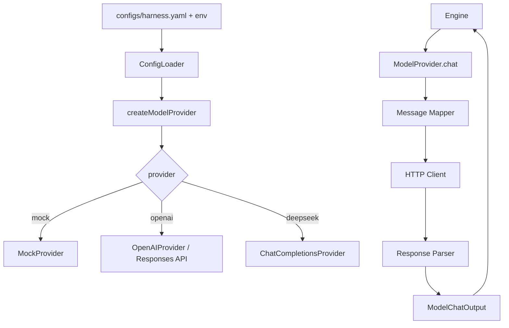

# MiniHarness 真实大模型 API 接入技术实现文档

状态：设计草案
日期：2026-06-27

## 1. 背景

MiniHarness 当前已经有模型抽象层：

- `src/core/model.ts` 定义 `ModelProvider`、`ModelChatInput`、`ModelChatOutput`。
- `src/runtime/engine.ts` 只依赖 `ModelProvider.chat()`，不关心具体模型供应商。
- `src/models/mock-provider.ts` 提供本地假模型。
- `src/models/openai-provider.ts` 提供 OpenAI Responses API 适配。
- `configs/harness.yaml` 已有 `model.provider`、`model.openai`、`temperature`、`maxTokens` 等配置字段。

目前的主要缺口是：`src/main.ts` 固定使用 `MockProvider`，并且现有 `OpenAIProvider` 使用 OpenAI Responses API 的 `/responses` 与 `input` 格式。DeepSeek 这类 OpenAI-compatible 服务通常使用 Chat Completions 的 `/chat/completions` 与 `messages` 格式，因此不能只把 `OpenAIProvider.baseUrl` 改成 DeepSeek 地址。

## 2. 目标

本次设计目标是让项目可以通过配置接入真实大模型 API，优先支持 DeepSeek，并保留继续扩展 OpenAI、OpenAI-compatible、其他厂商的空间。

必须满足：

- 运行时通过配置选择 `mock`、`openai`、`deepseek` 等 provider。
- DeepSeek API key 从环境变量读取，默认使用 `DEEPSEEK_API_KEY`。
- Provider 适配内部 `Message[]`、`Tool[]`、`ToolCall[]`，保持 `Engine` 主循环不变。
- HTTP 错误、网络错误、超时、限流被统一转换成 `ModelProviderError`。
- 单元测试不依赖真实网络和真实 API key，继续使用可注入 `fetchFn`。

暂不纳入：

- 多供应商自动故障转移。
- 成本统计与预算限额。
- SSE 流式输出落地到 `Engine.stream`。
- 多模态输入输出。

## 3. 官方 API 事实基础

根据 DeepSeek 官方 API 文档，DeepSeek 提供 OpenAI-compatible API，基础地址为：

```text
https://api.deepseek.com
```

聊天补全接口为：

```text
POST /chat/completions
```

请求体核心字段包括 `model`、`messages`、`temperature`、`max_tokens`、`stream`、`tools` 等。工具调用通过 Chat Completions 风格的 `tools` 与响应中的 `tool_calls` 表示。

截至本文档日期（2026-06-27），官方文档列出的新模型包括 `deepseek-v4-flash`、`deepseek-v4-pro`。如果使用旧别名，例如 `deepseek-chat` 或 `deepseek-reasoner`，需要以官方公告和控制台可用模型为准。

参考：

- DeepSeek Quick Start: https://api-docs.deepseek.com/
- DeepSeek Chat Completion API: https://api-docs.deepseek.com/api/create-chat-completion
- DeepSeek Function Calling: https://api-docs.deepseek.com/guides/function_calling
- DeepSeek Error Codes: https://api-docs.deepseek.com/quick_start/error_codes

## 4. 推荐方案

推荐新增一个通用的 Chat Completions 兼容 provider，再用 DeepSeek 配置包装它：

```text
src/models/
  chat-completions-provider.ts      通用 OpenAI-compatible Chat Completions Provider
  chat-completions-parser.ts        Chat Completions 响应解析
  provider-factory.ts               从配置创建 ModelProvider
  deepseek-provider.ts              DeepSeek 默认配置的轻包装，可选
```

不要把现有 `OpenAIProvider` 直接改成 DeepSeek provider。原因是：

- `OpenAIProvider` 当前绑定 OpenAI Responses API。
- DeepSeek 使用 Chat Completions 消息格式。
- 两种协议的工具调用、工具结果消息、usage 字段、结束原因都不同。
- 强行复用会让 `OpenAIProvider` 同时承担两套协议，后续难维护。

## 5. 架构设计



核心边界：

- `Engine` 不改协议细节，只传 `messages`、`tools`、`options`、`metadata`。
- Provider 负责内部消息与外部 API 格式互转。
- Parser 负责把外部响应转换成内部 `ModelChatOutput`。
- 工具执行链继续由 `DefaultToolRegistry` 和 `ToolExecutor` 负责。

## 6. 配置设计

建议扩展 `configs/harness.yaml`：

```yaml
model:
  provider: deepseek
  temperature: 0.2
  maxTokens: 4096

  openai:
    model: gpt-5.5
    apiKeyEnv: OPENAI_API_KEY
    baseUrl: https://api.openai.com/v1
    apiStyle: responses

  deepseek:
    model: deepseek-v4-flash
    apiKeyEnv: DEEPSEEK_API_KEY
    baseUrl: https://api.deepseek.com
    apiStyle: chat-completions
```

后续如果接入更多兼容供应商，可以统一成：

```yaml
model:
  provider: deepseek
  providers:
    deepseek:
      kind: chat-completions
      model: deepseek-v4-flash
      apiKeyEnv: DEEPSEEK_API_KEY
      baseUrl: https://api.deepseek.com
    openrouter:
      kind: chat-completions
      model: deepseek/deepseek-chat
      apiKeyEnv: OPENROUTER_API_KEY
      baseUrl: https://openrouter.ai/api/v1
```

第一阶段建议采用显式 `openai`、`deepseek` 字段，减少配置迁移成本；第二阶段再抽象到 `providers` map。

## 7. Provider 接口与实现

现有接口可以保持不变：

```ts
export interface ModelProvider {
  name: string;
  chat(input: ModelChatInput): Promise<ModelChatOutput>;
  stream?(input: ModelChatInput): AsyncIterable<ModelStreamEvent>;
}
```

新增通用 options：

```ts
export interface ChatCompletionsProviderOptions {
  name: string;
  apiKey?: string;
  apiKeyEnv?: string;
  model: string;
  baseUrl: string;
  fetchFn?: OpenAIFetch;
  defaultTimeoutMs?: number;
}
```

DeepSeek provider 可以是轻包装：

```ts
export class DeepSeekProvider extends ChatCompletionsProvider {
  constructor(options: Omit<ChatCompletionsProviderOptions, 'name' | 'baseUrl'> & {
    baseUrl?: string;
  }) {
    super({
      name: 'deepseek',
      baseUrl: options.baseUrl ?? 'https://api.deepseek.com',
      ...options,
    });
  }
}
```

如果不想增加 `DeepSeekProvider` 类，也可以只用：

```ts
new ChatCompletionsProvider({
  name: 'deepseek',
  baseUrl: 'https://api.deepseek.com',
  model: 'deepseek-v4-flash',
  apiKeyEnv: 'DEEPSEEK_API_KEY',
});
```

## 8. 请求映射

### 8.1 Message 映射

内部消息到 Chat Completions：

| 内部消息 | 外部消息 |
|---|---|
| `role: system` | `{ role: 'system', content }` |
| `role: user` | `{ role: 'user', content }` |
| `role: assistant` 无工具 | `{ role: 'assistant', content }` |
| `role: assistant` 有工具 | `{ role: 'assistant', content: content || null, tool_calls: toolCalls }` |
| `role: tool` | `{ role: 'tool', tool_call_id: id, content }` |

当前 `DefaultToolRegistry.execute()` 返回的 tool message 使用 `id: toolCall.id`，这正好可作为 Chat Completions 的 `tool_call_id`。为避免未来误改，建议在 `metadata` 中也保留：

```ts
metadata: {
  toolCallId: toolCall.id,
  toolName: tool.name,
  success: result.success,
}
```

### 8.2 Tool 映射

内部 `Tool` 到 Chat Completions：

```ts
{
  type: 'function',
  function: {
    name: tool.name,
    description: tool.description,
    parameters: tool.schema
  }
}
```

注意：这与当前 Responses API provider 的工具格式不同。现有 `OpenAIProvider` 使用：

```ts
{
  type: 'function',
  name: tool.name,
  description: tool.description,
  parameters: tool.schema
}
```

因此工具映射应该放在不同 provider 内部，不应共用同一个转换函数。

### 8.3 Request Body

DeepSeek 请求体建议：

```ts
{
  model,
  messages: input.messages.map(toChatMessage),
  tools: input.tools?.length ? input.tools.map(toChatTool) : undefined,
  temperature: input.options?.temperature,
  max_tokens: input.options?.maxTokens,
  stream: false
}
```

第一阶段先不启用流式输出。等 `Engine` 的 `enableStream` 真正接到 provider `stream()` 后，再实现 SSE 解析。

## 9. 响应解析

Chat Completions 响应需要解析：

```ts
{
  choices: [
    {
      message: {
        role: 'assistant',
        content: 'hello',
        tool_calls: [
          {
            id: 'call_x',
            type: 'function',
            function: {
              name: 'echo',
              arguments: '{"text":"hello"}'
            }
          }
        ]
      },
      finish_reason: 'stop' | 'tool_calls' | 'length' | 'content_filter'
    }
  ],
  usage: {
    prompt_tokens: 1,
    completion_tokens: 2,
    total_tokens: 3
  }
}
```

映射到内部：

```ts
{
  message: {
    id: createId('msg'),
    role: 'assistant',
    content: message.content ?? '',
    toolCalls: parsedToolCalls,
    createdAt: Date.now()
  },
  usage: {
    inputTokens: usage.prompt_tokens ?? 0,
    outputTokens: usage.completion_tokens ?? 0,
    totalTokens:
      usage.total_tokens ??
      (usage.prompt_tokens ?? 0) + (usage.completion_tokens ?? 0)
  }
}
```

工具参数解析规则：

- `function.arguments` 必须是 JSON string。
- JSON 解析失败时抛出 `ModelProviderError`，code 使用 `MODEL_TOOL_ARGUMENTS_INVALID`。
- 解析结果不是 object 时，返回空对象或抛错。建议抛错，因为工具参数类型错误通常不可重试。

输出质量门控继续复用 `ensureModelOutput()`。

## 10. 错误处理与重试语义

Provider 统一把错误转成 `ModelProviderError`。

建议 code：

| 场景 | code | retryable |
|---|---|---|
| 缺少 API key | `MODEL_API_KEY_MISSING` 或 `DEEPSEEK_API_KEY_MISSING` | false |
| HTTP 400/401/402/422 | `MODEL_HTTP_ERROR` | false |
| HTTP 408/429/5xx/503 | `MODEL_HTTP_ERROR` | true |
| 超时 | `MODEL_TIMEOUT` | true |
| 网络错误 | `MODEL_NETWORK_ERROR` | true |
| 响应结构不合法 | `MODEL_RESPONSE_INVALID` | true |
| 工具参数 JSON 不合法 | `MODEL_TOOL_ARGUMENTS_INVALID` | false |

第一阶段只标记 `retryable`，不在 provider 内自动重试，避免隐藏计费和重复工具调用风险。后续可以在 `reliability/retry.ts` 增加显式重试策略。

日志字段建议保留：

- `traceId`
- `sessionId`
- `providerName`
- `modelName`
- `latencyMs`
- `status`
- `errorCode`
- `retryable`

不要记录 API key、完整 prompt、完整工具结果。后续如需调试 prompt，应增加显式的 debug 开关和脱敏策略。

## 11. Provider 工厂

新增 `src/models/provider-factory.ts`：

```ts
export function createModelProvider(config: HarnessConfig): ModelProvider {
  switch (config.model.provider) {
    case 'mock':
      return new MockProvider();
    case 'openai':
      return new OpenAIProvider({
        model: config.model.openai.model,
        baseUrl: config.model.openai.baseUrl,
        apiKey: process.env[config.model.openai.apiKeyEnv],
        defaultTimeoutMs: config.runtime.requestTimeoutMs,
      });
    case 'deepseek':
      return new ChatCompletionsProvider({
        name: 'deepseek',
        model: config.model.deepseek.model,
        baseUrl: config.model.deepseek.baseUrl,
        apiKey: process.env[config.model.deepseek.apiKeyEnv],
        defaultTimeoutMs: config.runtime.requestTimeoutMs,
      });
    default:
      throw new Error(`Unsupported model provider: ${config.model.provider}`);
  }
}
```

同时新增配置加载与校验：

- `src/utils/config.ts`
- 使用现有依赖 `yaml` 读取 YAML。
- 使用现有依赖 `zod` 校验配置结构、默认值、枚举。

`src/main.ts` 改为：

```ts
const config = await loadHarnessConfig('configs/harness.yaml');
const model = createModelProvider(config);
```

## 12. 安全与环境变量

本地运行方式：

```bash
export DEEPSEEK_API_KEY=sk-<redacted>
pnpm dev
```

要求：

- 不把 API key 写入 `configs/harness.yaml`。
- 不把 `.env` 提交到仓库。
- 如果后续引入 dotenv，只读取本地 `.env`，并在 `.gitignore` 中忽略。
- 日志里禁止输出 `Authorization` header。

## 13. 测试计划

新增或扩展测试：

1. `tests/chat-completions-provider.test.ts`
   - 断言请求 URL 是 `${baseUrl}/chat/completions`。
   - 断言 Authorization header 正确。
   - 断言 system/user/assistant/tool 消息映射正确。
   - 断言 tools 映射为 Chat Completions 风格。
   - 断言 `temperature`、`max_tokens`、`stream: false` 正确。

2. `tests/chat-completions-parser.test.ts`
   - 解析普通文本。
   - 解析 `tool_calls`。
   - 解析 usage。
   - 非 JSON 工具参数抛 `ModelProviderError`。
   - 空响应触发 `ensureModelOutput()`。

3. `tests/provider-factory.test.ts`
   - `provider: mock` 返回 `MockProvider`。
   - `provider: deepseek` 返回 `ChatCompletionsProvider`。
   - 缺少 API key 时实际调用 `chat()` 抛可识别错误。

4. `tests/runtime.test.ts`
   - 保持现有测试不变。
   - 可补一个“tool message id 被保留为 tool_call_id”的 provider 映射测试。

5. 可选真实集成测试
   - 文件命名 `tests/integration/deepseek-live.test.ts`。
   - 默认跳过，只有设置 `RUN_LIVE_MODEL_TESTS=1` 和 `DEEPSEEK_API_KEY` 才运行。
   - CI 默认不跑，避免泄露密钥和产生费用。

## 14. 分阶段实施

### 第一阶段：DeepSeek 非流式调用

- 新增 `ChatCompletionsProvider`。
- 新增 `parseChatCompletionResponse()`。
- 新增 provider 单测和 parser 单测。
- 扩展配置文件增加 `deepseek` 字段。
- 新增配置 loader 和 provider factory。
- `src/main.ts` 改成按配置创建 provider。

验收标准：

- `pnpm test` 通过。
- `pnpm typecheck` 通过。
- 无 API key 时 mock 模式仍可运行。
- 设置 `model.provider: deepseek` 且提供 `DEEPSEEK_API_KEY` 时，`pnpm dev` 能返回真实模型回答。

### 第二阶段：配置抽象与多供应商

- 把 `model.openai`、`model.deepseek` 迁移到 `model.providers` map。
- 支持任意 OpenAI-compatible provider。
- 增加 provider 级别 headers 扩展，例如 OpenRouter 的来源标识。

验收标准：

- DeepSeek 配置不破坏。
- OpenAI Responses API 继续可用。
- 新增一个 OpenAI-compatible provider 只需要改配置，不需要写新类。

### 第三阶段：流式输出

- `ChatCompletionsProvider.stream()` 解析 SSE。
- `Engine` 按 `enableStream` 选择 `chat()` 或 `stream()`。
- `ModelStreamEvent` 支持文本增量、工具调用增量、完成、错误。

验收标准：

- 非流式测试不回归。
- 流式文本可以按 token/chunk 输出。
- 工具调用增量可以合并成完整 `ToolCall`。

## 15. 风险与处理

| 风险 | 影响 | 处理 |
|---|---|---|
| DeepSeek 模型名变更 | 配置失效 | 模型名放配置，不写死在代码；文档提示以官方控制台为准 |
| OpenAI Responses 与 Chat Completions 混用 | 工具调用异常 | 保持两个 provider 分离 |
| 工具结果缺少 `tool_call_id` | 多轮工具调用失败 | 使用 tool message `id` 作为 `tool_call_id`，metadata 冗余保存 |
| 真实 API 测试产生费用 | CI 不稳定、产生成本 | live test 默认跳过 |
| 429/503 限流过载 | 用户体验差 | 第一阶段暴露 retryable；第二阶段加显式重试和退避 |
| 日志泄露 prompt/key | 安全风险 | 默认不记录请求体和 Authorization |

## 16. 最小代码变更清单

建议第一阶段新增：

- `src/models/chat-completions-provider.ts`
- `src/models/chat-completions-parser.ts`
- `src/models/provider-factory.ts`
- `src/utils/config.ts`
- `tests/chat-completions-provider.test.ts`
- `tests/chat-completions-parser.test.ts`
- `tests/provider-factory.test.ts`

建议第一阶段修改：

- `src/index.ts` 导出新 provider、parser、factory。
- `src/main.ts` 使用配置加载与 provider factory。
- `configs/harness.yaml` 增加 `deepseek` 配置。
- `README.md` 增加 DeepSeek 运行示例。
- `src/tools/registry.ts` 在 tool message metadata 中补 `toolCallId`。

## 17. 推荐结论

第一阶段采用“新增 Chat Completions 兼容 Provider + DeepSeek 配置 + Provider 工厂”的方案。它对现有 `Engine`、memory、tools、MCP、orchestration 的侵入最小，也避免把 OpenAI Responses API 与 Chat Completions 协议混在一个类里。

实现完成后，用户只需要：

```bash
export DEEPSEEK_API_KEY=sk-<redacted>
```

并在 `configs/harness.yaml` 中配置：

```yaml
model:
  provider: deepseek
  deepseek:
    model: deepseek-v4-flash
    apiKeyEnv: DEEPSEEK_API_KEY
    baseUrl: https://api.deepseek.com
```

即可让 MiniHarness 使用真实 DeepSeek API。
