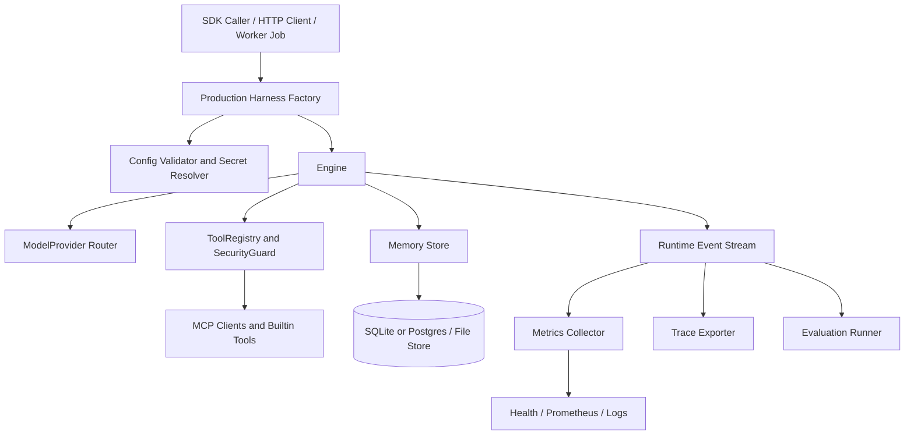

# MiniHarness 生产可用升级技术实现文档

## 1. 目标与结论

本文档面向 MiniHarness 从“可验证的 TypeScript Harness 原型”升级为“可在生产环境长期运行、可被业务系统集成、可观测、可回滚、可验收”的工程版本。

推荐路线是分阶段强化现有架构，而不是重写：

1. 保留当前轻量 SDK 内核：`Engine`、`Memory`、`ToolRegistry`、`ModelProvider`、`MCP`、`Orchestration` 继续作为核心抽象。
2. 增加生产装配层：提供统一的 harness factory、HTTP/Worker 服务入口、健康检查、指标导出、优雅关闭和配置校验。
3. 补齐持久化与发布闭环：把运行状态、checkpoint、长期记忆、评估基线、发布制品和回滚策略落地。

当前仓库已经具备较好的库级基础。2026-07-02 本地基线验证结果：

```bash
pnpm typecheck
pnpm test
pnpm build
```

结果：

- `pnpm typecheck` 通过。
- `pnpm test` 通过，46 个测试文件，195 个测试全部通过。
- `pnpm build` 通过，生成 ESM、CJS 和类型声明产物。

因此生产化的主要缺口不在单元能力，而在部署形态、持久化、观测接入、真实工具权限、发布治理和运行验收。

## 2. 当前能力评估

### 2.1 已具备的生产基础

| 能力 | 当前落点 | 状态 |
|---|---|---|
| Agent 主循环 | `src/runtime/engine.ts` | 已支持事件流、预算、重试、漂移检查、工具调度 |
| 模型接入 | `src/models/` | 已支持 mock、OpenAI Responses、OpenAI-compatible Chat Completions、provider router |
| 输出治理 | `src/models/output-governance.ts` | 已支持工具名、参数、注入模式和自纠正观察 |
| 记忆系统 | `src/memory/` | 已支持本地 session log、Markdown 长期记忆、上下文构建和 consolidation |
| MCP 接入 | `src/mcp/` | 已支持 Streamable HTTP 初始化、工具发现、工具调用、资源和 prompt 客户端 |
| 工具执行 | `src/tools/` | 已支持注册、schema 校验、执行器、安全检查、超时和结构化日志 |
| 安全策略 | `src/security/` | 已支持 allow/deny、网络和 shell 开关、路径校验、命令护栏、参数约束 |
| 编排 | `src/orchestration/` | 已支持 planner、task graph、coordinator、workflow state machine、message bus、scratchpad |
| 生产横切层 | `src/production/` | 已支持 feature gates、模块化 prompt、schema cache、metrics snapshot |
| 评估 | `src/evaluation/` | 已支持 EngineEvent 离线评估、聚合指标和回归检查 |
| 公共导出 | `src/index.ts` | 已导出主要 SDK API |

### 2.2 距离生产可用的关键缺口

1. 缺少明确的生产入口。当前 `src/main.ts` 是一次性本地演示，不是长期运行的服务入口，也没有 API 协议、健康检查、优雅关闭和启动校验。
2. 缺少统一装配层。模型、记忆、工具、MCP、metrics、security 的创建逻辑散落在 `main.ts` 和调用方中，业务集成容易漏接横切能力。
3. 持久化仍偏本地文件和内存。长期记忆使用 Markdown 文件，workflow checkpoint 只有内存实现，生产多实例和崩溃恢复能力不足。
4. 观测能力没有接入标准后端。已有 `ProductionMetricsCollector` 和 pino 日志，但缺少 Prometheus/OpenTelemetry/JSONL trace export 等适配层。
5. 真实工具生态仍未生产化。配置里 `allowShell`、`allowFile`、`allowHttp` 默认关闭，README 也标注 File/HTTP/Shell tools 尚未实现。
6. 发布治理不足。`package.json` 当前 `private: true`，缺少 `exports`、`files`、版本策略、CI 工作流、coverage 门槛、release checklist。
7. 缺少生产验收套件。现有测试覆盖模块行为，但缺少真实配置 smoke test、真实模型门控测试、长运行恢复测试、并发和资源压力测试。

## 3. 生产可用定义

MiniHarness 达到生产可用时，应满足以下标准：

| 维度 | 验收标准 |
|---|---|
| 集成形态 | 可作为 npm SDK 被业务引入，也可启动为 HTTP/SSE API 或 Worker 进程 |
| 启动安全 | 生产环境下缺失 API key、非法配置、不可写持久化目录、危险工具权限会 fail fast |
| 运行可靠性 | 支持 request timeout、abort、retry、budget、tool timeout、graceful shutdown |
| 状态恢复 | session log、memory entry、workflow checkpoint、schema cache 可跨进程重启恢复 |
| 可观测性 | 每次运行有 traceId/sessionId，日志、指标、健康状态、评估结果可导出 |
| 安全边界 | 工具默认最小权限，文件和 shell 工具必须经过 sandbox、allowlist 和审计 |
| 质量门禁 | CI 至少执行 typecheck、test、build、coverage、evaluation regression |
| 发布回滚 | 版本可追踪，可回滚配置和包版本，生产部署前有 smoke test |
| 文档运维 | 有配置说明、运行手册、故障排查、升级和回滚步骤 |

## 4. 升级路径对比

### 方案 A：分阶段硬化现有 SDK 内核（推荐）

保持当前模块边界，在现有 SDK 上增加装配层、服务入口、持久化适配器、CI/CD 和可观测性适配器。

优点：

- 复用现有 195 个通过测试的基础能力。
- 改动可分阶段交付，每阶段都能独立验收。
- 风险集中在新增边界层，不破坏核心 API。

缺点：

- 需要设计清晰的 production factory，避免 `main.ts` 继续膨胀。
- 需要维护 SDK 和服务两种使用方式的一致性。

### 方案 B：优先服务化

直接把 MiniHarness 包装成 HTTP API 服务，先服务化 `run`、`runEvents`、health 和 metrics，再逐步补齐 SDK 发布。

优点：

- 上层业务接入简单，通过 HTTP/SSE 即可使用。
- 更容易统一权限、配置、观测和部署。

缺点：

- 如果过早绑定 API 形态，会压缩 SDK 的灵活性。
- Worker、队列、持久化和多租户问题会更早暴露。

### 方案 C：平台化重构

引入插件市场、远程配置中心、队列、数据库、OpenTelemetry collector、审批系统和多租户控制面。

优点：

- 目标态完整，适合大规模 Agent 平台。

缺点：

- 当前项目规模不需要一次性平台化。
- 会显著增加依赖、部署复杂度和测试成本。

结论：采用方案 A。先把 SDK 生产化，再提供服务入口，最后按真实需求扩展平台能力。

## 5. 目标架构



新增边界：

- `ProductionHarnessFactory`：统一创建 model、memory、tools、MCP、security、metrics、output governance 和 engine。
- `Service Adapter`：把 `Engine.runEvents()` 映射为 HTTP JSON 或 SSE 事件流。
- `Persistence Adapter`：为 memory、checkpoint、schema cache 提供 SQLite/Postgres/JSONL 可选实现。
- `Observability Adapter`：把 EngineEvent 转为 metrics、logs、traces 和 evaluation artifacts。

## 6. 分阶段技术实现

### P0：发布与装配基线

目标：让 MiniHarness 成为可被稳定集成的 npm SDK，并把本地 demo 装配逻辑升级为可复用 factory。

改造内容：

1. 新增 `src/app/create-harness.ts`：
   - 输入 `HarnessConfig`。
   - 创建 `FeatureGateEvaluator`、`ModelProvider`、`Memory`、`ToolRegistry`、`SecurityGuard`、`ToolExecutor`、`ProductionMetricsCollector`、`ModelOutputGovernance` 和 `Engine`。
   - 返回 `{ engine, tools, memory, metrics, config }`，让 SDK 和服务入口共享同一装配逻辑。
2. 更新 `src/main.ts`：
   - 只保留 demo 入口。
   - 调用 `createHarness()`，避免复制生产装配逻辑。
3. 更新 `package.json`：
   - 增加 `exports`、`types`、`files`、`engines`、`packageManager`。
   - 保留 `private: true` 直到准备发布；内部部署可先使用 git/tag 包。
4. 新增 CI：
   - `pnpm install --frozen-lockfile`
   - `pnpm typecheck`
   - `pnpm test -- --coverage`
   - `pnpm build`
5. 新增 production smoke example：
   - 使用 mock provider 启动一次完整 run。
   - 使用 real provider 的 smoke test 由环境变量门控，避免 CI 默认访问网络。

验收标准：

- SDK 调用方可以只通过 `createHarness(config)` 完成完整装配。
- `pnpm typecheck && pnpm test && pnpm build` 继续通过。
- `tests/exports.test.ts` 覆盖新的 public API。

### P1：生产服务入口

目标：提供可长期运行的 API/Worker 入口，同时不污染 SDK 内核。

改造内容：

1. 新增 `src/server/http.ts`：
   - `POST /v1/runs`：一次性返回最终 assistant message。
   - `POST /v1/runs/stream`：以 SSE 输出 `EngineEvent`。
   - `GET /healthz`：返回进程健康状态、配置环境、metrics health。
   - `GET /readyz`：检查模型密钥、持久化路径、MCP 初始化和工具注册状态。
   - `GET /metrics`：输出 JSON metrics，后续可扩展 Prometheus text format。
2. 新增 `src/server/graceful-shutdown.ts`：
   - 监听 `SIGINT` 和 `SIGTERM`。
   - 停止接收新请求。
   - 等待运行中请求完成或到达 shutdown timeout。
   - 对 abortable run 传入 `AbortSignal`。
3. 新增 `configs/production.yaml`：
   - 明确 `production.environment: production`。
   - 默认关闭高风险工具。
   - 明确 request timeout、tool timeout、budget、metrics 阈值。
4. 增加服务级测试：
   - 使用 mock provider 测 `/healthz`、`/readyz`、`/v1/runs` 和 SSE 事件顺序。

验收标准：

- 本地可以启动长期运行服务。
- 健康检查可区分 alive 和 ready。
- shutdown 时不丢失已开始的 run 事件和 checkpoint。

### P2：持久化与恢复

目标：支持进程重启、崩溃恢复和多实例部署前的状态边界。

改造内容：

1. 新增 SQLite 存储适配：
   - `src/memory/sqlite-store.ts`：实现长期记忆、关键词搜索、session log。
   - `src/orchestration/sqlite-checkpoint-store.ts`：实现 `CheckpointStore`。
   - `src/production/sqlite-schema-cache.ts`：持久化 tool schema hash、访问次数和最近访问时间。
2. 新增 migration：
   - `migrations/001_initial.sql`。
   - 启动时检查 schema version。
3. 配置扩展：
   - `memory.type: sqlite`
   - `orchestration.checkpoint.store: sqlite`
   - `production.schemaCache.store: memory | sqlite`
4. 崩溃恢复测试：
   - 保存 session 和 checkpoint。
   - 重建 harness。
   - 验证 memory search 和 checkpoint load 可恢复。

验收标准：

- 重启进程后可以读取历史 session log、长期记忆和 workflow checkpoint。
- SQLite adapter 与现有 `Memory`、`MemoryEntryStore`、`CheckpointStore` 接口兼容。
- 文件型 Markdown store 仍保留，方便本地开发和可读调试。

### P3：可观测性与质量门禁

目标：把现有 EngineEvent、metrics 和 evaluation 变成生产可用的观测闭环。

改造内容：

1. 新增 `src/observability/`：
   - `event-jsonl-exporter.ts`：按 traceId 输出 JSONL 轨迹。
   - `prometheus-metrics.ts`：把 `ProductionMetricsSnapshot` 转为 Prometheus text format。
   - `otel-trace-exporter.ts`：把 run、model call、tool call 转为 span。
2. 扩展 `ProductionMetricsCollector`：
   - 支持按 provider、toolName、errorCode 聚合。
   - 支持滑动窗口，避免全生命周期指标掩盖近期异常。
3. 新增 evaluation baseline：
   - `eval/baselines/*.json` 保存聚合指标基线。
   - CI 中运行 `checkEvaluationRegression()`。
   - 默认允许 5% 质量下降和 10% 成本/耗时上升。
4. 增加 run artifact：
   - 每次发布前保存 smoke/eval 轨迹，便于回放。

验收标准：

- 每次生产 run 都能通过 traceId 找到日志、事件、指标和评估结果。
- CI 能阻止明显质量回归。
- `/metrics` 可被监控系统采集。

### P4：真实工具与 MCP 生产化

目标：让工具生态在最小权限下可用。

改造内容：

1. 内置工具：
   - `src/tools/builtin/file.ts`：仅 sandbox 内读写，默认只读。
   - `src/tools/builtin/http.ts`：支持 allowlist host、method、timeout、response size limit。
   - `src/tools/builtin/shell.ts`：默认关闭，必须配置 allowlist command 和 sandbox cwd。
2. MCP：
   - 增加 stdio transport。
   - 增加 MCP server auth headers 和 secret env 映射。
   - 持久化 discovery schema cache。
   - 每个 MCP server 绑定权限 profile。
3. 工具审计：
   - 记录 tool input hash、permission decision、latency、errorCode。
   - 高风险工具默认进入 approval 模式。

验收标准：

- file/http/shell 工具均有安全单测和集成测试。
- 未配置 allowlist 时高风险工具不能执行。
- MCP 工具的权限、schema 和错误都能进入观测系统。

### P5：安全与运维闭环

目标：把生产环境的故障、攻击面和误操作控制在可审计范围。

改造内容：

1. 启动校验：
   - `HARNESS_ENVIRONMENT=production` 时禁止使用 mock provider，除非显式 `ALLOW_MOCK_IN_PRODUCTION=true`。
   - provider API key 缺失时在 ready check 阶段失败。
   - 持久化目录不可写时启动失败。
2. 审批机制：
   - 为 shell、写文件、外部 HTTP、MCP 高风险工具增加 `approvalRequired` metadata。
   - 初版可返回 `TOOL_APPROVAL_REQUIRED`，由上层服务或 UI 决定是否重放。
3. 资源保护：
   - 限制单 run 最大事件数、最大工具结果字符数、最大 memory 写入字符数。
   - 对 HTTP 工具和 MCP 工具设置响应体上限。
4. 运维手册：
   - 常见错误码。
   - provider 限流处理。
   - checkpoint 恢复。
   - 版本回滚。

验收标准：

- 生产环境危险默认值会 fail fast。
- 所有拒绝都有稳定 errorCode 和 traceId。
- 运维人员可以根据 runbook 定位并恢复常见故障。

## 7. 建议文件变更清单

| 类型 | 路径 | 说明 |
|---|---|---|
| 新增 | `src/app/create-harness.ts` | 统一生产装配入口 |
| 新增 | `src/server/http.ts` | HTTP/SSE 服务适配器 |
| 新增 | `src/server/graceful-shutdown.ts` | 优雅关闭 |
| 新增 | `src/memory/sqlite-store.ts` | SQLite 记忆存储 |
| 新增 | `src/orchestration/sqlite-checkpoint-store.ts` | SQLite checkpoint |
| 新增 | `src/observability/event-jsonl-exporter.ts` | 事件轨迹导出 |
| 新增 | `src/observability/prometheus-metrics.ts` | Prometheus 指标导出 |
| 新增 | `src/tools/builtin/file.ts` | 文件工具 |
| 新增 | `src/tools/builtin/http.ts` | HTTP 工具 |
| 新增 | `src/tools/builtin/shell.ts` | Shell 工具 |
| 新增 | `configs/production.yaml` | 生产配置模板 |
| 新增 | `.github/workflows/ci.yml` | CI 质量门禁 |
| 修改 | `package.json` | exports、files、engines、coverage/release scripts |
| 修改 | `src/index.ts` | 导出 app/server/observability 新 API |
| 修改 | `README.md` | 生产部署和 SDK 使用说明 |

## 8. 测试与验收策略

### 8.1 必跑命令

```bash
pnpm typecheck
pnpm test
pnpm build
```

### 8.2 新增测试分层

| 层级 | 测试内容 |
|---|---|
| Unit | factory 装配、配置校验、存储 adapter、metrics exporter、工具安全策略 |
| Integration | HTTP run、SSE stream、SQLite 重启恢复、MCP mock server、graceful shutdown |
| E2E mock | 使用 mock provider 跑完整生产配置，不访问网络 |
| E2E real | 使用 `RUN_REAL_LLM=1` 和真实 API key 跑小流量 smoke |
| Regression | 使用 `evaluation/` 对比 baseline，阻止质量、成本和耗时明显退化 |
| Load | mock provider 下并发 run，验证事件顺序、内存增长和 p95 延迟 |

### 8.3 初始 SLO 建议

这些阈值用于第一版生产验收，后续根据真实业务量调整：

| 指标 | 初始目标 |
|---|---|
| API health 检查 | 99.9% 可用 |
| Mock provider `POST /v1/runs` p95 | 小于 500ms |
| Tool call p95 | 小于配置 `latencyWarningMs` |
| 非重试 runtime error rate | 小于 1% |
| Evaluation overall score | 不低于基线 95% |
| Duplicate tool call rate | 不高于基线 110% |

## 9. 发布流程

1. 合并前：
   - 运行 `pnpm typecheck && pnpm test && pnpm build`。
   - 运行 mock E2E 和 evaluation regression。
   - 检查 public exports 和 README 示例。
2. 预发布：
   - 打 tag 或生成 prerelease 包。
   - 在 staging 使用 `configs/production.yaml` 启动服务。
   - 运行 ready check、real provider smoke 和 MCP smoke。
3. 发布：
   - 发布 npm 包或部署容器镜像。
   - 记录 git sha、package version、config version。
   - 保存 smoke/eval artifact。
4. 回滚：
   - 回滚 package/image 版本。
   - 回滚 config version。
   - 如有 migration，执行已验证的 down migration 或只读兼容策略。

## 10. 风险与控制

| 风险 | 影响 | 控制措施 |
|---|---|---|
| 服务层过早复杂化 | 拖慢 SDK 迭代 | P0 先做 factory，P1 再做 HTTP service |
| SQLite 与 Markdown 双实现行为不一致 | 记忆召回差异 | 用同一套 `MemoryEntryStore` 契约测试覆盖两种实现 |
| 真实工具造成副作用 | 文件误写、网络外泄、命令风险 | 默认关闭，必须 sandbox、allowlist、审计和测试 |
| 观测指标膨胀 | 内存增长和高基数标签 | 限制 label 集合，事件全量写 JSONL，metrics 只聚合关键维度 |
| 真实模型测试不稳定 | CI 偶发失败 | 默认使用 mock，real smoke 单独门控并设置重试和预算 |

## 11. 推荐下一步

优先实施 P0。P0 完成后，项目就具备稳定 SDK 装配入口、CI 发布门禁和可复用生产配置，这是后续服务化、持久化、观测和工具生态升级的基础。

P0 的最小交付范围：

1. `createHarness(config)`。
2. `package.json` public package 元数据和导出策略。
3. CI workflow。
4. mock production smoke test。
5. README 中的 SDK 集成示例和生产配置说明。

完成 P0 后，再进入 P1 HTTP/SSE 服务入口；如果实际业务只需要 SDK，可以跳过 P1，直接做 P2 持久化和 P3 观测。
